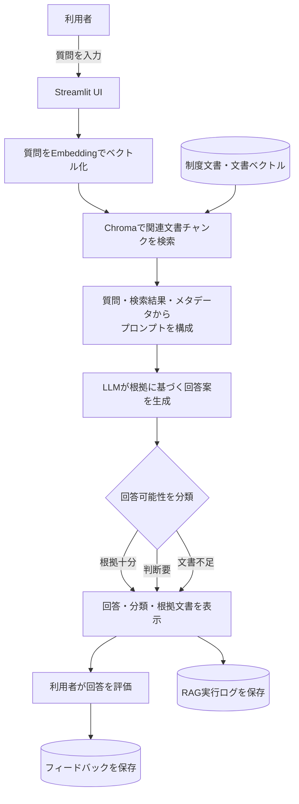
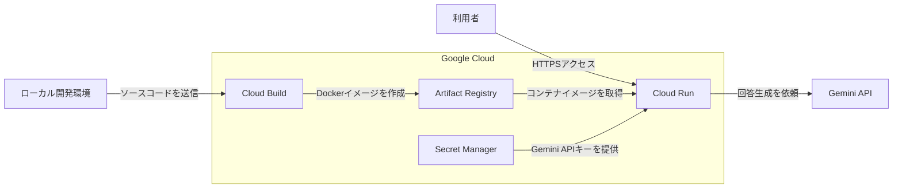

# 自治体向け制度問い合わせ支援RAG

## 公開デモ

[自治体向け制度問い合わせ支援RAGを試す](https://municipal-rag-assistant-280649014820.asia-northeast1.run.app/)

Dockerコンテナ化したアプリケーションを、Google Cloud Run上で公開しています。

> 利用がない場合はインスタンスを0件まで縮小する構成のため、初回アクセス時は起動に時間がかかる場合があります。

> [!NOTE]
> 本アプリはポートフォリオ用のデモです。検索対象には架空の制度文書を使用しています。

## 1. 概要

私は自治体職員として、人事・給与制度の運用業務および給与支給システムの管理業務に従事しています。

業務の中では、職員や所属担当者から制度や手続きに関する問い合わせを受ける機会が多くあります。
しかし、制度文書は複数の規程・通知・FAQ・手続きマニュアルに分散しており、問い合わせ内容に応じて該当箇所を探し、内容を確認する必要があります。

本プロジェクトでは、その課題を題材として、制度文書を検索し、根拠を提示しながら回答を生成するRAG（Retrieval-Augmented Generation）システムを構築しました。

単に回答を生成するだけでなく、以下の機能を実装し、実運用を意識した設計を行いました。

- 根拠文書の提示
- 推測による回答の抑制
- 回答分類（根拠十分／判断要／文書不足）
- 回答ログ・フィードバック収集

## 2. 背景・課題

自治体では、人事・給与制度に関する規程、運用通知、FAQ、手続きマニュアルなど、多数の文書をもとに制度運用が行われています。

制度担当者は問い合わせ対応の際、複数の文書を横断して確認する必要があり、情報探索コストが高いという課題があります。

また、制度問い合わせには、以下のような性質の異なる質問が存在します。

- 文書から明確に回答できる質問
- 個別事情により判断が必要な質問
- 文書に記載が存在しない質問

制度運用では、推測による回答が誤案内につながる可能性があります。そのため、単に回答を生成するだけでなく、「回答できること」と「回答できないこと」を適切に区別できる仕組みが求められます。

本プロジェクトでは、これらの課題に対して、文書検索・根拠提示・回答分類を組み合わせた制度問い合わせ支援RAGシステムを構築しました。

## 3. システム概要

本システムは、制度文書を検索し、その検索結果を根拠として回答を生成するRAG（Retrieval-Augmented Generation）システムです。

利用者からの質問に対して関連文書を検索し、取得した情報をもとに回答を生成します。

また、制度運用における誤案内リスクを低減するため、回答可能性に応じた回答分類機能を実装しています。

### 問い合わせ処理フロー



利用者が入力した質問に対し、Retrieverが関連文書を検索し、その結果をコンテキストとしてLLMへ渡します。

生成された回答は回答分類とともに表示され、利用者は根拠文書や検索結果を確認できます。

また、回答内容に対するフィードバックを収集し、継続的な改善に活用できる構成としています。

### デプロイ構成



ソースコードからDockerイメージを作成し、Artifact Registryへ保存したうえで、Cloud Runにデプロイしています。Gemini APIキーはソースコードやコンテナイメージに含めず、Secret ManagerからCloud Runへ提供しています。

### 回答分類

本システムでは、回答を以下の3種類に分類します。

| 分類 | 説明 |
|------|------|
| 根拠十分 | 参照文書のみで回答可能 |
| 判断要 | 個別事情や制度解釈の確認が必要 |
| 文書不足 | 参照文書に記載が存在しない |

制度問い合わせでは、すべての質問に一律に回答できるわけではありません。

そのため、本システムでは回答可能性を明示し、利用者が回答の信頼性を判断できるよう設計しています。

### 対象文書

本システムでは、以下の制度文書を検索対象として利用しています。

| 文書ID | 文書名 | 役割 |
|---------|---------|---------|
| DOC-001 | 給与制度規程 | 主根拠文書 |
| DOC-002 | 諸手当運用通知 | 主根拠文書 |
| DOC-003 | 人事給与FAQ | 主根拠文書 |
| DOC-004 | 届出・手続きマニュアル | 主根拠文書 |
| DOC-005 | 制度改正通知 | 補助文書 |

DOC-001〜DOC-004を主な回答根拠文書として扱い、DOC-005は制度改正に関する補助文書として利用しています。

## 4. 評価結果

本プロジェクトでは、検索性能評価および回答品質評価を実施し、システムの有効性を検証しました。

難問20件による追加評価では、検索結果だけでなく回答内容と失敗原因も質問単位で記録しています。詳細は [難問検索評価](eval/HARD_EVALUATION.md)、[難問回答品質評価](eval/HARD_ANSWER_EVALUATION.md)、[親見出しをEmbeddingへ加える検索実験](eval/CONTEXTUAL_HEADING_EVALUATION.md) を参照してください。

より多様な誤回答の傾向を測るため、[給与事務担当者向け500問評価セット](eval/LARGE_EVALUATION_SET.md)も用意しています。100シナリオの人手確認には[シナリオレビュー表](eval/evaluation_scenario_review.csv)を使用します。回答生成モデルの比較方針と概算費用は[LLMモデル候補](eval/LLM_MODEL_CANDIDATES.md)に記録しています。

承認済み評価セットを使ったモデル比較では、`eval.evaluate_models`が検索結果を一度保存し、Gemini、OpenAI、Mistralへ同じコンテキストを渡します。API制限で中断しても質問単位で結果を保存し、再実行時に続きから再開できます。

Gemini 3.1 Flash-Liteでformal 100問を実行した結果、回答分類一致は84/100、回答生成エラーは0、概算費用は$0.02473575でした。誤分類を検索失敗、分類ラベルのみの誤り、改正通知等の解釈誤りに分けた分析は[formal 100問評価](eval/GEMINI_3_1_FORMAL_EVALUATION.md)を参照してください。

### 評価結果サマリー

- Recall@3：1.00
- Recall@5：1.00
- 回答分類精度：86.7%
- 幻覚抑制：15/15

### 4.1 検索性能評価

検索性能評価では、以下の2種類の評価セットを作成しました。

- Basic：文書見出しに近い質問
- Practical：実際の問い合わせを想定した自然な質問

評価指標には Recall@1、Recall@3、Recall@5 を採用しました。

| 評価セット | Recall@1 | Recall@3 | Recall@5 |
|------------|----------|----------|----------|
| Basic | 0.95 | 1.00 | 1.00 |
| Practical | 0.69 | 1.00 | 1.00 |

#### 考察

Practical質問セットでは、質問表現が文書見出しから離れることで Recall@1 は低下しました。

一方で Recall@3 および Recall@5 は 1.00 を維持しており、関連文書を上位候補として取得できていることを確認しました。

---

### 4.2 回答品質評価

回答品質評価では、回答分類および回答内容の妥当性を確認しました。

評価対象

- 根拠十分
- 判断要
- 文書不足

の3分類を含む質問セットを作成し、期待分類との一致を評価しました。

| 評価項目 | 結果 |
|----------|------|
| 回答分類精度 | 86.7% (13/15) |
| 内容妥当性 | 15/15 |
| 幻覚抑制 | 15/15 |

#### 考察

回答分類では、一部の質問において制度改正通知との整合性判断や質問の曖昧さに起因する誤分類が発生しました。

一方で、対象文書に存在しない制度や手当に関する質問については、推測による回答を行わず「文書不足」と判定できることを確認しました。

制度問い合わせにおいて重要となる幻覚抑制については、評価対象の全質問で適切に動作することを確認しました。

---

### 4.3 総括

検索性能評価では Practical 質問セットにおいても Recall@3 = 1.00 を達成しました。

また、回答品質評価では回答分類精度 86.7% を記録し、文書不足質問に対する幻覚は確認されませんでした。

これにより、本システムが制度問い合わせ支援を行う上で一定の有効性を持つことを確認できました。

## 5. 技術スタック

| 分類 | 技術 | 採用理由 |
|------|------|------|
| 言語 | Python | AI・データ分析分野で広く利用されており、豊富なライブラリを活用できるため |
| RAGフレームワーク | LangChain | 文書検索、プロンプト生成、LLM連携を統一的に実装できるため |
| ベクトルDB | Chroma | ローカル環境で容易に利用でき、LangChainとの親和性が高いため |
| LLM | Gemini 2.5 Flash | 高速な応答性能を持ち、無料利用枠を活用できるため |
| Embedding | gemini-embedding-001 | 3072次元ベクトルによる検索性能を確保できるため |
| UI | Streamlit | Pythonのみで迅速にWebアプリケーションを構築できるため |
| コンテナ | Docker | 実行環境を統一し、ローカル環境とクラウド環境で同じ構成を再現するため |
| コンテナビルド | Google Cloud Build | ソースコードからDockerイメージをクラウド上で構築するため |
| イメージ管理 | Artifact Registry | 構築したDockerイメージをバージョン付きで管理するため |
| 実行環境 | Google Cloud Run | コンテナ化したWebアプリケーションを公開し、利用状況に応じて自動でスケーリングするため |
| シークレット管理 | Secret Manager | Gemini APIキーをソースコードやコンテナイメージに含めず、安全にCloud Runへ提供するため |
| 文書形式 | Markdown | 制度文書を構造化しやすく、保守性が高いため |
| ログ形式 | JSONL | 実行ログやフィードバックを蓄積しやすく、後続分析にも利用しやすいため |

本プロジェクトでは、LangChainを中心にRAGパイプラインを構築しました。

ベクトルDBにはChromaを採用し、Markdown形式の制度文書をEmbedding化して検索可能な状態で管理しています。

また、回答生成には Gemini 2.5 Flash、Embeddingには gemini-embedding-001 を利用し、検索性能と回答品質の両立を図りました。

公開環境では、アプリケーションをDockerコンテナ化し、Cloud Buildでイメージを構築しています。作成したイメージはArtifact Registryで管理し、Cloud Run上で実行しています。また、Gemini APIキーはSecret Managerで管理し、専用のサービスアカウントを通じてアプリケーションから参照しています。

## 6. セットアップ手順

### 6.1 リポジトリのクローン
```bash
git clone https://github.com/toko1970/municipal-rag-assistant.git
cd municipal-rag-assistant
```

### 6.2 仮想環境の作成・有効化
```bash
python -m venv .venv
source .venv/bin/activate
```

### 6.3 ライブラリのインストール
```bash
pip install -r requirements.txt
```

### 6.4 環境変数の設定
```bash
cp .env.example .env
```
.env に Gemini API キーを設定します。
GOOGLE_API_KEY=your_api_key_here

### 6.5 ベクトルDBの作成
```bash
python scripts/ingest.py
```

### 6.6 アプリケーションの起動
```bash
streamlit run app.py
```
ブラウザで Streamlit アプリが起動し、制度問い合わせを入力できるようになります。

### 6.7 Docker Composeでの動作確認

Docker Desktopを起動し、`.env`にGemini APIキーを設定した状態で、次のコマンドを実行します。

```bash
docker compose up --build
```

Dockerイメージの作成後、コンテナが起動します。ブラウザで `http://localhost:8080` を開き、アプリケーションの動作を確認します。

停止する場合は、起動中のターミナルで `Control + C` を押した後、次のコマンドを実行します。

```bash
docker compose down
```

2回目以降、Dockerfileや依存ライブラリに変更がなければ、次のコマンドで起動できます。

```bash
docker compose up
```

### 6.8 Google Cloud Runへのデプロイ
本プロジェクトでは、Cloud BuildでDockerイメージを作成し、Artifact Registryを経由してCloud Runへデプロイしています。

```bash
gcloud builds submit \
  --tag asia-northeast1-docker.pkg.dev/municipal-rag-portfolio/municipal-rag-images/municipal-rag-assistant:v1.0.0 \
  --project municipal-rag-portfolio
```

作成したイメージをCloud Runへデプロイします。

```bash
gcloud run deploy municipal-rag-assistant \
  --image asia-northeast1-docker.pkg.dev/municipal-rag-portfolio/municipal-rag-images/municipal-rag-assistant:v1.0.0 \
  --region asia-northeast1 \
  --project municipal-rag-portfolio \
  --service-account municipal-rag-runtime@municipal-rag-portfolio.iam.gserviceaccount.com \
  --set-secrets GOOGLE_API_KEY=gemini-api-key:1 \
  --memory 1Gi \
  --cpu 1 \
  --concurrency 10 \
  --timeout 300 \
  --min 0 \
  --max 1 \
  --allow-unauthenticated
```

> [!NOTE]
> Cloud Runのファイルシステムは永続ストレージではありません。本アプリケーションでは、新しいインスタンスでベクトルDBが存在しない場合、初回の質問時に`docs/`配下の文書から自動的に作成します。
>
> アプリケーションが出力するログやフィードバックもコンテナ内へ保存されるため、インスタンスの終了後も残る永続データとしては扱いません。

## 7. ディレクトリ構成

```text
rag-portfolio-app/
│
├── app.py
├── config.py
├── Dockerfile
├── .dockerignore
├── .gcloudignore
├── .env.example
├── Dockerfile
├── compose.yaml
├── .dockerignore
├── .gcloudignore
│
├── docs/
│   ├── 01_salary_rules.md
│   ├── 02_allowance_notice.md
│   ├── 03_hr_faq.md
│   ├── 04_procedure_manual.md
│   └── 05_revision_notice.md
│
├── src/
│   ├── __init__.py
│   ├── document_loader.py
│   ├── chunking.py
│   ├── embeddings.py
│   ├── vector_store.py
│   ├── retriever.py
│   ├── rag_chain.py
│   ├── logger.py
│   └── feedback.py
│
├── scripts/
│   ├── ingest.py
│   └── test_retriever.py
│
├── eval/
│   ├── evaluation_questions.csv
│   ├── evaluation_questions_practical.csv
│   ├── evaluation_questions_insufficient.csv
│   ├── answer_quality_questions.csv
│   ├── answer_quality_manual_review.csv
│   ├── evaluate_retrieval.py
│   └── evaluate_answer_quality.py
│
├── logs/
│   ├── rag_logs.jsonl
│   └── feedback_logs.jsonl
│
├── requirements.txt
└── README.md
```

### 7.1 ディレクトリ概要

| ディレクトリ | 内容 |
|------------|------------|
| docs | RAGの検索対象となる制度文書 |
| src | 文書読込、検索、回答生成などの主要ロジック |
| scripts | 文書登録や検索確認などの補助スクリプト |
| eval | 検索性能・回答品質評価用スクリプトおよび評価データ |
| logs | RAG実行ログおよびフィードバックログ |

本プロジェクトでは、データ（docs）、アプリケーション本体（src）、運用用スクリプト（scripts）、評価機能（eval）、ログ（logs）を分離することで、保守性と拡張性を意識した構成としています。

## 8. 主な実装内容

### 8.1 文書読み込み（document_loader.py）

制度文書（Markdown）を読み込み、Front Matterに記載されたメタデータを抽出する機能を実装しました。

取得した情報は LangChain の Document オブジェクトへ変換し、後続の検索処理で利用できる形式へ統一しています。

主な取得項目

- document_id
- document_name
- category
- effective_date
- version

---

### 8.2 チャンク分割（chunking.py）

Markdown文書を検索に適した単位へ分割する処理を実装しました。

MarkdownHeaderTextSplitter と RecursiveCharacterTextSplitter を組み合わせることで、

- 見出し構造の保持
- 文脈の維持
- 適切なチャンクサイズの確保

を実現しています。

また、各チャンクには以下の情報を付与しています。

- chunk_id
- heading_1
- heading_2

これにより回答時の根拠提示を可能としています。

---

### 8.3 ベクトル化・ベクトルDB登録

Gemini Embedding（gemini-embedding-001）を利用してチャンクをベクトル化し、Chromaへ登録する仕組みを実装しました。

登録結果

- 対象文書数：5
- 生成チャンク数：86

これにより制度文書を意味検索可能な状態で管理しています。

---

### 8.4 Retriever（retriever.py）

Chromaに対して類似検索を行う Retriever を実装しました。

検索結果には以下の情報を保持しています。

- スコア
- 文書ID
- 文書名
- 見出し情報

これにより回答生成だけでなく、根拠表示にも活用しています。

---

### 8.5 回答生成（rag_chain.py）

Retrieverで取得した関連チャンクをコンテキストとして Gemini へ渡し、回答を生成します。

また、制度問い合わせ業務を想定し、

- 根拠十分
- 判断要
- 文書不足

の3分類を行うプロンプト設計を実装しました。

制度運用における誤回答リスクを抑えるため、推測による回答を行わないよう制御しています。

---

### 8.6 Streamlit UI

利用者が質問を入力し、回答を確認できるWebアプリケーションを構築しました。

表示内容

- 回答内容
- 回答分類
- 根拠文書
- 検索結果

利用者が回答の妥当性を確認できるUIを意識しています。

---

### 8.7 ログ・フィードバック機能

回答結果を JSONL 形式で保存する仕組みを実装しました。

保存内容

- 質問
- 回答
- 回答分類
- 根拠文書

また、ユーザーによるフィードバック機能を実装し、将来的な改善へ活用できる構成としています。

---

### 8.8 評価機能

検索性能評価および回答品質評価を行うための評価スクリプトを実装しました。

検索性能評価

- Recall@1
- Recall@3
- Recall@5

回答品質評価

- 回答分類精度
- 内容妥当性
- 幻覚抑制

を確認できるようにしています。

評価機能を実装することで、システムの性能を定量的に把握できる構成としました。

## 9. 工夫した点

### 9.1 推測を防ぐ回答設計

制度問い合わせ業務では、不正確な回答が誤案内につながる可能性があります。

そのため、本システムでは参照文書に根拠が存在しない場合に推測で回答しないようプロンプトを設計しました。

文書に記載が存在しない場合は「文書不足」として回答し、利用者に対して根拠の有無を明示することで、回答の信頼性向上を図っています。

---

### 9.2 回答分類機能

制度問い合わせには、文書だけで回答できる質問だけでなく、個別事情や制度解釈の確認が必要な質問も存在します。

そのため、本システムでは回答を以下の3種類に分類する仕組みを実装しました。

- 根拠十分
- 判断要
- 文書不足

単に回答を生成するだけでなく、「回答可能かどうか」を利用者へ提示することで、実務での利用を意識した設計としています。

---

### 9.3 根拠文書の提示

制度運用では、「なぜその回答になったのか」を説明できることが重要です。

そのため、本システムでは回答生成時に利用した文書情報を保持し、利用者が根拠文書を確認できるようにしました。

また、チャンク生成時に見出し情報を保持することで、回答の根拠箇所を追跡しやすい構成としています。

---

### 9.4 評価を前提とした設計

RAGシステムでは、回答を生成できるだけでは性能を判断できません。

そこで本プロジェクトでは、開発段階から評価を実施することを前提に設計しました。

検索性能評価では、

- Recall@1
- Recall@3
- Recall@5

を測定し、回答品質評価では、

- 回答分類精度
- 内容妥当性
- 幻覚抑制

を確認しました。

これにより、システムの有効性を定量的に評価できる構成としています。

質問ごとの検索結果をCSVに保存する場合は、プロジェクトのルートから次を実行します（Gemini APIキーが必要です）。

```bash
python -m eval.evaluate_retrieval \
  --input eval/evaluation_questions_practical.csv \
  --output eval/results/practical_baseline.csv
```

出力には質問、正解文書ID、検索件数の設定、取得した文書IDの順位、各Kでの成否が含まれます。改善前後を比較するときは、同じ入力CSVを使い、別々の出力ファイル名で保存します。

CIではpushとプルリクエスト時に、外部APIを呼ばないテスト、lint、Terraform設定の形式・構文検証を実行します。ローカルで同じPythonの確認を行うには、開発用依存関係をインストールしてから次を実行します。

```bash
pip install -r requirements-dev.txt
python -m ruff check .
python -m pytest -q tests
```

実際の文書ベクトル検索とGeminiを使う評価はこのCIには含めず、評価セットや検索方式を変更した際に別途実行します。

難問20件での実検索評価、同一質問による方式比較、改善と退行の個別例は [eval/HARD_EVALUATION.md](eval/HARD_EVALUATION.md) に記録しています。実験方式は公開アプリには反映していません。

---

## 10. 今後の改善案

本プロジェクトはMVP（Minimum Viable Product）として構築しており、今後は以下の改善を検討しています。

### 10.1 評価データセットの拡充

現在は手作業で作成した評価データセットを利用しています。

今後は質問パターンや文書不足ケースを増やし、より実運用に近い条件で評価できるよう改善したいと考えています。

---

### 10.2 Rerankerの導入

現在はEmbedding検索結果をそのまま利用しています。

今後はCross Encoder等のRerankerを導入し、検索結果の順位付け精度を向上させることで、Recall@1や回答品質の改善を目指します。

---

### 10.3 ハイブリッド検索の導入

現在はベクトル検索のみを利用しています。

今後はキーワード検索（BM25等）とベクトル検索を組み合わせたハイブリッド検索を導入し、制度名や届出名称などの固有語に対する検索性能向上を検討しています。

---

### 10.4 フィードバック活用機能

現在は利用者フィードバックを保存する機能のみ実装しています。

今後は蓄積したフィードバックを分析し、検索性能や回答品質の継続的な改善へ活用できる仕組みを検討しています。

---

### 10.5 文書管理機能の強化

現在はMarkdown文書を手動で更新する運用を想定しています。

今後は文書更新時の差分管理や再インデックス処理を自動化し、保守性向上を図りたいと考えています。

---

### 10.6 回答根拠表示の改善

現在は参照文書情報を表示しています。

今後は回答生成に利用したチャンクの該当箇所をより分かりやすく表示し、回答の透明性向上を目指します。

---

### 10.7 ログ・フィードバックの永続化

現在、実行ログと利用者フィードバックはコンテナ内のファイルへ保存しています。Cloud Runのファイルシステムは永続ストレージではないため、インスタンスの終了や再作成によってデータが失われる可能性があります。

今後はCloud LoggingやCloud Storage、データベースなどの利用を検討し、ログやフィードバックを継続的な分析に活用できる構成へ改善したいと考えています。

---

### 10.8 ビルド・デプロイの自動化

公開環境への初回デプロイでは、Cloud Buildでコンテナイメージを作成し、Cloud Runへ手動で反映しました。

GitHub ActionsにCIとCDジョブを追加し、GitHubからGoogle Cloudへ接続する認証基盤をTerraformで適用しました。`main` へのpush後にCIが成功すると、`production` 環境の所有者承認を経て、コンテナイメージを作成し既存のCloud Runサービスへ反映する構成です。設定と運用手順は [infra/README.md](infra/README.md) に記載しています。

---

## 11. 学んだこと

本プロジェクトを通じて、RAGシステムの構築だけでなく、業務課題の整理から設計・実装・評価、クラウド環境への公開までを一貫して経験することができました。

特に、実際の業務を題材としてプロジェクトを進めたことで、

- 業務課題の整理
- 要件定義
- システム設計
- RAG実装
- 評価指標設計
- 回答品質評価
- Dockerによるコンテナ化
- Google Cloud上でのビルド・イメージ管理・デプロイ
- Secret Managerとサービスアカウントを用いた認証情報の管理

までを一通り実践することができました。

また、RAGシステムは回答を生成できるだけでは十分ではなく、検索性能や回答品質を評価し、継続的に改善していくことが重要であると学びました。

今回の開発を通じて、AI技術そのものだけでなく、「業務課題を理解し、適切なシステムとして設計・評価すること」の重要性を実感しました。

今後は、より大規模な文書群への対応や検索性能の改善、フィードバック活用などに取り組み、実運用を見据えたRAGシステムの構築へ発展させていきたいと考えています。

---

## 12. 関連ドキュメント

- [要件定義書](要件定義.txt)
- [実装計画書](実装計画書.txt)
