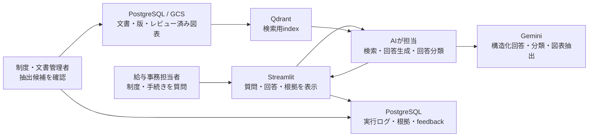

# 自治体向け制度問い合わせ支援RAG

[公開デモを試す](https://municipal-rag-assistant-280649014820.asia-northeast1.run.app/) | [評価レポート](eval/reports/README.md) | [技術設計](design/TECHNICAL_DESIGN.md) | [クラウド構成](design/CLOUD_RAG_V2_DEPLOYMENT_PLAN.md)

自治体の給与事務担当者が、複数の規程・通知・FAQ・業務マニュアルから根拠を探す作業を支援するRAGです。架空の制度文書を対象に、回答、回答可能性、根拠箇所を一緒に示します。

> [!NOTE]
> 転職活動用のポートフォリオです。実在する自治体の文書、職員情報、問い合わせ履歴は使用していません。Cloud Runは利用がないと0件まで縮小するため、初回表示に時間がかかる場合があります。

## 全体像


```mermaid
flowchart LR
    USER["給与事務担当者<br/>制度・手続きを質問"] --> UI["Streamlit<br/>質問・回答・根拠を表示"]
    ADMIN["制度・文書管理者<br/>抽出候補を確認"] --> DOCS["PostgreSQL / GCS<br/>文書・版・レビュー済み図表"]
    UI --> RAG["AIが担当<br/>検索・回答生成・回答分類"]
    DOCS --> INDEX["Qdrant<br/>検索用index"]
    INDEX --> RAG
    RAG --> GEMINI["Gemini<br/>構造化回答・分類・図表抽出"]
    RAG --> UI
    UI --> LOGS["PostgreSQL<br/>実行ログ・根拠・feedback"]
    ADMIN --> LOGS
```

- **利用者**: 各所属の給与事務担当者。制度や届出方法を自然文で質問する。
- **文書管理者**: 制度所管部署を想定。現状はCLIで図表抽出を確認し、レビュー済みデータだけを登録する。
- **AI**: 関連する文書・節を検索し、根拠に沿った回答案と回答分類を作る。
- **人が担う判断**: 個別事情や制度解釈が必要な場合は、AIが断定せず担当部署での確認につなげる。

詳しい処理順序は[技術設計](design/TECHNICAL_DESIGN.md)、データの責務は[データモデル](design/DATA_MODEL.md)、CI/CDとCloud Run構成は[公開RAG v2デプロイ記録](design/CLOUD_RAG_V2_DEPLOYMENT_PLAN.md)を参照してください。

## 問い合わせ例

すべて架空文書に対するダミー質問です。

| 質問例 | システムの振る舞い |
|---|---|
| 給与支給日はいつですか？ | 規程から支給日と休日の場合の扱いを回答し、根拠節を表示する |
| 通勤手当の申請書を受領した後、最初に何を確認しますか？ | フローチャートから最初の確認手順を読み取り、図表の根拠を示す |
| 2027年5月1日に住所変更した場合、提出期限日はいつですか？ | 起算規則が根拠だけでは確定できない場合、日付を推測せず`判断要`とする |
| 会計年度任用職員の給料日はいつですか？ | 検索対象に根拠がなければ、推測せず`文書不足`とする |

## 実装した機能

- Markdown文書と、事前レビュー済みの架空PDF図表6件を検索対象として管理
- 文書名と見出し階層を加えたEmbeddingとQdrant Top-8検索
- Gemini 3.1 Flash-Liteによる根拠付き構造化回答
- `根拠十分`、`判断要`、`文書不足`の回答分類
- 改正前後の根拠を扱う版注記と、必要時だけ動くVersion Resolver
- 具体的な暦日期限だけを対象にした決定的な日付計算
- PostgreSQLへの質問、検索、生成、分類、根拠、feedbackの記録
- GitHub Actionsによるtest・lint・Terraform検証と、承認後のCloud Runデプロイ

## 評価結果

評価セットを簡単な質問から難問、開発回帰、未見holdoutへ段階的に広げました。異なる評価セットの数値は直接比較せず、母数と条件を併記しています。

| 評価 | 主な結果 | 得られた判断 |
|---|---|---|
| 初期Practical検索 | Recall@3 = 1.00 | 正解文書は取れるが、難しい節選択を十分に測れていなかった |
| Formal検索 88問 | 全根拠見出しHit@5 74/88 → 78/88 | Contextual headingを採用 |
| Top-k影響8問 | 必須内容一致 6/8 → 8/8 | 費用増を確認した上でTop-8を採用 |
| 開発用End-to-End 130問 | 総合成功 117/130 → 120/130、退行0 | Query Decompositionと版処理を対象限定で採用 |
| Sealed text holdout 100表現 | 総合成功83/100、検索100/100 | 分類の過剰な慎重さと期限計算を次の課題として特定 |
| Holdout後の日付改善 | 新規表現4/4、既存120/130は影響なし | 対象限定の効果を確認。2回目のText holdoutは未実施 |
| Sealed visual holdout 10問 | End-to-End 70%、分類70% | 事前の分類閾値80%に届かず不合格として記録 |

`Recall@3`は、正解として定めた文書・根拠が検索上位3件以内に含まれた質問の割合です。複数根拠が必要な質問は、すべて取得できた場合だけ成功とします。詳しい定義、改善手法を選んだ理由、失敗例、未完了事項は[評価レポート案内](eval/reports/README.md)にまとめています。

## 技術選定

| 責務 | 技術 | この構成での役割 |
|---|---|---|
| UI・アプリ | Python / Streamlit / LangChain | 質問受付、RAG処理、根拠と分類の表示 |
| 回答生成・分類 | Gemini 3.1 Flash-Lite | JSON Schemaに沿った回答と分類を生成 |
| Embedding | gemini-embedding-001 | 日本語の質問と文書要素を3072次元vectorへ変換 |
| 検索index | Qdrant | Vector検索、payload filter、indexの再構築 |
| 正本・ログ | PostgreSQL | 文書版、抽出要素、実行ログ、根拠、feedbackをSQLで追跡 |
| 図表asset | Google Cloud Storage | レビュー済みPDFページ画像を非公開で保存 |
| 実行・配布 | Docker / Cloud Run | ローカルと公開環境で同じimageを実行 |
| CI/CD・IaC | GitHub Actions / Terraform | 検証、承認付きdeploy、クラウド設定のコード管理 |

Qdrantは検索専用index、PostgreSQLは再構築の基準になる正本として責務を分けています。Chroma実装は移行前baselineとの比較証拠として残しています。

## ローカルで動かす

### 1. 準備

```bash
git clone https://github.com/toko1970/municipal-rag-assistant.git
cd municipal-rag-assistant
cp .env.example .env
```

`.env`の`GOOGLE_API_KEY`へGemini APIキーを設定します。APIキーや`.env`はコミットしません。

### 2. PostgreSQLとQdrantを起動

```bash
docker compose up -d postgres qdrant
```

### 3. Python環境とデータを準備

```bash
python -m venv .venv
source .venv/bin/activate
pip install -r requirements-dev.txt
alembic upgrade head
python -m scripts.manage_rag_v2 ingest
```

### 4. アプリを起動

```bash
streamlit run app.py
```

Docker内でアプリも動かす場合は`docker compose up --build`を実行し、`http://localhost:8080`を開きます。

## テストと評価

通常のCIは外部APIを呼ばず、pushとpull requestで次を実行します。

```bash
python -m ruff check .
python -m pytest -q -m "not integration" tests
```

PostgreSQLとQdrantを使う統合テストは分離しています。

```bash
docker compose up -d postgres qdrant
python -m pytest -q -m integration tests/integration
```

実検索・生成評価はAPI費用とprovider制限を伴うため、評価セットや候補変更時に有限runとして実施します。各runは質問セット、モデル、上限、費用、retry、結果artifactを固定します。

## 主要ディレクトリ構成

```text
rag-portfolio-app/
├── app.py                    # Streamlit UIと問い合わせ画面
├── config.py                 # モデル名、DB接続、Top-kなどの設定
├── cloud_bootstrap.py        # Cloud Run Jobから呼ぶ初期化entry point
├── src/                      # 検索・生成・分類・保存を行うアプリ本体
│   ├── query_service.py      # End-to-Endの問い合わせ処理を統合
│   ├── qdrant_index.py       # Qdrant検索indexのadapter
│   ├── persistence/          # PostgreSQL modelとrepository
│   ├── visual_ingestion.py   # PDF・図表の取込処理
│   └── deadline_calculator.py # 根拠が揃う期限だけを決定的に計算
├── docs/                     # RAGが検索する架空の制度文書5件
├── scripts/                  # 取込、接続確認、RAG v2管理コマンド
├── eval/                     # 評価set、runner、詳細な実験記録
│   ├── reports/              # 精度改善の流れと図表RAGの実装境界
│   ├── results/              # CSV・JSONLなどの機械可読artifact
│   ├── text_holdout/         # Text sealed holdoutの契約とmanifest
│   └── visual_holdout_v2/    # 図表sealed holdoutの契約とmanifest
├── design/                   # 技術設計、データモデル、運用判断
│   └── schemas/              # 回答・分類・評価用JSON Schema
├── migrations/               # PostgreSQLのAlembic migration
├── infra/                    # Google CloudのTerraform定義
├── tests/                    # unit、回帰、integration test
├── .github/workflows/        # CIと承認付きCloud Run CD
├── compose.yaml              # ローカルPostgreSQL・Qdrant・app構成
├── Dockerfile                # Cloud Runとローカルで共通のimage定義
└── README.md                 # プロジェクト概要と各資料への入口
```

`docs/`は説明資料ではなく検索対象の制度文書です。評価の説明は`eval/reports/`、実装判断は`design/`へ分けています。

## 詳細資料

| 知りたいこと | 資料 |
|---|---|
| 評価指標と改善の流れ | [評価レポート案内](eval/reports/README.md) |
| RAG全体の処理設計 | [技術設計](design/TECHNICAL_DESIGN.md) |
| PostgreSQLとQdrantの責務 | [データモデル](design/DATA_MODEL.md) |
| 精度改善の原因・手法・採否 | [精度改善の流れ](eval/reports/ACCURACY_IMPROVEMENT.md) |
| 改善手法の原理・処理・弱点 | [精度改善手法の技術ガイド](eval/reports/ACCURACY_METHODS_TECHNICAL_GUIDE.md) |
| 図表機能の実装済み・未実装範囲 | [図表RAGの実装状況](eval/reports/VISUAL_RAG_STATUS.md) |
| Cloud Run・Cloud SQL・CI/CD | [公開RAG v2デプロイ記録](design/CLOUD_RAG_V2_DEPLOYMENT_PLAN.md) |
| 現在の制約と再開地点 | [作業checkpoint](design/WORK_CHECKPOINT.md) |

## 現時点の限界

- 公開デモはポートフォリオ規模であり、本番相当の可用性・SLAを保証しない。
- Sealed text holdoutでは、検索後の回答分類と複数文書・版境界に課題が残った。対象限定の日付改善後も、2回目のText sealed holdoutは未実施である。
- PDF・図表機能はレビュー済みfixtureによるvertical sliceであり、任意PDFのアップロード・レビュー画面は未実装である。
- 図表holdoutは分類精度の事前閾値に届いておらず、受入不合格として記録している。
- 具体期限の決定的計算は対象を限定しており、和暦、相対日付、営業日・休日計算は未対応である。
- 評価値は架空文書と各評価セットに対する結果であり、未知の自治体文書全般への性能を意味しない。
