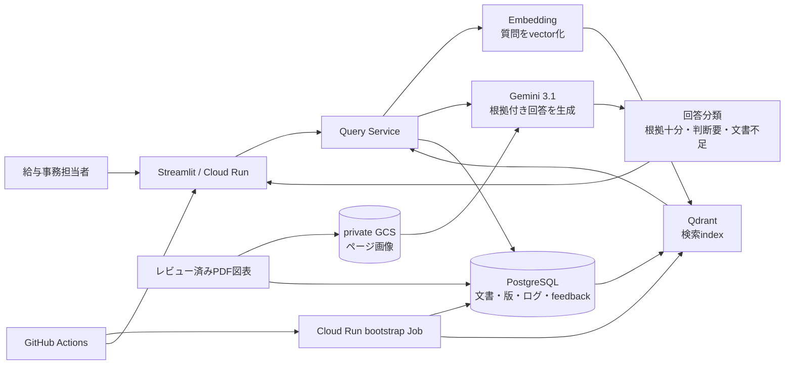
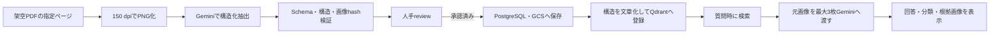

# 2026年9月22日〜9月30日の変更まとめ

## 1. この資料の目的

この資料は、2026年9月22日から9月30日までに自治体向け制度問い合わせ支援RAGへ加えた変更を、初めてRAG開発を見る人にも分かるように整理したものである。

単なるコミット一覧ではなく、次の順序で説明する。

1. 以前はどのような状態だったか
2. 何が課題だったか
3. どの技術を、どのような役割で追加したか
4. 何を測って採用・不採用を決めたか
5. 現在どこまで完成し、何が残っているか

対象期間のGit履歴は93コミットある。ただし、この数には評価用PDF、画像、CSV、JSONLなどの検証artifactも含まれる。コミット数やファイル数を成果の中心にはせず、設計・実装・評価・公開の流れを9つの技術テーマにまとめる。

> [!NOTE]
> この資料は2026年9月30日時点のローカルリポジトリと保存済み評価結果を根拠にしている。公開環境やAPI利用枠は変化するため、対外説明の直前には再確認が必要である。

> [!TIP]
> この資料は期間内の変更全体を説明する概要である。Contextual heading、Query Decomposition、版注記、Version Resolver、日付計算、BM25などの処理原理と原理的な弱点は、[精度改善手法の技術ガイド](../eval/reports/ACCURACY_METHODS_TECHNICAL_GUIDE.md)で確認できる。

## 2. 8日間で何が変わったか

### 変更前後の概要

| 観点 | 9月22日時点の中心構成 | 9月30日時点 |
|---|---|---|
| 検索 | Chromaを使ったテキスト検索 | Qdrantによる検索index。Contextual heading、Top-8、限定的なQuery Decompositionを追加 |
| 文書・ログ管理 | ファイルとJSONLが中心 | PostgreSQLを文書・版・実行ログ・feedbackの正本として利用 |
| 回答 | Geminiによる回答 | Gemini 3.1 Flash-Liteの構造化回答、分類、版競合処理、限定的な日付計算 |
| 対象文書 | Markdown中心 | Markdownに加え、レビュー済みPDF図表のvertical sliceを実装 |
| 図表 | 回答経路なし | PDF画像化、構造抽出、人手review、検索、元画像を使う回答、根拠画像表示 |
| 評価 | 比較的簡単な検索質問 | 難問、500問benchmark、130問開発回帰、Text/Visual sealed holdout |
| クラウド | 既存Cloud Run構成 | Cloud Run、Cloud SQL、Qdrant Cloud、private GCSを接続した公開RAG v2 |
| CI/CD | 基本的な構成 | test・Ruff・Terraform検証、承認付きdeploy、bootstrap、health確認、traffic切替 |
| 説明資料 | READMEへ情報が集中 | READMEを入口にし、評価と設計の詳細を別資料へ分離 |

### 現在の全体構成

この構成で大切なのは、**PostgreSQLとQdrantの役割を分けたこと**である。PostgreSQLは文書やログを失ってはいけない「正本」、Qdrantは正本から作り直せる「検索用index」である。

## 3. 変更の時系列

### 3.1 9月22日: CI/CDとIaCの土台を整備

#### 何を変更したか

- GitHubへのpushとpull requestで、PytestとRuffを実行するCIを追加した。
- Cloud Runへのdeployを、GitHubのproduction environment承認後にだけ進める構成にした。
- GitHub ActionsからGoogle Cloudへ接続するため、Workload Identity Federationとdeploy用service accountをTerraformで定義した。
- Terraform state用GCS bucketの保護設定と、plan結果を記録した。

#### 初学者向け解説

**CI**は、コードをGitHubへ送ったときに、テストや書式チェックを自動で実行する仕組みである。人が毎回同じコマンドを打つより、確認漏れを減らせる。

**CD**は、検証済みのコードを実行環境へ配る仕組みである。このプロジェクトではproduction environmentの承認を境界にし、意図しない公開を防いでいる。

**IaC**は、service accountや権限などのクラウド設定をTerraformコードで表す方法である。毎回クラウドを作り直す仕組みではない。コードと実環境の差をTerraformが調べ、必要な変更だけを適用する。

**Workload Identity Federation**は、長期間使えるservice account keyをGitHubへ保存せず、一時的な認証情報でGoogle Cloudへ接続する仕組みである。秘密鍵の漏えいリスクを減らせる。

#### なぜ必要だったか

ポートフォリオでは、アプリが一度動くだけでなく、変更後も同じ品質で公開できる再現性が重要である。CI/CDとIaCを先に整え、その後の大きなRAG変更を安全に反映できる土台を作った。

### 3.2 9月22日〜23日: 評価セットを意図的に難しくした

#### 何を変更したか

- 複数文書、似た節、文書不足、言い換えを含む難問20件を追加した。
- 検索失敗、回答生成失敗、回答分類失敗、文書に根拠がないケースを分けて記録した。
- 質問の幅を広げるため、給与事務担当者を想定した500問benchmarkを作成した。
- 人手レビュー用sheetを作り、評価質問と正解条件を固定した。
- 100問でGeminiによるEnd-to-End評価を実行した。

#### 分かったこと

最初のPractical質問ではRecall@3とRecall@5が1.00だった。しかし難問20件では、検索対象15件のうち、必要な根拠見出しをすべてTop-3へ出せたのは8件、Top-5では10件だった。

主な弱点は、文書全体を見失うことより、**正しい文書の中にある似た節から必要な節を上位へ出せないこと**だった。

#### 初学者向け解説

**Recall@3**は、正解として定めた文書や節が検索結果の上位3件に入った割合である。複数の根拠が必要な質問では、すべて取れた場合だけ成功とする。

簡単な質問だけでRecallが100%でも、実利用で高精度とは限らない。質問が見出しとほぼ同じなら、検索は簡単だからである。このため、評価セット自体を難しくして弱点が表面化するかを確かめた。

### 3.3 9月26日〜27日: 最終仕様と評価契約を定義

#### 何を変更したか

- RAGの目標構成、データの責務、構造化回答Schemaを設計資料へ記録した。
- TextとVisualのdevelopment setとsealed holdoutを分離した。
- フローチャート、期限タイムライン、表、帳票の架空PDF fixtureを作った。
- 日本語スキャン、回転画像、低品質スキャンを用意し、取込時の失敗条件を試した。
- holdoutの質問、hash、goldを固定し、開発中に正解を見ないcustody手順を作った。

#### 初学者向け解説

**fixture**は、テストで繰り返し使う固定の入力データである。ここでは架空のPDF、ページ画像、期待する構造がfixtureに当たる。

**sealed holdout**は、改善に使わず最後に一度だけ開封する試験問題である。同じ問題を見ながら何度も直すと、その問題だけ得意になる「過学習」が起きる。開発用評価と未見評価を分けることで、未知の言い換えにも効くかを確認する。

**構造化回答**は、LLMに自由文だけを返させず、claim、根拠、未確定条件などをJSON Schemaに沿って返させる方式である。後続コードが各項目を検証しやすく、画面表示と監査ログを安定させられる。

### 3.4 9月27日: PostgreSQLとQdrantを使うRAG v2へ移行

#### PostgreSQLを追加

PostgreSQLへ次のデータを保存するようにした。

- 文書と文書version
- 見出し、段落、図表などのcontent element
- 質問request
- 検索結果
- 回答生成と分類のattempt
- 表示したclaimと根拠link
- 利用者feedback

これにより、一つのrequest IDから「何を質問し、何を検索し、どの回答を生成し、どう分類し、利用者がどう評価したか」をSQLで追跡できる。

#### Qdrantを追加

文書要素のvectorとmetadataをQdrantへ保存し、質問に近い要素を検索するようにした。PostgreSQLのcontent elementとQdrant pointは安定UUIDで対応させ、indexを再構築しても同じ要素を追跡できる。

#### 初学者向け解説

**Embedding**は、文章の意味を数値の並びであるvectorへ変換する処理である。意味が近い文章ほど、vector空間でも近くなるように学習されている。

**Vector DB**は、そのvectorから近いデータを高速に探す仕組みである。Qdrantは検索に特化しているが、業務上の正本や複雑な実行ログの管理はPostgreSQLの方が適している。

**Migration**は、DBの表や列を履歴付きで変更する手順である。このプロジェクトではAlembicを使い、ローカルとCloud SQLへ同じ変更を適用する。

#### DB移行の検証

ChromaとQdrantでEmbedding、chunk、Top-k、質問16件を同じにした結果、Hit@1、Hit@3、Hit@5と検索順位はすべて一致した。

Qdrantの採用理由は精度向上ではない。metadata filter、安定ID、再構築、PostgreSQLとの責務分離を行いやすくするためである。DBを変えただけで精度が上がったとは説明しない。

### 3.5 9月27日: 検索・モデルを同じ条件で比較

#### Embeddingモデル比較

| モデル | 全根拠見出しHit@5 | 最初の正解根拠MRR | 判断 |
|---|---:|---:|---|
| Gemini Embedding 001 | 74/88 | 0.861 | 維持 |
| Gemini Embedding 2 768 | 72/88 | 0.847 | 不採用 |
| Ruri v3 310M | 74/88 | 0.815 | 不採用 |

Gemini 2は一部を改善したが別の質問を退行させ、Ruriは主要指標が同数でも文書不足が1件増えた。主要指標で同率かつMRRが最良だった`gemini-embedding-001`を維持した。

**MRR**は、最初の正解が何位に出たかを見る指標である。正解が1位なら高く、下位になるほど小さくなる。Hit@5が同じでも、利用者が早く正解へ到達できるかを比較できる。

#### Contextual heading

段落だけでなく、文書名と見出し階層を検索対象の文章へ加えた。似た内容の節を区別しやすくなり、全根拠見出しHit@5は74/88から78/88、section missingは11件から7件へ改善した。

#### Top-k

検索候補を5件から8件へ増やした。影響が想定される8問では必要内容の一致が6/8から8/8になった。一方でGeneratorへ渡す入力が増え、費用は約36%増えるため、効果と費用を一緒に記録した。

#### 回答・分類モデル

Gemini 3.1 Flash-Liteを構造化回答と分類へ採用した。分類用benchmark 36件ではGeminiが31件正解、BGE-M3が6件正解だった。BGE-M3はローカル実行と費用面で有利だが、日本語の業務分類との適合が不足したため採用しなかった。

### 3.6 9月27日〜28日: クラウドへRAG v2を公開

#### 追加したクラウド構成

| サービス | 役割 |
|---|---|
| Cloud Run | StreamlitアプリとRAG処理を実行 |
| Cloud SQL for PostgreSQL | 文書、版、ログ、feedbackの正本 |
| Qdrant Cloud | 検索用vector index |
| Google Cloud Storage | レビュー済みPDFページ画像を非公開保存 |
| Secret Manager | DB接続情報とQdrant API keyを管理 |
| Cloud Run Job | deploy前にmigrationとデータ取込を実行 |

#### deployの順序

1. GitHub Actionsでtest、Ruff、Terraformを検証する。
2. commit SHA付きDocker imageを作る。
3. Cloud Run JobでAlembic migrationを適用する。
4. 文書をPostgreSQLへupsertし、Qdrant indexを作る。
5. DBとindexの件数・IDが一致するか確認する。
6. 代表質問を1件実行する。
7. すべて成功した場合だけCloud Run serviceを更新する。
8. trafficをlatest revisionへ切り替え、healthを確認する。

**冪等なupsert**とは、同じデータをもう一度登録しても重複を増やさず、同じIDを更新できる処理である。deployを再実行しても文書が増殖しないようにした。

#### 費用と保護策

- Cloud SQLは`db-f1-micro`と10 GiB HDDで、確認時点の概算は月額約US$8.57だった。
- QdrantはFree clusterを使用した。
- Google Cloudで月額2,000円の予算alertをTerraform管理した。
- Cloud SQLにはdeletion protectionを設定した。
- 予算alertは利用を自動停止する上限ではなく、超過を知らせる通知である。

### 3.7 9月28日: PDF・図表を回答できるvertical sliceを実装

#### 実装した流れ

#### 技術的な考え方

図表をそのままvector検索する構成にはせず、フローチャートのnodeとedge、表のcell、期限の順序などを構造化JSONへ変換し、それを検索可能な文章へ直した。回答時には元画像もGeminiへ渡し、構造化時の情報損失を補う。

LLMが抽出した内容を自動で正本にせず、次のgateを設けた。

- JSON Schemaに合うこと
- nodeやedgeなどの参照関係が壊れていないこと
- 元画像のSHA-256が一致すること
- 人が内容を確認し、`reviewed`として承認したこと

#### 実装済みと未実装の境界

実装済みなのは、レビュー済みの架空PDF図表を取り込み、検索し、元画像を使って回答し、根拠画像を表示する一連の経路である。

任意PDFのWeb upload、抽出内容を修正する管理画面、PDF全ページの自動判定、無確認OCR、大量文書運用は実装していない。

#### Visual sealed holdout

開発に使っていないPDF 4件・10問では、必要文書取得率100%、回答キー包含率90%、End-to-End成功率70%だった。一方、回答分類精度は70%で、事前閾値80%を下回ったため総合判定は不合格とした。

検索と回答内容が良くても、根拠から回答できる質問を不要に`判断要`へ寄せる分類失敗が残った。End-to-End成功だけでなく、構成要素を分けて測る必要性が分かった。

### 3.8 9月28日〜29日: End-to-End精度を原因別に改善

#### このRAGでの「精度」

このプロジェクトでは、次のすべてを満たした質問を総合回答成功とする。

1. 必要な文書・節を検索できる。
2. 質問に必要な内容を回答できる。
3. 回答の主張が取得根拠に支持される。
4. `根拠十分`、`判断要`、`文書不足`を正しく分類できる。
5. 安全な表示契約を満たす。

検索だけ良くても、誤った回答や分類を表示すれば利用者にとっては失敗である。そのためRecallと総合回答成功率を分けている。

#### 改善前の開発評価

開発用130問では117/130、失敗13件だった。

| 主原因 | 件数 | 失敗13件に占める割合 |
|---|---:|---:|
| 回答生成 | 6 | 46.2% |
| 回答分類 | 4 | 30.8% |
| 検索 | 3 | 23.1% |

#### 試したが採用しなかった方法

| 方法 | 狙い | 結果 | 判断 |
|---|---|---|---|
| Required facets prompt | 最大原因だった回答生成6件をまとめて直す | 対象4件の厳密改善0、既存成功control 6件中4件が退行 | 不採用 |
| BM25 Hybrid | 固有語の一致で検索不足を補う | 対象改善0、全根拠Hit@5が80/90から73/90、既存成功8件が退行 | 不採用 |
| 分類prompt全体へ版規則を追加 | 新旧文書の選択を改善 | 対象7件中5件改善、control 10件中2件退行 | 影響範囲が広いため不採用 |
| BGE-M3分類器 | ローカル分類で費用とAPI依存を減らす | 36件中6件正解。Geminiは31件正解 | 不採用 |

最大原因から試したものの、一つの広いprompt変更では失敗の種類が揃っておらず、既存成功を壊した。小さいpilotで止めたことで、費用と退行を抑えた。

#### 採用した対象限定の方法

| 方法 | 解決する問題 | 効果 |
|---|---|---|
| Query Decomposition | 一つの質問に複数の検索意図がある | Q436を単独改善し、Q291改善の前提を作った |
| 生成前の版注記 | 新旧両方を取得した後、Generatorが旧版を選ぶ | Q291で旧版採用を防いだ |
| 条件付きVersion Resolver | 通常分類を変えず、版競合だけ再判定する | Q286を単独改善し、Q291にも寄与 |
| 規則を2種類へ縮小 | 広い適用による退行を防ぐ | 効果のない規則と退行規則を除いた |

結果は120/130、92.3%で、改善3件、退行0件だった。Q291は複数の変更が組み合わさって成功したため、各方法の寄与を単純に3件ずつ加算しない。

#### Text sealed holdoutで分かったこと

候補を固定した後、開発に使っていない50シナリオ・100表現で評価した。

| 指標 | 結果 |
|---|---:|
| 総合回答成功 | 83/100 |
| Scenario stability | 39/50 |
| 回答分類 | 86/100 |
| 回答内容 | 94/100 |
| Document retrieval | 100/100 |
| Evidence retrieval | 100/100 |

検索は100/100だったため、次の主対象は検索後の処理になった。特に、根拠が揃っているのに`判断要`へ寄せる過剰な慎重さと、具体期限を聞かれても起算規則だけを答える不足が見つかった。

#### Holdout後の日付改善

具体的な起算日と暦日規則が根拠に明記されている場合だけ、コードで期限日を計算する処理を追加した。LLMに暗算させず、入力条件をLLMが抽出し、日付演算は決定的なPythonコードが担う責務分離である。

初回holdoutとは異なる新規4表現で4/4に成功した。ただし改善後の2回目のText sealed holdoutは未実施であり、全体が83%から何%へ上がったかはまだ主張できない。

### 3.9 9月29日〜30日: 公開運用の失敗を再発防止へ変えた

#### 根拠のない日付計算を拒否

最初の公開smokeで、文書には「14日以内」しかないのに、LLMが「当日を1日目」と補って期限日を断定した。promptだけに契約を任せず、根拠本文に起算規則の明示表現がなければ日付計算を破棄するコード検証を追加した。

これは「モデルへ注意書きを増やす」だけでなく、守るべき安全条件をアプリケーション側で強制する変更である。

#### provider errorの扱いを分離

- 503は一時的な混雑として、5.1秒、10.2秒の指数バックオフで最大2回だけ再試行する。
- 429は利用枠の問題として追加retryせず停止する。
- その他は通信エラーとして分けて画面表示する。
- Gemini SDK内部の隠れた再試行を防ぐため、`retries=0`を明示した。

**指数バックオフ**は、失敗直後に連打せず、待ち時間を段階的に増やして再試行する方法である。503のような短時間の混雑には有効だが、利用枠を使い切った429には効果がないため、エラー種類ごとに処理を分けた。

#### Cloud Run trafficを明示

rollback後に新revisionを作っても、公開trafficが旧revisionへ残る問題を発見した。deploy後に`--to-latest`でtrafficを明示的に切り替え、その後healthを確認するようCDを修正した。

#### READMEと評価資料を再構成

9月30日に次をローカルbranchとdraft PR #15へ追加した。

- READMEをプロジェクト全体の入口へ縮小
- 利用者、文書管理者、AIの関係を示す構成図
- ダミー問い合わせ例
- コメント付きディレクトリ構成
- 精度改善の原因、採否、実測値をまとめた評価資料
- 図表RAGの実装済み・未実装範囲を分けた資料

この変更は説明資料の改善であり、RAGの推論精度を上げる変更ではない。2026年9月30日時点ではdraft PRであり、mainへは未mergeである。

## 4. 主要な技術変更をファイルから追う

| 関心 | 主な場所 | 初学者向けの読み方 |
|---|---|---|
| 問い合わせ全体 | `src/query_service.py` | 検索、生成、分類、保存をどの順で呼ぶかを見る |
| Qdrant検索 | `src/qdrant_index.py` | vectorとmetadataをどう登録・検索するかを見る |
| PostgreSQL | `src/persistence/`、`migrations/` | 保存する表と、DB変更履歴を分けて読む |
| 図表取込 | `src/visual_ingestion.py` | PDF画像化からreview済み登録までを追う |
| 日付計算 | `src/deadline_calculator.py` | LLMの抽出結果を決定的コードでどう検証するかを見る |
| Cloud初期化 | `cloud_bootstrap.py` | deploy前にmigration、取込、smokeをどう行うかを見る |
| CI/CD | `.github/workflows/` | どのイベントで検証・deployが動くかを見る |
| Google Cloud | `infra/` | Cloud SQL、GCS、IAM、予算をコードで確認する |
| 評価runner | `eval/` | 質問、正解条件、実行結果、採用判断を対応させる |

## 5. この期間に得られた設計上の学び

### 5.1 技術を変えることと精度を上げることは別

ChromaからQdrantへ変えても、同じ条件では検索順位は変わらなかった。Qdrantは運用・拡張・責務分離のために採用し、精度改善はContextual headingなど別の実験で確認した。

### 5.2 最大件数の原因が、最も安く直せるとは限らない

回答生成失敗が6件で最大だったが、広いprompt変更は既存成功を4件退行させた。一方、検索失敗3件には共通性があり、限定的なQuery Decompositionから最終的な3件改善へつながった。

### 5.3 LLMへ任せる責務を狭くする

日付計算、版条件、Schema検証、表示契約はコードでも検証する。LLMは文章理解に強いが、毎回必ず同じ規則を守る保証はない。決定できる部分を通常コードへ移すと、再現性とテスト容易性が上がる。

### 5.4 検索成功だけではRAG成功にならない

Text holdoutでは検索が100/100でも総合成功は83/100、Visual holdoutでは必要文書取得100%でも分類精度70%だった。検索、回答内容、根拠支持、分類、表示を別々に計測する必要がある。

### 5.5 効かなかった実験も成果になる

Embedding変更、BM25 Hybrid、Required facets prompt、BGE-M3分類器は採用しなかった。しかし条件、費用、改善、退行を保存したことで、流行の技術を理由なく採用せず、実測から判断したことを説明できる。

## 6. 検証済みの主な数値

| 評価 | 実測 | この数値が示すこと |
|---|---:|---|
| 難問検索 | 全根拠Hit@3 8/15、Hit@5 10/15 | 初期評価が簡単すぎた |
| Qdrant移行 | 16問でChromaと順位差0 | DB移行による検索退行なし |
| Embedding比較 | Gemini 001のHit@5 74/88、MRR 0.861 | 現行Embedding維持が妥当 |
| Contextual heading | Hit@5 74/88 → 78/88 | 見出し文脈が節選択に有効 |
| Top-k比較 | 必須内容一致 6/8 → 8/8 | 候補増加が複数条件質問に有効 |
| 開発用End-to-End | 117/130 → 120/130、退行0 | 対象限定の3手法を採用 |
| Text sealed holdout | 総合83/100、検索100/100 | 次の主課題は検索後の処理 |
| 日付改善の新規表現 | 4/4 | 対象機構は動作。全体一般化は未確認 |
| Visual sealed holdout | End-to-End 70%、分類70% | 図表経路は成立。分類gateは不合格 |
| 分類モデル比較 | Gemini 31/36、BGE-M3 6/36 | 現行Geminiを維持 |

異なる評価セットの数値を、単純な前後比較には使わない。例えば開発130問の92.3%とText holdoutの83%は質問が異なり、前者から後者へ9.3ポイント悪化したという意味ではない。

## 7. 2026年9月30日時点の状態

### 完了していること

- PostgreSQLとQdrantを使うRAG v2の実装と公開
- 文書、検索、生成、分類、根拠、feedbackをrequest IDで追跡するログ
- レビュー済みPDF図表6件を使うvisual RAG vertical slice
- 検索・Embedding・分類モデル・回答改善の比較実験
- TextとVisualのsealed holdout初回評価
- CI、承認付きCD、Terraform、予算alert
- 503 retry、429 fail-fast、Cloud Run traffic切替の運用改善

### 未完了または限定的なこと

- 日付改善後の2回目のText sealed holdout
- Visual holdoutで事前閾値を下回った分類精度の改善
- 任意PDF uploadと文書管理・review UI
- 大量文書、同時アクセス、SLAを前提にした性能検証
- 和暦、相対日付、営業日・休日を含む一般的な期限計算
- Gemini SDK retry無効化を含む最新mainの公開反映確認
- README再構成を含むdraft PR #15のreviewとmerge

### 公開環境についての注意

保存済み証拠では、Cloud Run revision `municipal-rag-assistant-00009-j49`がReadyで、traffic 100%、通常質問の回答と根拠表示まで確認済みである。具体期限と図表の最終smokeはGeminiのprovider制約により未完了だった。

PR #14でSDK内部retryを無効化したコードはmainへmerge済みだが、そのdeployはGeminiの日次枠によりbootstrapで停止した。このため、新しいDocker imageを作れたことと、公開revisionへ反映済みであることを混同しない。

## 8. 面接での説明例

> 既存RAGに対して、まずCIと評価基盤を整え、簡単な評価では見えなかった節選択の弱点を難問で発見しました。次にPostgreSQLを文書とログの正本、Qdrantを再構築可能な検索indexとして分離し、Cloud Run、Cloud SQL、Qdrant Cloud、GCSへ公開しました。
>
> 精度改善では、検索、生成、分類を別々に測りました。最大原因だった生成promptの一括修正は既存成功を壊したため不採用にし、共通性のある複合質問と版競合だけへ変更を限定しました。その結果、同じ130問で117件から120件へ改善し、退行は0件でした。一方、未見100表現では83件だったため、開発評価だけで完成とは判断せず、日付計算と分類を次の課題として記録しています。
>
> 図表についても、PDFを画像化してLLM出力をそのまま公開するのではなく、Schema、構造、画像hash、人手reviewを通したデータだけを登録し、回答時は元画像を再確認するvertical sliceを実装しました。Visual holdoutでは検索100%でも分類70%だったため、総合受入は不合格として限界も公開しています。

## 9. 関連資料

- [README](../README.md)
- [精度改善の流れ](../eval/reports/ACCURACY_IMPROVEMENT.md)
- [精度改善手法の技術ガイド](../eval/reports/ACCURACY_METHODS_TECHNICAL_GUIDE.md)
- [図表RAGの実装状況](../eval/reports/VISUAL_RAG_STATUS.md)
- [Qdrant移行評価](../eval/QDRANT_MIGRATION_EVALUATION.md)
- [Embeddingモデル比較](../eval/EMBEDDING_MODEL_EVALUATION.md)
- [分類モデル比較](../eval/CLASSIFIER_MODEL_COMPARISON.md)
- [Text sealed holdout受入評価](../eval/TEXT_HOLDOUT_ACCEPTANCE_RESULTS.md)
- [Visual sealed holdout v2結果](../eval/VISUAL_HOLDOUT_V2_RESULT.md)
- [精度改善の意思決定](../eval/ACCURACY_IMPROVEMENT_DECISION_REPORT.md)
- [統合候補評価](../eval/INTEGRATED_QUERY_CANDIDATE_EVALUATION.md)
- [公開RAG v2構成](CLOUD_RAG_V2_DEPLOYMENT_PLAN.md)
- [2026年9月29日の公開受入記録](PUBLIC_RELEASE_RESULT_2026-09-29.md)
- [学習と利用枠の運用](LEARNING_AND_USAGE_PLAN.md)
