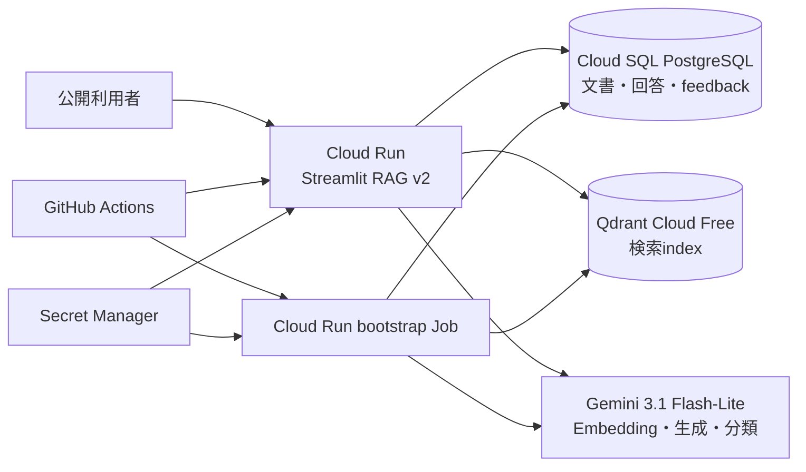

# Public RAG v2 deployment plan

- 作成日: 2026-09-27
- 状態: `PUBLIC_RAG_V2_LIVE_SMOKE_VERIFIED`
- 目的: localで検証したQdrant、PostgreSQL、Gemini 3.1のRAG v2を公開Cloud Runへ反映する
- Terraform apply: 予算2件とRAG v2基盤12件を追加、0 change、0 destroy

## 1. 公開構成

ローカルのPostgreSQL containerをCloud SQLへ、Qdrant containerをQdrant Cloudへ置き換える。アプリケーションのrepositoryとvector index interfaceは維持する。

## 2. Terraform apply

2026-09-27に既存GCS backendのstateをrefreshし、予算を先行適用した後、次のRAG v2基盤を適用した。適用後のplanは`No changes`だった。

| 分類 | 追加resource |
|---|---|
| API | Cloud SQL Admin、Secret Manager |
| Cloud SQL | PostgreSQL 16 zonal `db-f1-micro`、10 GiB HDD、`rag_portfolio` DB、`rag_app` user |
| Secret | `rag-database-url`とversion、`qdrant-api-key`のcontainer |
| IAM | runtime service accountのCloud SQL Client、2 secretへのSecret Accessor |
| Credential | 32文字の英数字DB passwordを生成 |

Cloud SQL instanceは`RUNNABLE`、接続名は`municipal-rag-portfolio:asia-northeast1:municipal-rag-postgres`である。`rag-database-url`のversion 1まで作成済みである。Qdrant Free clusterはGCP Sydney（`australia-southeast1`）で`HEALTHY`、database API keyはSecret Managerの`qdrant-api-key` version 5へ登録済みである。

既存Cloud Run、Artifact Registry、WIF、deployer service accountへの変更とresource削除はない。Cloud SQL instanceはTerraformの`deletion_protection = true`とし、誤ったdestroyを拒否する。

DB passwordと接続URLはTerraform stateにsensitive valueとして保存される。stateは既存の非公開GCS backendに保存し、CLI出力やrepositoryへ値を記録しない。Qdrant database API keyの値はcluster作成後にSecret Managerへ一度だけ登録し、Terraformではsecret containerとIAMだけを管理する。

## 3. 費用

2026-09-27に[Cloud SQL公式価格表](https://cloud.google.com/sql/pricing)で東京リージョンを確認した。

| 項目 | 単価 | 730時間の概算 |
|---|---:|---:|
| `db-f1-micro` | $0.0105 / hour | $7.665 |
| HDD 10 GiB | $0.000123288 / GiB-hour | $0.900 |
| Cloud SQL小計 |  | **約$8.57 / month** |
| Qdrant Cloud Free | $0 | $0 |

Cloud Run、Secret Manager、Gemini、network、税、為替は利用量により別途発生する。`db-f1-micro`はshared CPUでSLA対象外である。Qdrant Free clusterは学習・demo用で、未使用時のsuspendや削除条件を受け入れる。

Cloud SQLは`activation_policy = ALWAYS`のため、質問がない時間もinstance料金が発生する。公開を終了するときは、必要な評価証拠を保存し、deletion protectionを明示的に解除してdestroyする。

課金resourceより先に、このprojectだけを対象とする月額2,000円のCloud Billing予算をTerraformで作成した。実費の50%、80%、100%で標準のrole-based email通知を送る。予算は利用停止や上限固定を行う機能ではなく、超過を知らせるガードレールである。請求先アカウントには以前から全project対象の月額1,000円予算もあり、対象範囲が異なるため維持する。

## 4. CDの順序

`main`へのpush、CI成功、GitHub `production` environment承認後に次を行う。

1. commit SHA付きimageをbuildしてArtifact Registryへpushする。
2. `CLOUD_SQL_CONNECTION_NAME`と`QDRANT_URL`が空でないことを検査する。
3. `municipal-rag-bootstrap` Cloud Run Jobを同じimageで実行する。
4. Alembic migrationを適用する。
5. 5文書をPostgreSQLへupsertし、contextual headingでEmbeddingしてQdrantへupsertする。
6. PostgreSQLのINDEXED elementとQdrant point IDが一致することを確認する。
7. `給与支給日はいつですか？`をGemini 3.1で1問実行し、request ID、分類、参照件数を記録する。
8. 上記が成功した場合だけCloud Run serviceへ同じimageをdeployする。
9. Streamlit health endpointを確認する。

bootstrapは5文書を再upsertする。安定UUIDによりDB行とQdrant pointは増殖しないが、Embedding APIは再実行される。文書数が増える場合は、content hashとembedding profileによる差分取込へ変更する。

Cloud RunとCloud SQLの接続にはCloud SQL Auth Proxy統合のUnix socketを使う。公式手順は[Cloud RunからCloud SQLへ接続](https://docs.cloud.google.com/sql/docs/postgres/connect-run)を参照する。Qdrantは公式Python clientの`url`と`api_key`を使用し、全requestでdatabase API keyを送る。[Qdrant Cloud authentication](https://qdrant.tech/documentation/cloud/authentication/)

## 5. 外部設定

Google Cloud側のTerraform apply後に次を設定する。

| 設定先 | 名前 | 値 |
|---|---|---|
| Qdrant Cloud | cluster | `municipal-rag-portfolio`、GCP `australia-southeast1`、Free tier |
| Secret Manager | `qdrant-api-key` | database API key。version 5だけを有効化 |
| GitHub production variable | `QDRANT_URL` | Qdrant HTTPS endpoint |
| GitHub production variable | `CLOUD_SQL_CONNECTION_NAME` | Terraform output |

Secret値はGitHubへ保存しない。Cloud Runとbootstrap JobはSecret Managerのversion 5を明示して環境変数として受け取る。2026-09-28にversion 5からQdrantの`/collections`へHTTP 200で接続できることを確認し、旧database API keyをQdrant Cloudから削除、Secret Manager version 1〜4を無効化した。keyをrotationするときは、新versionの動作確認後にworkflowのversion番号を更新する。

## 6. Go-live判定

次をすべて満たした場合だけRAG v2を公開済みと記載する。

- Terraform apply後のplanが0 changeである。
- bootstrap Jobがmigration、5文書・86 element、Qdrant整合性、代表質問を完了する。
- 公開URLで回答分類、本文、8件の根拠が表示される。
- feedback 1件がPostgreSQLへ保存される。
- SQLでrequest、retrieval、generation、classification、feedbackを結合して取得できる。
- Cloud Run revisionのcommit SHAと実行日時を記録する。

### 2026-09-28の実測

- GitHub Actions run `36359613114`はtest、lint、Terraform検証、bootstrap Job、service deploy、health checkの全工程が成功した。
- bootstrap execution `municipal-rag-bootstrap-jtkms`はmigrationをheadへ適用し、5文書・86要素を登録した。PostgreSQLのINDEXED要素86件とQdrant point 86件はmissing 0、unexpected 0だった。
- bootstrapの代表質問「給与支給日はいつですか？」は`根拠十分`、参照8件で成功した。
- revision `municipal-rag-assistant-00005-rwd`はcommit `4a621fcb938b37d718cb294c51870733531387e7`のimageを使用し、traffic 100%、`Ready=True`だった。
- 公開URLのhealth endpointとトップページはHTTP 200だった。実ブラウザから同じ質問を実行し、毎月21日、休日の場合は直前の営業日という回答、`根拠十分`、参照8件を確認した。
- 公開画面から「採用した」とコメント「公開RAG v2デプロイ後の動作確認」を送信し、「フィードバックを保存しました。」を確認した。
- request、retrieval、generation、classification、feedbackのSQL結合は同じschemaのローカル実DBで確認済みである。今回のCloud SQLに対する直接のread-only SQL監査は、ローカルにADCとCloud SQL Auth Proxyがないため未完了とし、公開画面の保存成功と混同しない。

## 7. Rollback

新revisionに問題がある場合は、一つ前のCloud Run revisionへtrafficを戻す。Cloud Runのrevisionはimageとenvironment設定を固定して保持するため、旧Chroma revisionへtrafficを戻せる。Cloud SQLとQdrantは削除せず、原因調査と再deployに使う。ロールバック手順はgo-live前に一度dry-runで確認する。

公開終了時のdestroyはrollbackと別操作である。Cloud SQLのdeletion protection解除、Qdrant cluster削除、Secret無効化、最終plan確認を順に行う。

## 8. 未実装範囲

この公開で対象にするのは現時点のtext RAG v2である。PDF・図表はfixture、gold、validatorまで完成しているが、runtime取込と画像付き回答はまだ公開経路へ接続していない。図表vertical sliceの実装後、同じPostgreSQL、Qdrant Cloud、Cloud Runへ追加する。
