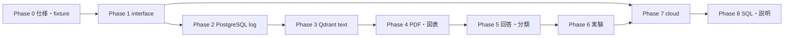

# RAG実装計画

## 1. 進め方

各段階は一つの検証可能な目的に限定する。前段の受入条件を満たすまで次へ進まず、READMEでは現行実装と目標構成を分けて記載する。モデル、Embedding、チャンク、検索方式を同じ比較で同時変更しない。各Phaseは[学習・Codex利用枠運用計画](LEARNING_AND_USAGE_PLAN.md)の学習単位へ分割し、開始前にUsageを確認する。

## 2. 段階と受入条件

### Phase 0: 仕様・fixture・評価境界を固定する

**作業**

- 本design一式とJSON Schemaをレビューする。
- 既存100シナリオ・500表現をtext development / regression v1.0として固定し、別の架空文書familyからtext sealed holdout 50シナリオ・100表現を作る。各scenarioは同じ正解条件を持つformalとparaphrase/noisyの2表現とし、質問文とgoldのhashだけをrepositoryへ置く。
- 必須6図表についてdevelopmentとholdoutで重複しない最低2つの文書familyを持つ架空PDF fixtureとgold annotationを作る。
- 図表50シナリオを30件のdevelopmentと20件のsealed holdoutへ文書・版・図表family単位で分ける。ユーザーをgold custodianとし、holdoutの質問文、構成、source PDFとgoldのhashだけをrepositoryへ置く。source PDF本体と正解は開封までcommit対象外のローカルartifactで管理し、候補実装を固定した後に初めてsource PDFを入力する。
- Cloud SQL、GCS、Qdrant Cloud、Geminiについて最小接続と費用を確認する。課金リソースは作成前に承認を得る。

**受入条件**

- 各fixtureの期待ページ、bbox、表セル、flow edge、回答根拠が機械可読である。
- text sealed holdoutの文書familyが既存development文書と重複せず、同じscenarioの派生表現がsplitをまたがない。
- manifestにsplit、文書、質問、schemaのhashがある。
- holdoutのPDFと正解を実装調整へ使わず、候補実装、予測、開封の順序を検査する手順が明記されている。
- 接続先、認証、見積費用、停止手順が記録されている。

### Phase 1: interfaceとローカル基盤

**作業**

- repository interfaceを定義する。
- Docker ComposeへPostgreSQLとQdrantを追加する。
- schema migration、health check、設定検証を実装する。

**受入条件**

- アプリケーションのcore testが外部SDKなしでfake実装を使える。
- clean environmentでmigration、起動、health checkが再現する。
- 接続情報がrepositoryへ保存されない。

### Phase 2: PostgreSQLログへの移行

**作業**

- request、retrieval、generation、feedbackをrequest IDで保存する。
- 現行JSONLは移行期間のexportだけにする。
- PII maskと30日retention jobを実装する。

**受入条件**

- 一質問の検索、回答、分類、feedbackをSQLで結合できる。
- 検索・生成・分類・API失敗を別々に集計できる。
- 保存失敗時に成功回答として扱わない。

### Phase 3: Qdrantテキスト検索への移行

**作業**

- 現行Markdownを安定IDでPostgreSQLへ登録する。
- outbox、worker、抽出世代activation、全index更新用alias、reconciliationを実装する。
- dense検索を実装する。sparse / RRFはPhase 6の独立experimentにする。

**受入条件**

- 同じ原本を2回取り込んでも文書・要素・pointが増えない。
- PostgreSQL commit後、Qdrant upsert前後の障害注入から再開できる。
- 空のQdrantへ全再構築し、ID、hash、件数が一致する。
- development 100シナリオの結果を現行baselineと同じ指標で比較し、退行を個別記録する。

### Phase 4: PDF・図表取込の縦方向実装

**作業**

- PDF描画、テキスト抽出、OCR、領域抽出、構造化、レビューCLIを実装する。
- 6種類のfixtureを取り込み、原画像と構造JSONを関連付ける。

**受入条件**

- 6種類すべてで期待要素、ページ、bboxを取得する。
- goldの金額、日付、期限、表セル、flow edgeに誤りがない。
- 曖昧fixtureは`REVIEW_REQUIRED`となり、自動で`READY`にならない。
- retry、失敗後再開、原本重複のtestを通す。

### Phase 5: 根拠付きマルチモーダル回答

**作業**

- 構造化回答、claimとevidence ID、元画像確認を実装する。
- 回答生成と分類を別工程にする。
- Gemini基準分類器とcode mappingを実装する。

**受入条件**

- 引用IDが`READY + PUBLISHED`版のactive抽出世代だけを指す。
- 金額、日付、期限、要件、可否に根拠がない回答を「根拠十分」で返さない。
- オンラインログには検索不足を記録し、corpus不在はgold annotationを持つ評価結果だけで区別する。
- 各外部依存の障害時動作が[`TEST_STRATEGY.md`](TEST_STRATEGY.md)どおりである。

### Phase 6: 改善実験

**作業**

- 同一Qdrant、同一チャンク、同一評価で現行Embedding、Ruri、Geminiの候補を比較する。
- BM25 sparse + RRF、画像Embedding、reranker、Jev分類器はそれぞれ独立experimentにする。

**受入条件**

- run manifestに全条件、raw result、費用、遅延がある。
- 採用・不採用の理由にdevelopmentとholdoutを混ぜない。
- 効かなかった変更と退行例を残す。

### Phase 7: クラウド永続化とIaC

**作業**

- GCS、Cloud SQL、service account、Secret参照、network設定をTerraformへ追加する。
- Qdrant Cloud接続とバックアップ手順を構成する。
- CI/CDにmigration、smoke test、rollback判定を追加する。

**受入条件**

- Cloud Run revisionを更新しても文書、ログ、feedbackが残る。
- 公開UIから文書を追加できない。
- rate limit、文字数、max instances、API日次上限が有効である。
- backupからPostgreSQLを復元し、空Qdrantを再構築するrunbookを一度実行する。
- 月額見積と実測API費用が予算内である。

### Phase 8: SQL分析とポートフォリオ説明

**作業**

- 失敗分類、文書、質問種別、版、費用、遅延、feedbackをSQLで集計する。
- 最も重い原因を一つ選び、対策前後を比較する。
- README、構成図、評価reportを検証済み事実へ更新する。

**受入条件**

- SQLから件数と個別requestへ追跡できる。
- 改善前後で同じsplit、指標、条件を使う。
- 実装済み、実験中、後続候補が区別されている。
- SnowflakeはPostgreSQLだけでは答えにくい分析課題と十分なデータ量が確認された場合だけ別decisionとして開始する。

## 3. 全体Definition of Done

1. 必須4形式と6図表を、原本・ページ・領域へ追跡できる形で取り込める。
2. PostgreSQLが正本、Qdrantが再構築可能なindex、GCSがbinary正本として動作する。
3. 取込はingestion run ID、質問からfeedbackまではrequest IDで追跡でき、claim-level引用まで辿れる。
4. 重複取込0件、reconciliation不一致0件、空Qdrantからの復元成功を実証する。
5. 固定したbaseline runに対し、text development 100と図表development 30で次を満たした候補だけをtext sealed holdout 50と図表sealed holdout 20へ進める。
   - evidence hit@5を低下させず、対象にした既知失敗を1件以上改善する
   - `判断要`と`文書不足`のrecallをどちらも低下させない
   - 金額、日付、期限、要件、可否の根拠なし断定0件を維持する
6. text sealed holdout 50シナリオ・100表現と図表sealed holdout 20シナリオで次を満たす。textはscenario単位の値を合否判定に使い、2表現間の安定性を別記する。
   - evidence hit@5 90%以上、hit@3 80%以上
   - 内容正解率85%以上
   - 回答分類macro F1 0.80以上
   - 金額、日付、期限、要件、可否に関する根拠なし断定0件
   - 全attemptを分母とするend-to-end success率95%以上
   - 外部API error率5%以下
7. holdoutのp95応答時間10秒以下、1質問のAPI費用0.01 USD以下を目標とし、未達なら実測と理由を記録して公開範囲を判断する。
8. クラウドrevision更新後もデータが永続化され、障害・復元・費用・security controlを説明できる。
9. SQLで最大の失敗要因を示し、一つの変更による効果と限界を再現できる。

閾値未達を結果から除外したり、holdoutを修正して合格扱いにしたりしない。閾値を変える場合は実行前の仕様変更として理由と版を残す。

## 4. 依存順序

## 5. 要求トレーサビリティ

| 要求ID | 要求 | 設計 | 実装段階 | 検証 |
|---|---|---|---|---|
| R-01 | Markdown、text PDF、scan PDF、PDF図表を取り込む | `TECHNICAL_DESIGN.md` §3 | Phase 0, 4 | extraction fixture test |
| R-02 | 必須6図表を検索し、原画像を回答時に確認する | `TARGET_RAG_SPEC.md` §4, §7 | Phase 4, 5 | 図表development / holdout |
| R-03 | 文書版、施行日、根拠位置を追跡する | `DATA_MODEL.md` §3 | Phase 3, 4 | 版境界、page、bbox test |
| R-04 | 回答生成、grounding、分類の失敗を分離する | `TECHNICAL_DESIGN.md` §6 | Phase 5 | oracle / retrieved evidence比較 |
| R-05 | PostgreSQL、Qdrant、GCSの責務と整合性を保つ | `DATA_MODEL.md` §2, §4, §8 | Phase 1–4 | 障害注入、reconciliation、rebuild |
| R-06 | 一要因ずつ品質・費用・遅延を比較する | `TEST_STRATEGY.md` §4, §5 | Phase 6 | version付きrun manifest |
| R-07 | cloudで永続化し、securityと費用を制御する | `TECHNICAL_DESIGN.md` §8, §9 | Phase 0, 7 | restore、abuse、cost gate |
| R-08 | ログとfeedbackからSQLで改善対象を選ぶ | `DATA_MODEL.md` §6, §7 | Phase 2, 8 | 集計からrequestへの追跡 |

表内の節番号はartifactの見出しを指す。見出しを変更した場合はこの表も同じ変更で更新する。
