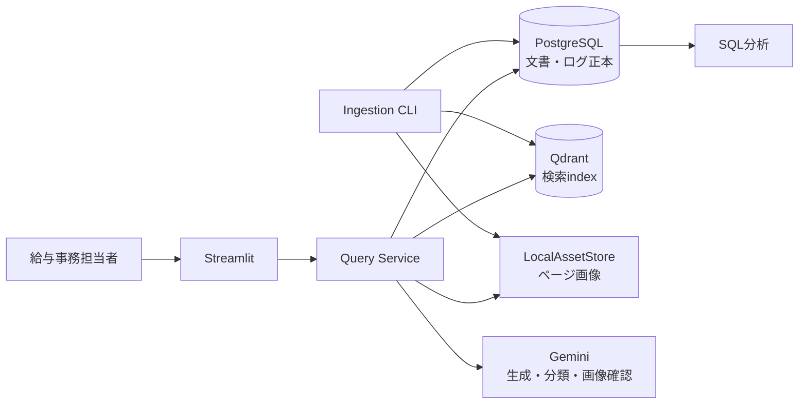

# ポートフォリオ短期集中実装計画

- 決定日: 2026-09-27
- 状態: `READY_FOR_IMPLEMENTATION`
- 目的: 本番運用の全要件を実装するのではなく、転職活動で技術選定、実装、評価、改善を証拠付きで説明できるRAGを完成させる
- 詳細な本番要件: [`TECHNICAL_DESIGN.md`](TECHNICAL_DESIGN.md)と[`DATA_MODEL.md`](DATA_MODEL.md)をProduction Referenceとして保持する

## 1. 完成時に示すストーリー

1. ChromaとJSONLで動く既存RAGをbaselineとして保持した。
2. 文書・利用ログの正本をPostgreSQL、検索indexをQdrantへ分離した。
3. 同じEmbeddingと評価セットで移行前後を測り、DB変更と精度変更を混同しなかった。
4. PDF・図表を構造化し、検索時は説明文、回答時は元画像も使う図表RAGを実装した。
5. 動作済みbaselineを固定してEmbeddingを比較し、最大の失敗原因へ一つだけ改善を適用した。
6. 精度、退行、費用、遅延、採用・不採用理由を同じ評価条件で記録した。
7. ポートフォリオ実装と、本番なら追加する構成を明確に分けた。

## 2. Portfolio Completion Scope

### 実装する

- Docker Compose上のPostgreSQLとQdrant
- PostgreSQLでの文書、版、content element、図表asset metadata、質問、検索結果、回答、分類、feedback管理
- Qdrantでのdense vector検索とmetadata filter
- Markdown、native text PDF、scan PDF、既存6図表fixtureの取込
- 図表の構造JSONと検索用テキスト表現
- 図表質問での元ページ画像を含むGemini回答
- claim単位のevidence IDと、コードによる最終表示分類
- Streamlitでの回答、引用、根拠ページ画像、feedback表示
- Chroma baseline、Qdrant移行baseline、Embedding候補の比較
- development setでの失敗分類と、一要因だけの改善
- 候補固定後のtext・visual sealed holdout評価
- SQLによる失敗、費用、遅延、feedback集計
- CI、Docker再現手順、評価report、README、構成図

### 最小化する

- Asset保存は最初に`LocalAssetStore`で実装し、GCSはinterfaceと最小接続spikeまでを必須とする。
- PostgreSQLからQdrantへの同期は、安定IDと再実行可能な管理CLIで実装する。production outbox workerは作らない。
- reviewは管理CLIと既存gold validatorを使う。管理画面は作らない。
- dense検索を完成させてから、sparse、RRF、画像Embeddingのうち最大原因に合う一つだけを比較する。
- localで完成したtext RAG v2は、Cloud SQL、Qdrant Cloud、Secret Managerを接続してCloud Runへ公開する。費用とresource差分は[`CLOUD_RAG_V2_DEPLOYMENT_PLAN.md`](CLOUD_RAG_V2_DEPLOYMENT_PLAN.md)で確認し、図表runtimeは後続のvertical sliceとして同じ公開構成へ追加する。

### Production Backlogへ送る

- Cloud SQLのHA、PITR、長期運用、connection pool tuning
- Qdrant Cloudの複数node、SLA、自動snapshot
- transactional outbox、常駐worker、dead-letter処理
- Pub/SubまたはCloud Tasksによる非同期取込
- 自動PII検出、30日retention job、匿名session quotaの完全実装
- signed URL、管理者認証、文書upload UI
- 定期backup restore、RPO/RTO訓練、監視・alert
- Snowflake、Jev、画像Embedding、rerankerの網羅的比較

これらは未実装を隠さず、採用条件、代替案、本番で必要になる理由をREADMEへ記載する。

## 3. ポートフォリオ構成

本番候補では`LocalAssetStore`をGCS、local PostgreSQLをCloud SQL、local QdrantをQdrant Cloudへ置き換える。coreはrepository interfaceを通し、provider差分を境界へ閉じ込める。

## 4. Work Package A: 動くtext RAG v2

### 目的

既存MarkdownをPostgreSQLへ登録し、Qdrantで検索し、Geminiで回答し、一連のログとfeedbackをPostgreSQLで追跡できる状態を作る。

### 主な変更

- `compose.yaml`へPostgreSQLとQdrantを追加する。
- SQLAlchemy、Alembic、psycopg、qdrant-clientを追加する。
- `DocumentRepository`、`VectorIndex`、`EventLogger`を小さいProtocolとして定義する。
- 最小schemaをmigrationで作る。
  - `documents`
  - `document_versions`
  - `content_elements`
  - `visual_assets`
  - `embedding_profiles`
  - `rag_requests`
  - `retrieval_results`
  - `generation_results`
  - `generation_attempts`
  - `classification_attempts`
  - `answer_claims`
  - `claim_evidence`
  - `feedback`
- 既存Markdownを安定UUIDでupsertする管理CLIを作る。
- 現行`gemini-embedding-001`を使い、文書名・見出し階層をEmbedding入力だけへ加えてQdrantへindexする。payloadとPostgreSQLには引用用の原文を保持する。
- 生成器はclaim、evidence ID、不足情報を構造化して返す。基準分類器は`gemini-3.1-flash-lite`、temperature 0、固定JSON Schemaを使い、別の構造化出力で判定要因を返す。
- 最終表示文は生成器や分類器の自由文をそのまま採用せず、構造化結果からアプリケーションコードで組み立てる。
- `generate_answer()`をrepository経由へ移し、request IDを返す。
- Streamlitの既存操作を保ち、引用とfeedbackを新repositoryへ接続する。
- JSONLはbaseline互換のexportへ降格する。

### 簡略化した整合性

- PostgreSQL commit後に管理CLIがQdrantへupsertする。
- point IDは`content_elements.id`と同じにする。
- Qdrant失敗時は`INDEX_FAILED`を記録し、同じCLIを再実行する。
- 同じ原本、版、Embedding profileを再実行しても件数が増えないことをtestする。
- productionのtransactional outboxは実装せず、採用理由と必要条件をProduction Backlogへ残す。

### 完了条件

- cleanなDocker環境でmigration、ingest、health check、質問、feedbackが再現する。
- PostgreSQLのSQL一つで質問、retrieval、answer、feedbackを結合できる。
- Qdrantを空にして管理CLIを再実行し、point IDと件数が戻る。
- 現行Embedding・chunk・質問setを固定し、Chromaからの重大な退行を個別に記録する。
- unit testは外部SDKをfake化し、integration testはPostgreSQLとQdrantだけを使う。

### 目安

集中作業4〜6日。

## 5. Work Package B: 図表RAG vertical slice

### 目的

既存6 fixtureを取り込み、図表に関する質問へ元画像を確認した根拠付き回答を返す。

### 主な変更

- `AssetStore`と`LocalAssetStore`を実装する。
- PDFをPyMuPDFでページ画像化し、rotationを正規化する。
- native text PDFはtext block、scan PDFはGemini画像入力から構造化する。
- flowchart、timeline、table、form、改定比較を既存JSON Schemaへ構造化する。
- `content_elements`へpage、bbox、element type、content text、structured JSON、review statusを保存する。
- 図表構造から検索用テキスト表現を決定的に生成し、Qdrantへ登録する。
- 検索結果がvisual elementなら、質問、構造JSON、対応ページ画像をGeminiへ渡す。
- claimへcontent element IDを付け、Streamlitで文書名、ページ、元画像を表示する。
- 低品質fixtureは`REVIEW_REQUIRED`で停止し、自動で検索対象へ入れない。

### 初期版で行わないこと

- 画像Embedding検索
- 任意レイアウトへの品質保証
- bbox highlight UI
- 文書upload管理画面

ページ画像全体の根拠表示を完成条件とし、bbox highlightは余力がある場合だけ追加する。

### 完了条件

- 既存6 development fixtureを同じCLIで処理できる。
- goldの重要値、要素、表cell、flow edge、bboxを既存validatorで比較できる。
- visual development 30問で文書、ページ、element hit@3 / hit@5を記録できる。
- 回答claimのevidence IDが今回取得したvisual elementに存在する。
- 金額、日付、期限、条件、可否を根拠なしで断定しない。
- candidate固定前にvisual sealed holdoutを開かない。

### 目安

集中作業4〜7日。

## 6. Work Package C: Embedding比較と精度改善

### 目的

動作済みのtext・visual RAGをbaselineとして固定し、Embeddingと一つの検索改善を比較する。

### 比較順序

1. Chromaの既存結果をbaselineとして保存する。
2. 同じGemini Embedding、chunk、top-kでQdrant baselineを測る。
3. Qdrant、chunk、top-k、評価setを固定し、Embeddingだけを変える。
4. 候補は実験直前に提供状況と費用を確認し、最低限次を含める。
   - 現行Gemini Embedding
   - 現行の新しいGemini候補
   - `ruri-v3-310m`
5. development setの失敗を検索、生成、分類、corpus不在へ分ける。
6. 最大原因へmetadata filter、chunk、sparse/RRFなどから一つだけ適用する。
7. 改善candidateを固定してからsealed holdoutを一度だけ実行する。

### 固定指標

- evidence hit@3 / hit@5
- MRR
- 内容正解率
- 回答分類macro F1
- 根拠なし断定件数
- end-to-end success率
- p50 / p95 latency
- index作成時間
- API token・費用またはlocal推論時間
- 改善した質問、退行した質問、変化しない質問

### 完了条件

- 各runが同じ評価版、文書snapshot、chunk、top-kをmanifestへ持つ。
- 一度に変える主要因は一つだけである。
- 不採用candidateと退行例を削除しない。
- developmentで選んだcandidateだけをholdoutへ進める。
- 閾値未達でも、質問やgoldを変更して合格扱いにしない。

### 目安

集中作業3〜5日。外部API rate limitによる待機を除く。

## 7. Work Package D: deliveryと説明

### 目的

実装済み、spike検証済み、Production Backlogを分け、面接でコードと数字を示せる状態にする。

### 主な変更

- READMEへ現行構成、起動手順、構成図、評価結果を記載する。
- 技術選定を、採用理由、代替案、不採用理由、再検討条件で記録する。
- SQLで最大失敗原因からrequest、retrieval、evidenceへ追跡する例を載せる。
- Chroma→Qdrant、JSONL→PostgreSQL、text→visual RAGの変更理由を記載する。
- GCSは最小spike結果、Cloud SQLとQdrant Cloudはコード完成後の接続判断を記載する。
- 職務経歴書へ記載できる検証済み事実だけを抽出する。

### 公開状態ラベル

| label | 意味 |
|---|---|
| `Implemented` | repositoryのコードとtestで確認済み |
| `Validated by spike` | 外部serviceへの限定的な接続を実測済み |
| `Production alternative` | 本番候補として比較・設計したが未実装 |

### 完了条件

- READMEの数値がraw resultから再計算できる。
- 実装済みと計画中が混在していない。
- clean checkoutからDocker起動、ingest、代表質問、評価を再現できる。
- 面接用に5分の構成説明、失敗例、改善前後、限界を説明できる。

### 目安

集中作業2〜4日。

## 8. Loop適用

### Work Package A / B

[The evidence-first feature loop](https://signals.forwardfuture.com/loop-library/loops/evidence-first-feature-loop/)を適用する。

- 対象artifact: 各packageの縦方向実装全体
- 最大round: 3
- 1 round: 現状確認 → 一つのcoherent slice実装 → 対象test → integration確認 → 証拠記録
- 成功: packageの完了条件がすべて証拠付き
- 停止: architecture blocker、外部承認、同じ失敗が2 round改善しない、利用枠80%以上

細かなfile単位には分割せず、Aでは「ingestからfeedback」、Bでは「PDFから画像付き回答」を一つのsliceとして扱う。

### Work Package Bのfixture検証

保存済みの`Fixture validation quality streak`を6 development fixtureへ適用する。

- 固定scenario: 6 fixtureの抽出・意味検査
- repair round: 最大2
- 成功: 固定順で6件連続成功
- sealed holdoutはstreakへ含めない

### Work Package C

[The Revolve versioned-experiment loop](https://signals.forwardfuture.com/loop-library/loops/revolve-self-improvement-loop/)を適用する。

- baseline、evaluation revision、指標を先に固定する。
- 1 roundでEmbeddingまたは検索構成の主要因を一つだけ変える。
- Embedding比較は最大3 candidate、検索改善は最大2 roundとする。
- improvementはdevelopmentで選び、sealed holdoutは最終acceptanceにだけ使う。
- 成功: 既知失敗を1件以上改善し、must-pass指標を悪化させないcandidateを得る。
- 停止: no progress、費用上限、API limit、比較条件を保てない、利用枠80%以上。

### Work Package D

[The promise-to-proof loop](https://signals.forwardfuture.com/loop-library/loops/promise-to-proof-loop/)を1 passだけ使い、READMEと実測証拠の不一致を直す。これは機能改善loopではなく公開前監査である。

### Loopを使わない作業

- GCSの単発spike
- migration作成
- dependency追加
- 一回のcloud preflight
- 文書の通常更新
- commit、PR、deploy

結果で次の行動が変わらない作業は固定checklistで行う。

## 9. 検証頻度

| 時点 | 実行する検証 |
|---|---|
| 実装中 | 変更対象のunit test |
| coherent slice完成 | 対象unit + integration test + Ruff |
| package完成 | `tests/`全体、Docker clean start、代表scenario |
| PR / release | 全test、評価artifact、secret scan、diff、README claim audit |

文書だけの変更で全testを毎回実行しない。失敗を隠すskip、閾値緩和、blind retryは行わない。

### 自律実行

各Work Packageの開始後は、リポジトリ内の実装、local service操作、test、評価、commit、push、draft PR更新を連続して行う。軽微な実装判断では停止せず、coherent slice完了時に証拠と学習事項をまとめる。

cloud resource変更、合意済み上限を超えるAPI費用、merge、production deploy、destructive migration、sealed holdout開封、credit使用だけを承認gateとして残す。承認待ちでは依存しないlocal作業へ切り替える。

## 10. 並行化と順序

Work Package Aはデータ契約を確定するため最初に行う。Aのschemaとinterfaceが固まった後は、次を並行可能とする。

- BのPDF・図表extractorと、AのUI・SQL report
- Cのembedding adapter準備と、Bの回答UI
- Dの構成図・技術選定記録と、Cの長時間評価run

同じmigration、repository interface、評価manifestを複数作業で同時編集しない。

## 11. 短期日程と工数

| Package | 集中日数 | 実働目安 |
|---|---:|---:|
| GCS spikeとscope反映 | 1日 | 3〜6時間 |
| A: text RAG v2 | 4〜6日 | 20〜30時間 |
| B: 図表RAG | 4〜7日 | 20〜35時間 |
| C: 比較・改善 | 3〜5日 | 15〜25時間 |
| D: delivery | 2〜4日 | 10〜20時間 |
| 合計 | 14〜23集中日 | 68〜116時間 |

1日5〜6時間の集中作業なら約3〜5週間を基準にする。API rate limit、cloud approval、手動reviewにより延びる場合は、実装を止めず、独立したlocal作業へ切り替える。

## 12. 直近の順序

1. [`GCS_CONNECTION_SPIKE_RUNBOOK.md`](GCS_CONNECTION_SPIKE_RUNBOOK.md)の実測とcleanup証拠を保存し、IAM伝播待ちは外部blockerとして追跡する。
2. Work Package AのEvidence-first loopを開始する。
3. `compose.yaml`、migration、repository interface、Markdown ingest、Qdrant検索、PostgreSQL log、Streamlitを一つの縦方向sliceで完成させる。
4. Work Package Aのlocal integration完了後、GCSを再開してPhase 0を閉じる。
