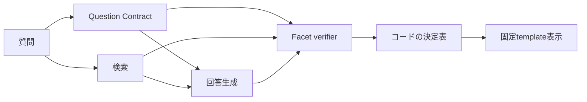

# Question Contractによる回答分類改善候補

- 状態: Rubric v2へ整合済み。アプリケーションへ未実装
- 作成日: 2026-09-30
- 対象: 初回Text sealed holdoutで最大だった回答分類失敗
- 採否手順: [`eval/INTERVENTION_ADOPTION_PROTOCOL.md`](../eval/INTERVENTION_ADOPTION_PROTOCOL.md)

本書の分類語義と決定順序は[`CLASSIFICATION_RUBRIC_V2.md`](CLASSIFICATION_RUBRIC_V2.md)を正とする。Question Contractは質問が要求する項目と入力値を構造化するが、質問内の情報だけから最終分類を決めない。

## 1. この設計で学ぶこと

この候補では、LLMが行う意味判断と、コードが保証する整合性を分ける。

- **LLM**: 質問が求める論点、質問に明記された事実、claimと根拠の意味的な対応を判定する。
- **コード**: ID参照、全論点の評価、決定表、表示可否を決定的に検証する。

完了時には、自然文の細かな言い回しを列挙せずに、過剰な`判断要`と危険な`根拠十分`を同じ仕組みで扱う方法を説明できることを目標とする。

## 2. 対象と理論上限

初回holdout 100表現の失敗原因は次のとおりだった。

| 原因 | 件数 | この候補の直接対象 |
|---|---:|---|
| 回答分類 | 14 | 実行できた12件 |
| 回答内容 | 6 | claim検証で検出するが、内容そのものは直さない |
| 実行 | 2 | 対象外 |
| 文書検索 | 0 | 対象外 |

実行できた分類不一致12件は、`根拠十分 → 判断要`が9件、`判断要 → 根拠十分`が3件だった。9件の過剰保留のうちTH011は期限回答も不完全なので、分類だけを直しても総合成功にならない。したがって、既知データに対するこの候補単体の総合成功の理論上限は**8件改善**である。

TH014とTH026の実行失敗、TH011の期限算出不足は、別のfailure familyとして残す。この候補の効果へ合算しない。

## 3. 現行方式の問題

現行Classifierは、質問、取得根拠、生成回答を一度に読み、回答全体について5個の真偽値を返す。

```text
retrieval_sufficient
answer_fully_supported
requires_case_facts
requires_policy_judgment
version_conflict
```

質問が直接求めた内容と、回答に関連するが質問されていない個別条件の境界が構造化されていない。そのため「金額だけを求め、他条件は満たすと明記した質問」でも、制度一般に存在する個別条件を不足とみなしやすい。

一方、単純に`判断要`を減らすと、施設コードが読めないTH025や受給歴が未照合のTH031まで`根拠十分`にする危険がある。必要なのは、保留を一律に減らす処理ではなく、**質問の結論に必要な未解決条件だけを残す処理**である。

## 4. 採用候補の構成



Question Contractの生成と検索は互いに依存しないため、実装時は並列に開始できる。回答生成は、Question Contractと取得根拠の両方を受け取る。Facet verifierはQuestion Contract、取得根拠、生成claimをまとめて検証するが、最終ラベルは返さない。コードが検証結果を決定表へ通し、ラベルと表示可否を決める。

### 4.1 Question Contract

候補Schemaは[`question-contract-v1.schema.json`](schemas/question-contract-v1.schema.json)である。

```json
{
  "schema_version": "1.0",
  "status": "SUCCESS",
  "requested_facets": [
    {
      "facet_id": "facet-1",
      "requirement": "2027年5月31日の引継ぎに対する上限適用後の額",
      "answer_type": "amount"
    },
    {
      "facet_id": "facet-2",
      "requirement": "2027年6月1日の引継ぎに対する上限適用後の額",
      "answer_type": "amount"
    }
  ],
  "input_facts": [
    {
      "fact_id": "fact-1",
      "text": "両日とも条件を満たす120分の引継ぎを実施した",
      "fact_type": "condition",
      "applies_to_facet_ids": ["facet-1", "facet-2"]
    }
  ],
  "error_code": null
}
```

`requested_facets`は質問が直接要求する答えを原子的に分ける。`input_facts`は質問に明記された日付、金額、数量、条件などを記録し、推測で補わない。入力値はclaimの計算や適用条件に参照できるが、文書根拠の代わりにはならず、それ自体から`根拠十分`・`判断要`を決めない。

たとえば「施設コードが読めない」は入力事実として保持する。取得文書にコード確認を必要とする判断基準があり、コードによって結論が変わるとFacet verifierが確認した場合に限り、`case_fact`の人による確認要件になる。

Question Contractは質問だけを入力にする。取得文書や生成回答を見せないため、見つかった根拠に合わせて質問範囲を書き換えることを防ぐ。

### 4.2 facet付き回答

候補Schemaは[`answer-output-v3-candidate.schema.json`](schemas/answer-output-v3-candidate.schema.json)である。現行v2へ次の参照を追加する。

- 各claimが答える`facet_ids`
- 各claimが使用する`input_fact_ids`
- 各claimが使用する`calculation_ids`
- 各missing conditionが妨げる`facet_ids`
- 各日付計算が答える`facet_ids`
- missing conditionを識別する`condition_id`

Generatorは質問外の注意事項を`missing_conditions`へ追加しない。注意事項を将来表示する場合は、分類を変えない別フィールドとして設計する。

### 4.3 facet単位の独立検証

候補Schemaは[`classification-output-v2-candidate.schema.json`](schemas/classification-output-v2-candidate.schema.json)である。Facet verifierは最終ラベルではなく、各facetについて次を返す。

- 対応するclaim
- claimが根拠にどの程度支持されるか
- 取得根拠だけでfacetへ答えられるか
- 結論に本当に必要な個別事実、制度判断、文書版
- 判定に使った根拠ID

これにより、次の二つを分けて記録できる。

```text
evidence_coverage = sufficient + claim_support = no_claim
  -> 文書はあるがGeneratorが答えを作れなかった

evidence_coverage = insufficient + claim_support = no_claim
  -> 回答に必要な文書根拠が足りない
```

前者を`文書不足`へ混ぜず、`GENERATION_INCOMPLETE`として記録する。これが検索失敗、回答生成失敗、回答分類失敗を区別するという評価方針と整合する。

## 5. LLMとコードの責務

| 判断 | 担当 | 理由 |
|---|---|---|
| 質問を原子的facetへ分ける | Question Contract用LLM | 自然文の意味理解が必要 |
| 質問に明記された入力値 | Question Contract用LLM | 言い換えを含む意味理解が必要 |
| claimと根拠の意味的支持 | Facet verifier用LLM | 単語一致では判定できない |
| 未解決条件が結論に必要か | Facet verifier用LLM | 制度文と質問範囲の関係判断が必要 |
| ID、参照、件数、順序 | コード | 決定的に検証できる |
| 全facetが一度ずつ評価されたか | コード | 抜けと重複を確実に拒否できる |
| 最終ラベルと表示可否 | コード | 同じfactorから常に同じ結果にする |

最終ラベルをLLMへ直接選ばせない。LLM出力を信頼してそのまま表示せず、意味判断の結果だけを固定ルールへ渡す。

## 6. 検証規則

JSON Schemaだけでは別配列間の参照を検証できない。一方、質問範囲のような意味条件はコードだけでは保証できない。実装時は両者を分ける。

### 6.1 コードで決定的に検証する条件

1. `facet_id`と`fact_id`は1から連続し、重複しない。
2. 全`applies_to_facet_ids`がContract内に存在する。
3. claim、condition、date calculationのIDは1から連続する。
4. 回答内の全`facet_ids`がContract内に存在する。
5. 全根拠IDが今回取得したactive文書世代に存在する。
6. Contractの全facetがFacet verifierでちょうど一度評価される。
7. `claim_ids`は生成回答内、根拠IDは取得集合内に存在する。
8. `no_claim`なら`claim_ids`は空、`fully_supported`ならclaimと根拠IDは空でない。
9. `evidence_coverage=insufficient`のfacetに`human_review_requirements`があれば意味的違反にする。
10. review IDは結果全体で一意である。
11. Schema違反、未知参照、facet欠落は安全側のpipeline failureにする。

### 6.2 LLMと評価で確認する意味条件

1. 一つのfacetが一つの回答要求だけを表す。
2. `input_facts`が質問に明記された内容だけで、推測を含まない。
3. claimが割り当て先facetへ実際に答えている。
4. missing conditionが割り当て先facetの結論に本当に必要である。
5. 質問外の助言や一般的注意事項が、分類を変えるmissing conditionになっていない。

これらはpromptへ指示するだけでは保証できない。既知failure、未知challenge、paraphrase pairで期待Contractと照合し、失敗率を記録する。

## 7. コードによる決定表

判定は上から順に適用する。

| 優先 | 条件 | status / 表示 |
|---:|---|---|
| 1 | Schema・参照・facet完全性に違反 | `PIPELINE_INCONSISTENCY`。分類付き回答を表示しない |
| 2 | いずれかのfacetで`evidence_coverage=insufficient` | `文書不足`。claimを表示しない |
| 3 | 根拠は十分だがclaimが欠落・部分支持・不支持 | `GENERATION_INCOMPLETE`。分類付き回答を表示しない |
| 4 | 全claimは完全支持だが`case_fact`、`policy_judgment`、`version_conflict`が残る | `判断要`。完全支持されたclaimだけ表示 |
| 5 | 全facetが完全支持され、人による確認要件がない | `根拠十分`。全claimを表示 |

一つのfacetについて`evidence_coverage=insufficient`と人による確認要件を同時に返す出力は意味的に不正とする。判断基準が取得できていない状態では、何を確認すれば結論が決まるかを取得文書から正当化できないためである。

confidenceは監査と将来のselective classification検証用に保存する。未校正の値だけで最終ラベルを上書きしない。

## 8. 既知失敗への設計dry-run

| case | Contractと検証結果 | 期待する動作 | 総合成功への寄与 |
|---|---|---|---:|
| TH022 | 登録期限と請求期限を別facet化。終了日時を入力値として参照 | 不要な個別条件を追加せず`根拠十分` | 2表現改善候補 |
| TH034 | 5/31と6/1の金額を別facet化。実施日と時間を入力値として参照 | 月境界の各claimを検証し`根拠十分` | 2表現改善候補 |
| TH037 | 金額facet。指示日、作業日、区画数を入力値として参照 | 質問外条件で保留しない | 1表現改善候補 |
| TH041 | 金額と申請締切を別facet化 | 両claimが支持されれば`根拠十分` | 1表現改善候補 |
| TH047 | 金額facet。予約日、利用日、実費を入力値として参照 | 版選択後に`根拠十分` | 2表現改善候補 |
| TH025 | 可否facet。施設コードを入力事実として保持 | 文書の判断基準に照らして必要な`case_fact`を残し`判断要` | 危険な断定2件を防ぐ |
| TH031 | 可否facet。受給歴に関する質問記述を入力事実として保持 | 文書の判断基準に照らして受給歴確認を残し`判断要` | 危険な断定1件を防ぐ |
| TH011 | 金額と具体期限を別facet化。期限claimが欠落 | `GENERATION_INCOMPLETE`として検出 | 分類誤りは整理できるが総合改善0 |
| TH014 / TH026 | pipeline実行失敗 | この候補の効果へ数えない | 0 |

この表はmechanismの確認であり、採用証拠ではない。既知ケースを見て作った設計なので、未知challengeと代表回帰が必要である。

## 9. 選択肢と設計判断

| 選択肢 | 長所 | 弱点 | 判断 |
|---|---|---|---|
| 文言ごとの例外rule | 安価で即効性がある | 未知表現へ広がらず、rule衝突が増える | 不採用 |
| 現行promptへ例を追加 | 実装量が少ない | 質問範囲と根拠検証が依然一体 | 単独では不採用 |
| GeneratorがContractも同時生成 | 追加callがない | 回答を作るモデルが質問範囲も自己採点する | 初期候補では不採用 |
| factorごとに5回LLMを呼ぶ | 診断しやすい | 費用と待ち時間が大きい | 不採用 |
| 質問専用Contract + 1回のfacet検証 | 質問範囲が独立し、共通表現で検証できる | 標準経路で1 call増える | 第一候補 |
| ローカル小型モデルでContract生成 | API費用を抑えられる | 日本語の境界性能と運用対象が増える | 後続比較候補 |

第一候補は一般化と説明可能性を優先する。ただし追加callに見合う正味改善がなければ採用しない。

## 10. 実装境界と費用上限

最初の実装は分類改善に必要な範囲だけに限定する。

- retrieval query、filter、top-kは変更しない。
- full Query Planner、検索query分解、rerankerは追加しない。
- 最初の比較ではGenerator、Question Contract、Facet verifierを`gemini-3.1-flash-lite`、temperature 0に固定し、構造変更とモデル変更を混ぜない。
- 現行answer v2とclassification v1を残し、feature flagでcandidateを切り替える。
- 実験中はContract失敗を現行経路へ隠れてfallbackさせず、独立したfailureとして数える。
- 標準経路のlogical external callは現行より最大1回増とする。
- Contract出力は最大6 facets、12 factsに制限する。
- retryは既存のprovider障害方針を超えて増やさない。

採用前の運用gateは、baseline比で平均API費用`+25%以下`、p95 latency`+25%以下`とする。検索とContract生成を並列化しても超える場合は、出力短縮、条件付き実行、ローカルモデルの順で再設計する。品質gateを費用改善のために緩めない。

## 11. 事前固定する評価gate

### Gate 1: 既知失敗でmechanism確認

- 過剰保留9件で、質問外条件だけを理由に`判断要`へしない。
- 危険側3件で、必要な未解決条件を3件すべて保持する。
- TH011を回答成功へ数えず、生成不足として検出する。
- 実行失敗2件を改善件数へ数えない。

### Gate 2: 未知同型challenge

- 実装結果を見る前に別制度・別文書familyの24 scenarioを固定する。
- 主stratumは、過剰保留target 12、真の判断要6、文書不足3、単純な既存成功control 3とする。
- 主stratumとは別の横断sliceとして、複数facetを6以上、版境界を4以上含める。
- target sliceでbaseline比3件以上改善する。
- `判断要/文書不足 → 根拠十分`の危険な新規退行は0件とする。
- 重要8 scenarioには未知paraphrase/noisy表現を一つずつ追加し、facetと最終statusの一致を確認する。

### Gate 3以降

- 130問のpaired回帰で正味改善が正、危険な新規退行0件。
- 検索、回答内容、Schema failureを別々に集計する。
- 改善・退行・境界caseだけを2〜3回再実行し、run間一致を測る。
- 費用とlatencyが第10節の上限内である。
- candidate固定後だけfresh sealed holdoutへ進む。

Challenge 24 scenarioは実運用成功率の推定には使わない。弱点を意図的に多く含む開発評価であることを結果資料へ明記する。

## 12. 実装順序

1. 3 Schemaと構造validatorを実装する。
2. Question Contract promptを作り、既知12件と単純controlでmechanism testを行う。
3. Generatorをanswer v3へ対応させる。
4. Facet verifierとコード決定表をfeature flag下へ追加する。
5. 未知challengeをgold review後に固定する。
6. Gate 2を通った場合だけ130問回帰へ進む。
7. 費用・再現性gate後にcandidateを固定し、fresh holdoutを別途承認して実行する。

最初の実装単位は1〜4である。ここでは本番経路を切り替えず、ローカルfixtureで構造と安全動作を確認する。
