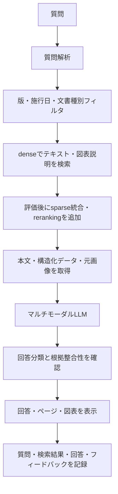

# 自治体向け制度問い合わせ支援RAG 最終仕様

## 1. 文書の位置づけ

- ステータス: Approved（2026-09-26 ユーザー承認・独立レビュー完了）
- 対象: 本リポジトリで今後実装するRAGの目標構成
- 目的: PDF・図表対応、検索基盤、ログ基盤、評価方法を先に定義し、個別技術の変更による手戻りを防ぐ

この文書でいう「最終仕様」は、転職活動用ポートフォリオとして完成させる範囲を指す。実在する自治体の本番システムを想定した全機能は対象にしない。

詳細な実装契約は次を正とする。

- [技術設計](TECHNICAL_DESIGN.md)
- [データモデル](DATA_MODEL.md)
- [実装計画とDefinition of Done](IMPLEMENTATION_PLAN.md)
- [テスト・評価戦略](TEST_STRATEGY.md)
- [学習・Codex利用枠運用計画](LEARNING_AND_USAGE_PLAN.md)
- [以前の仕様案からの変更概要](SPEC_CHANGE_SUMMARY.md)
- [作業再開checkpoint](WORK_CHECKPOINT.md)

## 2. 目的

自治体の給与事務担当者が、規程、通知、FAQ、業務マニュアル、申請書記入例を横断して検索し、根拠と参照位置を確認しながら問い合わせへ回答できるようにする。

完成時には、次の内容をコード、評価結果、SQL、構成図を使って説明できる状態にする。

1. テキストと図表を含む文書をどのように検索可能な形へ変換したか
2. 検索失敗、回答生成失敗、分類失敗をどのように区別したか
3. Embeddingと検索方式を同じ評価セットで比較した結果
4. 質問ログとフィードバックをPostgreSQLへ保存し、SQLで改善対象を特定した方法
5. クラウド上でデータを永続化し、費用と運用上の制約を判断した理由

## 3. 利用者とデータ制約

### 3.1 想定利用者

- 各所属の給与事務担当者
- 制度所管部署の人事・給与担当者

### 3.2 データ制約

- ポートフォリオでは架空の制度文書、帳票、質問だけを使用する。
- 実在職員の氏名、職員番号、給与額、住所などの個人情報を保存しない。
- 自由入力された質問にも個人情報を入力しない旨を画面に表示する。
- ログにはAPIキー、認証情報、プロンプト全体を保存しない。

## 4. 対象文書

### 4.1 必須対応形式

| 形式 | 対象 | 取込方法 |
|---|---|---|
| Markdown | 現在の架空制度文書 | 見出し構造を保持して解析 |
| テキストPDF | 規程、通知、マニュアル | テキストとレイアウトを抽出 |
| スキャンPDF | 過去通知、紙資料 | OCR後にテキストとページ画像を保持 |
| PDF内の図表 | フローチャート、判断フロー、表、記入例 | 図表領域を画像として切り出し、説明文と構造化データを生成 |

### 4.2 変換して対応する形式

DOCX、PPTX、XLSXは原本を保持し、レイアウトを維持したPDFへ変換してから取り込む。Office形式の直接解析は必須範囲に含めない。

### 4.3 必須の図表パターン

1. 申請処理フローチャート
2. 支給可否の判断フロー
3. 期限・処理日程のタイムライン
4. 支給額・区分の表
5. 申請書の記入例
6. 改定前後の手続き比較

業務システムの画面キャプチャと組織図は追加候補とし、上記6種類の評価後に必要性を判断する。

## 5. 質問と回答

### 5.1 対応する質問

- 一つの文書内の根拠で回答できる質問
- 複数文書を横断する質問
- 図の処理順序や条件分岐に関する質問
- 表の行と列を特定する質問
- 申請書の記入箇所に関する質問
- 改定前後を区別する質問
- 個別事情により断定できない質問
- 文書に根拠がない質問
- 言い換え、略語、軽微な誤字を含む質問

### 5.2 回答に含める情報

- 回答分類: 根拠十分、判断要、文書不足
- 根拠に基づく回答本文
- 文書名
- 文書版または施行日
- ページ番号
- 見出しまたは図表名
- 複数根拠を使用した場合は根拠ごとの参照位置

図表に関する回答では、取得した図表画像を回答画面から確認できるようにする。

### 5.3 回答規則

1. 現行版として有効な文書を優先する。
2. 質問に基準日がある場合は、その時点で有効な版を使用する。
3. 図表から抽出した説明文だけで最終判断せず、回答生成時に元画像も確認する。
4. 条件が不足して経路を一つに決められない場合は、必要な追加条件を示して「判断要」とする。
5. 文書にない情報を補完しない。
6. 金額、日付、期限、支給可否は、根拠箇所を特定できない限り断定しない。

### 5.4 回答分類

回答生成と回答分類を別工程にする。回答生成LLMには根拠に基づく回答本文と参照箇所を生成させ、分類器には質問、取得根拠、生成回答を渡す。

オンライン分類器には最終ラベルを直接選ばせず、次の判断を構造化して返させる。

- 今回取得した根拠だけで回答できるか
- 回答中の重要な主張が根拠に支持されるか
- 最終判断に不足している個別条件があるか
- 所管部署による制度解釈が必要か
- 文書間または改定前後に未解決の矛盾があるか

最終ラベルはコードで次の優先順位により決定する。

1. 取得根拠が不足する場合は「文書不足」
2. 根拠が取得できており、具体的な個別条件、制度解釈、未解決の矛盾がある場合は「判断要」
3. 回答の重要主張を支持できない場合は「文書不足」
4. 上記に該当せず、文書だけで結論が確定する場合は「根拠十分」

`retrieval_sufficient=false`と個別事情要因が同時に返った場合は「文書不足」を優先する。`requires_case_facts`は`missing_conditions`の有無だけで無効化しない。generatorが不足条件を出し忘れた真の`判断要`を`根拠十分`へ緩和しないためである。

オンラインの「文書不足」は「今回取得した根拠では確認できない」を意味し、corpusに情報が存在しないとの断定には使わない。`corpus_answerability`はオンラインの入力・出力・ログに含めず、評価基盤がgold annotationから`expected_corpus_answerability`として管理する。評価ではoracle evidenceとretrieved evidenceの両方を使い、検索失敗と分類失敗を分離する。

分類器は交換可能なインターフェースとし、`gemini-3.1-flash-lite`、temperature 0、固定JSON Schemaを基準実装にする。Jevのような分類専用モデルは比較実験へ追加し、分類精度、クラス別再現率、回答本文との矛盾、確信度、費用、応答時間、API可用性を同じ評価セットで比較する。

分類専用モデルを採用する条件は、分類ラベルのみの誤りを減らし、「判断要」と「文書不足」の重大な取りこぼしを増やさず、外部API依存を含む運用条件が許容できることである。分類APIが失敗した場合は基準実装へフォールバックし、使用した分類器とフォールバックの有無をログへ記録する。

## 6. 文書取込仕様

### 6.1 取込単位

```text
Document
  └─ DocumentVersion
       ├─ TextChunk
       ├─ Table
       ├─ VisualAsset
       └─ StructuredDiagram
```

### 6.2 取込処理

1. 原本をオブジェクトストレージへ保存する。
2. 文書ID、版、施行日、失効日、文書種別を登録する。
3. PDFをページ単位の画像へ変換する。
4. テキスト、見出し、ページ番号を抽出する。
5. 表と図の領域を検出して切り出す。
6. 図表から検索用説明文を生成する。
7. フローチャートはノード、接続、分岐条件をJSONへ変換する。
8. 表は行、列、セルを構造化して保存する。
9. 各要素に原本、ページ、座標を関連付ける。
10. 検索用テキストをEmbedding化し、ベクトルストアへ登録する。

取込は`RECEIVED -> PROCESSING -> WAITING_REVIEW -> INDEXED -> READY`の準備状態を持ち、別列の`PUBLISHED / WITHDRAWN`で管理上の公開可否を扱う。`READY + PUBLISHED`かつ基準日の施行期間に合うactive抽出世代だけを検索する。呼出側のidempotency key、原本hash、抽出世代、transactional outboxにより再実行と部分失敗を回復する。具体的な抽出器、JSON Schema、レビュー条件は[技術設計](TECHNICAL_DESIGN.md)に定義する。

### 6.3 図表の検索表現

必須方式は、図表を次のテキスト表現へ変換して検索する方式とする。

- 図表名
- 周辺の見出しと説明文
- 図中テキスト
- マルチモーダルLLMが生成した説明文
- ノード、接続、分岐条件を文章化した内容

図そのものをEmbeddingする方式は実験対象とする。同じ評価セットで追加効果が確認できた場合に採用する。

### 6.4 チャンク分割

すべての文書を同じ固定文字数で分割せず、文書の意味構造を優先する。検索用チャンクはEmbeddingモデル間で同一内容を比較できるように固定し、モデル固有のトークン数だけを基準に内容を変えない。

| 文書要素 | 分割単位 |
|---|---|
| 規程・要綱 | 条、項、号。本文とただし書き、条件と例外を分離しない |
| 通知 | 見出しとその本文。改定内容と適用日を同じ単位に含める |
| FAQ | 質問と回答を一つの単位にする |
| 手続きマニュアル | 一つの作業または判断単位。番号付き手順の途中で分割しない |
| 表 | 表題、列見出し、行見出し、対象行を一つの単位にする。大きい表は列見出しを各行グループへ付与する |
| フローチャート | 図全体の説明と、主要な分岐経路ごとの説明を作る。元画像と構造化JSONへ関連付ける |
| 申請書 | 帳票全体の説明と、記入欄のまとまりごとの説明を作る |
| OCR文書 | 段落・表・図の領域単位。OCR信頼度とページ座標を保持する |

テキストチャンクは400〜800文字程度を基準とする。意味単位が長すぎる場合だけ文または段落境界で分割し、約100文字を重複させる。短い条文やFAQを件数合わせのために結合しない。

文書名、版、施行日、見出し階層、ページ番号は常にmetadataへ保持する。Embedding対象には直近の見出しを含め、文書名や親見出しまで加える方式は、既存の見出し追加実験で実務質問の悪化があったため比較実験として扱う。

チャンクIDは取込順の連番にせず、文書版、抽出run、要素種別、正規化locatorからUUIDv5で生成する。同じidempotency keyは既存runを再開し、parserやmodelを変える再抽出は新runを丸ごと構築してactive世代を切り替える。OCRやLLMが生成した内容hashはIDへ含めず差分検出に使う。

## 7. 検索・回答フロー



### 7.1 検索の基本方式

- dense vector検索
- 文書名、版、施行日、要素種別によるメタデータフィルタ
- 初期構成はdense上位20件から上位5件を回答へ渡す
- キーワード不足が失敗原因として確認された後に、SudachiPy、BM25 sparse、RRFを一つのexperimentとして追加する

rerankerは必須構成に含めず、検索失敗分析で必要性が確認された場合に追加する。

### 7.2 画像の利用

- 検索時: まず図から生成したテキスト表現を使用する。
- 回答時: 検索された図の元画像をマルチモーダルLLMへ渡す。
- 実験: 画像Embeddingを追加し、図表評価セットの改善件数、遅延、費用を比較する。

## 8. 保存先と責務

| データ | 保存先 | 理由 |
|---|---|---|
| PDF、Office原本、ページ画像、図表画像 | Google Cloud Storage | 大きなバイナリを版付きで保持するため |
| 文書、版、チャンク、図表メタデータ | PostgreSQL | 関係性と更新履歴をSQLで管理するため |
| 質問、検索結果、回答、費用、フィードバック | PostgreSQL | 即時記録とSQL分析を行うため |
| 検索用ベクトル | Qdrant | フィルタ、複数ベクトル、ハイブリッド検索を独立して拡張するため |
| 集計・分析用データ | Snowflake（後続拡張） | PostgreSQLにログが蓄積した後に連携する |

Snowflakeをアプリケーションの一次保存先にはしない。PostgreSQLから匿名化・整形した分析用データを定期的に転送する。

## 9. ベクトルストア選定条件

### 9.1 選定原則

小規模データの完全検索では、同じベクトル、距離関数、フィルタを使えばDB製品による意味検索精度の差は原則として生じない。このため、次の条件で選ぶ。

1. テキストと図表の検索表現を管理できること
2. 文書版、施行日、要素種別で絞り込めること
3. dense検索とキーワード検索を統合できること
4. Cloud Runから安全に接続できること
5. 永続化、バックアップ、認証方法を説明できること
6. 公開デモとして維持可能な費用であること
7. 検索結果とPostgreSQLのログを追跡IDで結び付けられること

### 9.2 採用方針

検索用ベクトルストアにはQdrantを採用する。採用理由は、検索精度がDB製品だけで向上するためではなく、次の検索要件と将来の拡張を独立して扱いやすいためである。

- 文書版、施行日、要素種別によるpayload filter
- 本文、図表説明、画像など複数のnamed vector
- dense、sparse、multi-vectorを組み合わせるハイブリッド検索
- ベクトル件数や検索アクセス増加時のシャーディングとレプリケーション
- PostgreSQLのトランザクション処理と検索負荷の分離

Qdrantは検索インデックスであり、文書やログの正本にはしない。Qdrantのpoint IDにはPostgreSQLの`content_elements.id`を使用し、検索結果から正本を取得できるようにする。QdrantのデータはPostgreSQLとCloud Storageから再構築可能にする。

pgvectorは比較検討した代替案として設計判断に残すが、本構成では採用しない。アプリケーションからQdrant固有APIを直接広げず、検索リポジトリを通して利用する。

## 10. PostgreSQLデータモデル

最低限、次のデータを保持する。列、制約、状態遷移、Qdrantとの同期方式は[データモデル](DATA_MODEL.md)を正とする。

- `documents`
- `document_versions`
- `content_elements`
- `visual_assets`
- `ingestion_runs`
- `embedding_records`
- `rag_requests`
- `retrieval_results`
- `generation_results`
- `feedback`
- `evaluation_runs`
- `evaluation_results`

`rag_requests.request_id`を一連の処理の追跡IDとし、検索、生成、フィードバックを結び付ける。

## 11. 評価仕様

### 11.1 既存評価

- 承認済み100シナリオは既に改善分析へ利用したため、テキストRAGのdevelopment / regression setとして維持する。
- 既存のGemini 3.1 Flash-Liteによる結果を変更前の基準値として保持する。
- 最終受入用に、既存文書と異なる架空文書familyからtext sealed holdout 50シナリオを作る。各scenarioはformalとparaphrase/noisyの2表現を持ち、100表現を実行するが合否はscenario単位で集計する。goldは予測結果固定まで開封しない。

### 11.2 図表評価

新たに50シナリオを作成し、文書・版・図表family単位でdevelopment 30件とsealed holdout 20件に分ける。実装調整にはdevelopmentだけを使い、holdoutには未見の架空文書fixtureを使用し、正解根拠は最終評価まで使わない。

| 種類 | 目安 |
|---|---:|
| フローチャート | 10問 |
| 判断フロー | 10問 |
| 表 | 10問 |
| 申請書 | 10問 |
| スキャン文書 | 5問 |
| 改定前後 | 5問 |

表の件数は作成時の配分目安とし、合計50件と各必須図表の存在を固定条件にする。同一根拠の言い換えを異なるsplitへ分けない。

### 11.3 指標

- evidence hit@3、hit@5
- 正しい文書版の取得率
- 正しいページ・図表の取得率
- 分岐経路の正答率
- 表セルの正答率
- 回答分類一致率
- 根拠のない断定件数
- 質問1件あたりの応答時間と費用
- 文書取込1件あたりの時間と費用

Embeddingモデル、ベクトルストア、検索方式を同時に変更しない。比較時は変更要因を一つに固定する。

合格条件、fixtureの抽出精度、内容の人手判定、run manifestは[テスト・評価戦略](TEST_STRATEGY.md)と[Definition of Done](IMPLEMENTATION_PLAN.md#3-全体definition-of-done)を正とする。

## 12. クラウド構成

- Webアプリケーション: Cloud Run
- バッチ取込: ローカルCLIから開始し、必要に応じてCloud Run Jobsへ移行
- 原本・画像: Cloud Storage
- 業務ログ・メタデータ: Cloud SQL for PostgreSQL
- ベクトル: Qdrant。ローカルはDocker、クラウドは接続・費用spike後にQdrant Cloudを使用する
- APIキー: Secret Manager
- CI/CD: GitHub Actions、Workload Identity Federation、Cloud Build、Artifact Registry
- IaC: 追加するクラウドリソースをTerraformで管理

文書登録用の公開画面や利用者認証は必須範囲に含めない。文書は管理者向けCLIまたはジョブで登録し、公開デモの閲覧者が文書を追加できない構成とする。

## 13. 実装順序

1. schema、障害状態、security、負荷、受入条件を確定する。
2. 必須6図表のfixture、gold annotation、development / holdoutを先に作る。
3. Cloud SQL、GCS、Qdrant Cloud、Geminiの接続・費用spikeを行う。
4. repository interfaceとローカルPostgreSQL・Qdrantを実装する。
5. PostgreSQLログ、Qdrant text検索、同期・再構築を実装する。
6. PDF・図表取込から根拠付き回答までの縦方向を実装する。
7. development setで一要因ずつ改善し、sealed holdoutで最終確認する。
8. backup、復元、security gateを通してからクラウドへ反映する。
9. PostgreSQLのログをSQLで集計する。
10. データ量と分析目的が整った段階でSnowflake連携を実装するか判断する。

詳細な依存順序と各段階の受入条件は[実装計画](IMPLEMENTATION_PLAN.md)を正とする。

## 14. 対象外

- 実在する人事・給与データの利用
- 人事上の最終判断の自動化
- 申請や給与計算の自動実行
- 一般利用者による文書アップロード
- 全Office形式の直接解析
- Snowflakeを使うこと自体を目的とした導入
- 評価結果で必要性が確認できない複数検索基盤の常設

## 15. 設計判断

### 15.1 確定した方針

1. 検索インデックスはQdrant、正本データはPostgreSQLへ分離する。
2. 文書原本と図表画像はCloud Storageへ保存する。
3. PostgreSQLへのログ・フィードバック保存とSQL分析を完成条件に含める。
4. SnowflakeはRAG本体の必須構成にせず、求人の歓迎要件との接点を作る後続拡張とする。
5. Snowflakeを追加する場合は、PostgreSQLのログと評価結果を転送し、改善判断に使う分析まで実装する。
6. 画像Embeddingは完成条件に含めず、説明文検索に対する追加効果を測る実験とする。
7. 必須対象は6種類の図表とし、業務画面キャプチャと組織図は後続候補とする。
8. 既存100シナリオはtext development setとし、別文書familyのtext 50シナリオと、図表50シナリオのうち20件をsealed holdoutにする。
9. Qdrant Cloudは接続・費用・停止方法を確認してから公開構成に採用し、月額3,000円を超える継続費は別途判断する。
