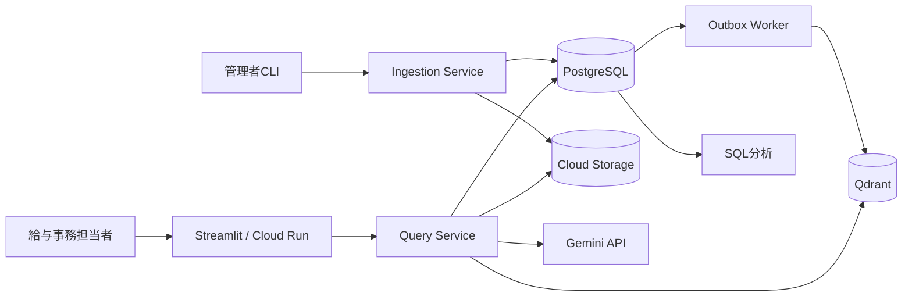

# RAG技術設計

## 1. 目的と設計境界

この文書は[`TARGET_RAG_SPEC.md`](TARGET_RAG_SPEC.md)を実装へ落とす契約である。現行のStreamlit、Gemini、Chroma、JSONL構成から、PDF・図表、PostgreSQL、Qdrant、Cloud Storageを使う目標構成へ段階移行する。

完成対象は転職用ポートフォリオの公開デモであり、実在自治体の本番業務、最終判断、個人情報処理は含めない。

## 2. コンポーネント



| コンポーネント | 責務 | 実装境界 |
|---|---|---|
| Streamlit UI | 質問受付、回答・引用・図表表示、フィードバック | 検索ロジックを持たない |
| Query Service | 版決定、検索、正本取得、生成、検証、分類、記録 | repository interfaceだけを使う |
| Ingestion Service | 原本登録、抽出、構造化、チャンク、索引準備 | 管理者CLIから起動する |
| Outbox Worker | PostgreSQLのイベントをQdrantへ冪等反映 | 二重書込みを行わない |
| PostgreSQL | 文書構造と利用ログの正本 | ベクトル値を持たない |
| Qdrant | 再構築可能な検索インデックス | 回答・質問の正本を持たない |
| Cloud Storage | 原本と画像の正本 | 非公開bucketとする |
| Gemini adapter | 図表構造化、回答生成、基準分類 | モデル名をrun manifestへ記録する |

アプリケーションは`DocumentRepository`、`VectorIndex`、`AssetStore`、`AnswerGenerator`、`AnswerClassifier`、`EventLogger`の各interfaceを介して外部サービスへ接続する。

## 3. 文書取込契約

### 3.1 対応ツールと出力

| 入力 | 初期実装 | 必須出力 |
|---|---|---|
| Markdown | Python Markdown parser | 見出し、本文、順序 |
| テキストPDF | PyMuPDF | テキスト、ページ、座標、ページ画像 |
| スキャンPDF | PyMuPDFで300dpi画像化し、Geminiの構造化出力でOCR | 文字列、ページ、領域、信頼度、原画像 |
| 図・表・帳票 | Geminiの画像入力とJSON Schema | 説明文、構造JSON、ページ、領域、原画像 |
| DOCX/PPTX/XLSX | 管理者環境のLibreOffice headlessでPDF化 | 変換前原本、変換後PDF、変換ログ |

初期実装の対象は日本語、A4縦横、0/90/180/270度回転、1文書50ページ以下とする。複数ページ表はページごとの表を抽出し、同じ表題と列見出しを持つ連続ページだけを一つの論理表へ結合する。交差する矢印、接続先が曖昧な矢印、読めない文字は推測せずレビュー対象にする。

構造化JSONはversion付きの[`visual-extraction-v1.schema.json`](schemas/visual-extraction-v1.schema.json)に従う。座標はページ左上原点、ページ幅・高さを1とする0〜1の値で、小数第4位へ丸める。

必須6パターンはschemaの4種類へ次のように対応付ける。申請処理flowと支給可否判断flowは`flowchart`、期限・処理日程は`timeline`、支給額・区分表と改定前後比較は`table`、申請書記入例は`form`とする。

- 表: `row_count`、`column_count`、`cells[]`。各cellは`row`、`column`、`row_span`、`column_span`、`text`、`bbox`
- フロー: `title`、`nodes[]`、`edges[]`。edgeは`from`、`to`、`condition`、`bbox`
- 帳票: `title`、`fields[]`。fieldは`label`、`example_value`、`bbox`
- タイムライン: `title`、`events[]`。eventは`date_or_offset`、`action`、`bbox`

抽出JSONには`schema_version`、ページ番号、原画像hashを含め、抽出モデルとprompt版は`ingestion_runs.stage_manifest`へ保存する。検索用`description`はJSON Schema検証後に別の`content_elements`として保存し、元構造JSONと同じassetへ関連付ける。モデル出力を直接正本にせず、JSON Schema検証と追加整合性検証を通した値だけを保存する。追加検証では`x0 < x1`、`y0 < y1`、flow edgeのfrom/toが既存nodeを参照すること、cellのrow/column/spanが表の範囲内で重複しないこと、IDが要素内で一意であることを確認する。

### 3.2 信頼度と人手確認

- ネイティブPDFの文字抽出が空、または決定的な文字化け率が10%を超える場合はスキャン経路へ送る。文字化け率は、非空白文字中のUnicode replacement character、private-use character、許可しないcontrol characterの割合とする。この指標で検出できないOCR誤りは人手レビューで補う。
- OCRまたは図表構造化で必須項目が欠落する、JSON Schemaに違反する、モデルが曖昧と返す場合は`REVIEW_REQUIRED`にする。
- 金額、日付、期限、可否、フローの分岐条件は、gold fixtureと一致しない限りfixtureの合格としない。
- `REVIEW_REQUIRED`を含む文書版は`WAITING_REVIEW`へ遷移させ、`READY`にしない。CLIのレビューコマンドで原画像と抽出値を確認し、承認または修正履歴を残す。
- 金額、日付、期限、可否を含む新規図表、OCR engineが返す信頼度0.90未満または信頼度を返さない出力、未接続・循環・参照不能edge、列数や結合セルが不整合な表、parser/model/schema変更後の各種類最初の3文書は、人手確認を必須にする。Geminiの自己申告confidenceは校正値として扱わず、自動承認に使わない。
- 自動承認はnative text PDFとMarkdownの通常本文だけに限定する。図表、scan、帳票は必ず人手確認する。

### 3.3 状態遷移と冪等性

```text
RECEIVED -> PROCESSING -> WAITING_REVIEW -> INDEXED -> READY
                |                  |             |
                +---------------> FAILED <-------+
```

1. 呼出側は`document_code`、`version_label`、`idempotency_key`を指定する。
2. 同じidempotency keyは既存runを返し、新しい要素を作らない。明示的な再抽出は新runを作る。
3. 各runは入力hashと処理版をmanifestへ記録し、完了段階から再開する。新runは旧runの要素を更新せず、新しい世代として構築する。
4. 要素とoutboxを一つのPostgreSQL transactionで保存する。
5. 通常の文書追加・再抽出ではWorkerがactive collectionへ`publication_state=STAGED`でupsertし、件数・ID・hashを照合する。
6. `ACTIVATE_GENERATION` eventで新runのpayloadを`QUERYABLE`へ変更する。この時点でPostgreSQLはまだ旧runをactiveとしているため、新runはquery後の正本確認で除外される。
7. Qdrant activation完了後に一つのPostgreSQL transactionで`active_ingestion_run_id`と`ingestion_status=READY`を設定する。ここから新runが検索可能になる。
8. 旧runのpointを`STAGED`へ戻すoutbox eventを発行する。失敗中もPostgreSQLのactive run確認で旧pointを除外する。完了後に旧assetとpointをtombstoneする。

Embedding profileの変更や全再構築では新collectionを作り、検証後にaliasを一度だけ切り替える。通常の1文書取込でcollection全体を作り直さない。原本保存後にDB登録へ失敗したGCS objectはingestion IDのprefixから日次cleanupで検出する。

各境界でqueryが並行しても、Qdrantの`QUERYABLE`とPostgreSQLの`active_ingestion_run_id`が両方一致した要素だけを採用する。activation前、Qdrant activation後、PostgreSQL切替後、旧run無効化前後の障害注入testを行う。

初回取込では`document_versions.ingestion_status`を状態図どおり進める。active runがある再抽出中は版を`READY`のまま維持し、新runの状態は`ingestion_runs.status`だけで管理する。新runが失敗しても旧active runを検索可能なまま残す。activation transactionは再抽出時に`active_ingestion_run_id`だけを切り替え、初回だけ版の`ingestion_status`も`READY`にする。

## 4. 文書版の決定

- 基準日あり: `effective_from <= as_of_date < effective_to`を満たす`READY`版を対象にする。
- 基準日なし: Asia/Tokyoの質問受付日を基準日にする。
- 改定通知は、`supersedes_version_id`で置換対象を明示する。単なる発行日の新しさで優先しない。
- 同一文書で有効期間が重複する登録は拒否する。
- 複数文書間の優先関係が登録されていない、または必要期間に版がない場合は`VERSION_CONFLICT`として回答を断定しない。

質問解析は`date_expression`、`as_of_date`、`date_confidence`、`date_resolution_status`を返す。年月日を一意に解決できない「昨年4月」「改正前」等は受付日に置換せず、利用者へ基準日を確認する。確認できない場合は「判断要」とし、検索条件と曖昧表現をログに残す。

## 5. 検索契約

### 5.1 初期方式

1. 質問から基準日と明示的な文書・様式名を抽出する。
2. `publication_state=QUERYABLE`、施行期間、文書種別、要素種別をQdrant payload filterへ渡す。
3. dense検索で20件ずつ取得し、PostgreSQLの`ingestion_status=READY`、`availability_status=PUBLISHED`、`active_ingestion_run_id`一致を再確認する。
4. 無効候補を除いて5件未満なら次の20件を取得し、候補が尽きるか有効な5件が揃うまで最大100件までrefillする。
5. 有効候補の上位5件を回答生成へ渡す。

初期版ではsparse検索、reranker、画像Embeddingを使わない。本文、図表説明、構造JSONの文章化結果を`text_dense`へ入れ、元画像は回答時にだけ使用する。検索失敗分析後、SudachiPy SplitMode C、BM25 sparse、Reciprocal Rank Fusion（初期候補`k=60`）を一つの独立experimentとして比較する。

回答時は検索順位を保ったまま、図表hitに対応する`visual_assets`をPostgreSQLから取得する。保存画像を読み込む前にSHA-256を照合し、構造JSON、element ID、添付順とともにGeminiへ渡す。画像入力は1回答あたり上位3枚を上限とし、入力費用と遅延を制御する。画像が取得できない、またはhashが一致しない場合は生成失敗として記録し、画像なしで図表回答を続行しない。

`visual_assets.storage_uri`にはローカルで`file://`、Cloud Runで`gs://` URIを保存する。`VISUAL_ASSET_BACKEND`に応じてLocal/GCSのstoreとreaderを差し替え、回答処理は取得bytesのSHA-256をPostgreSQLの値と照合してからGeminiとUIへ渡す。GCS uploadはcontent hashを含むobject keyと`if_generation_match=0`を使い、同じ内容の再実行だけを冪等成功にする。

### 5.2 Qdrant構成

- Embedding profileごとにコレクションを分ける。
- point IDは`content_elements.id`、初期vector名は`text_dense`。experiment採用後に`text_sparse`を追加する。
- `municipal_docs_active` aliasだけを公開検索に使う。
- query結果のIDでPostgreSQLの`READY + PUBLISHED`版とactive抽出世代を再確認し、不一致は除外してreconciliationへ記録する。
- collection、距離関数、次元、モデル、prefixをindex manifestへ固定する。BM25 experimentではcorpus snapshotごとに語彙・document frequency・平均文書長・fusion設定を固定し、文書追加時は新collectionで全sparse vectorを再生成してaliasを切り替える。

### 5.3 想定負荷

| 項目 | ポートフォリオ設計値 |
|---|---:|
| 文書 | 500件以下 |
| 内容要素 | 50,000件以下 |
| 同時質問 | 5件以下 |
| 平均質問 | 1日100件以下 |
| 文書更新 | 1日10版以下 |

この範囲ではshardingやreplicaを必須にしない。Qdrant採用理由は現時点の規模ではなく、検索機能と正本DBを分離し、named vectorとfilterを評価しやすくすることにある。クラウドはQdrant Cloudを対象とし、契約前に同一region、TLS、API key、バックアップ方法、当時の料金を確認する。月額の継続費が3,000円を超える構成はユーザー承認なしに作成しない。

## 6. 回答と分類の契約

### 6.1 回答生成出力

出力は[`answer-output-v1.schema.json`](schemas/answer-output-v1.schema.json)へ適合させる。

```json
{
  "schema_version": "1.0",
  "claims": [
    {
      "claim_id": "claim-1",
      "ordinal": 1,
      "text": "重要な主張",
      "evidence_element_ids": ["uuid"],
      "evidence_kind": "text"
    }
  ],
  "missing_conditions": []
}
```

LLMには独立した自由文回答も最終表示modeも生成させない。回答generatorは根拠付きclaimsと候補`missing_conditions`だけを返す。別工程のclassifierが構造化要因を返し、コードが最終ラベルと表示templateを一度だけ決定する。これにより表示本文にだけ存在する事実主張と、generator/classifier間のラベル矛盾を作らない。

引用IDは今回取得した`READY + PUBLISHED`版のactive抽出世代だけを許可する。すべてのclaimは1件以上の根拠IDを必須とし、金額、日付、期限、要件、可否を含むclaimに根拠がない場合は検証失敗とする。再生成でも解消しない場合はclaimを表示せず、固定文「根拠を確認できませんでした」を返す。

### 6.2 分類要因

オンライン分類器は[`classification-output-v1.schema.json`](schemas/classification-output-v1.schema.json)に従い、ラベルではなく次を返す。

- `retrieval_sufficient`: 取得根拠だけで回答可能か
- `answer_fully_supported`: 全重要claimが引用に支持されるか
- `requires_case_facts`: 個別事情が不足するか
- `requires_policy_judgment`: 所管部署の解釈が必要か
- `version_conflict`: 版・文書間の矛盾が解決しているか
- `confidence`: 0から1

`corpus_answerability`はオンライン分類器の入力・出力・ログに含めない。通常検索だけではcorpus全体に答えがないことを証明できないためである。これは評価基盤がgold annotationから設定する`expected_corpus_answerability`として管理する。

- 正解根拠IDが1件以上あるreview済みcase: `answerable`
- corpusに根拠がないことを人手確認したcase: `unanswerable`
- どちらも確定していないcase: `unknown`として受入評価の分母から除外する

オンラインログを後日人手で確認し、正解根拠とanswerabilityを付けて評価setへ昇格させた場合は、その新しい評価annotationにだけ値を保存する。元のオンラインrequest logへ遡って自動設定しない。

オンラインの最終表示は、検索不足を「対象文書内に存在しない」と断定しない。

1. `retrieval_sufficient=false`の場合は「文書不足」と表示し、「今回取得した根拠では確認できない」と説明する。
2. 根拠が取得できており、`version_conflict`、個別事情、制度解釈がある場合は「判断要」。
3. 上記に該当せず`answer_fully_supported=false`の場合は「文書不足」。
4. 上記以外は「根拠十分」。

`retrieval_sufficient=false`と個別事情要因が同時に返った場合は、取得根拠だけでは回答できない事実を優先して「文書不足」とする。`requires_case_facts`を`missing_conditions`の有無だけで無効化すると、generatorが不足条件を出し忘れた真の`判断要`を緩和するため採用しない。

コードは最終ラベルと生成結果を次の規則で整合させる。

- 「根拠十分」: claimが1件以上、全claimがsupport済み、`missing_conditions`が空の場合だけ表示する。
- 「判断要」: support済みclaimだけを表示し、`missing_conditions`と、個別事情・制度解釈・版競合のfactorから作る固定案内を表示する。
- 「文書不足」: generatorのclaimを表示せず、固定案内だけを表示する。
- 規則へ適合しない場合は1回再生成し、解消しなければ`CLASSIFICATION_FAILED`として回答表示を止める。

基準分類器は`gemini-3.1-flash-lite`、temperature 0、JSON Schema固定とする。モデルが利用不能になった場合は設定値を変更し、評価runに実モデル名を残す。Jev等はoracle evidenceとretrieved evidenceの両方で比較し、低確信度（初期値0.80）またはAPI失敗時だけ基準分類器へ1回fallbackする。oracle runでも分類器の出力項目はオンライン時と同じで、`expected_corpus_answerability`は評価基盤が別に保持する。基準分類器自体がtimeout、schema違反、API errorになった場合は`CLASSIFICATION_FAILED`とし、分類付き回答を表示しない。閾値は開発セットで固定し、holdout結果を見て変更しない。

JSON Schemaに加え、claim IDとordinalの一意性、ordinalの連続性、引用IDが今回取得したactive世代に属すること、最終ラベルと上記表示規則の整合性をsemantic validatorで確認する。表示本文はvalidator通過後のclaims、classifier factors、固定templateだけから作る。generator/classifierのprovider、model、prompt版はattempt tableへ保存する。

## 7. 評価の独立性

- 現在の100シナリオは既に改善分析へ使ったため、`development/regression v1.0`と呼ぶ。
- 同じシナリオの5表現を異なるsplitへ分けない。
- text sealed holdoutはdevelopmentと文書familyを分離した50シナリオとし、各scenarioのformalとparaphrase/noisyの2表現を同じsplitへ置く。100表現を実行しても合否はscenario単位で重み付けし、表現差はscenario stabilityとして別に示す。
- 新しい図表50シナリオは、30件を開発用、20件を封印holdoutとする。splitは文書・版・図表family単位で分け、holdoutにはdevelopmentにない架空文書fixtureを使う。ユーザーがgold custodian兼独立レビュー担当となり、採点完了まで正解根拠を実装側の調整に使わない。
- PDF fixtureは必須6種類を各1件以上作り、要素、表セル、flow edge、bboxをgold annotationにする。
- 内容正解と根拠のない主張は、質問順を無作為化し、設定名を伏せて人手判定する。
- splitごとにCSVとfixtureのSHA-256、文書snapshot、model/index/prompt版をmanifestへ保存する。

## 8. 障害時の動作

| 障害 | 利用者への動作 | 記録・回復 |
|---|---|---|
| PostgreSQL停止 | 質問処理を開始しない | health check失敗、503 |
| Qdrant停止 | 回答を生成しない | 503、再構築runbookへ |
| GCS画像取得失敗 | 図表質問は回答しない。テキスト質問は画像不要を確認して続行 | degraded理由を記録 |
| Gemini生成失敗 | 回答せず再試行可能と表示 | error code、tokenなし |
| 比較分類器失敗 | 1回だけ基準Geminiへfallback | 使用モデルとfallbackを記録 |
| 基準Gemini分類器失敗 | `CLASSIFICATION_FAILED`として分類付き回答を表示しない | errorとattemptを記録 |
| outbox失敗 | 初回取込またはactive世代の不整合なら版を`READY`にしない。非activeのstaged再抽出なら旧active世代を継続 | 指数backoff、上限後は対象runだけFAILED |

RPOは24時間、RTOは4時間をポートフォリオ目標とする。PostgreSQLの日次backup、GCS object versioning、Qdrantの日次snapshotまたはmanifestからの全再構築を使う。少なくとも一度、空のQdrantへ再構築し、件数・ID・hash・代表検索を照合する。

## 9. セキュリティと公開デモ

- Cloud Run、Cloud SQL、GCS、Qdrant、Geminiの資格情報はSecret ManagerまたはWorkload Identityで渡す。
- GCS bucketは非公開。UIは認可済みbackendを経由して必要画像だけを短時間表示する。
- Cloud SQL connector、TLS、接続pool上限を使う。Qdrant CloudはTLSとread/write keyを分離する。
- 公開UIは質問1,000文字、feedback 2,000文字まで。初回アクセス時に署名付きHttpOnly匿名session cookieを発行し、session IDのHMACだけを24時間保存する。cookieは本人認証ではなくsoft limit用で、再発行による回避はglobal limitで抑える。
- PostgreSQLの`quota_buckets`を`SELECT ... FOR UPDATE`して、匿名sessionあたり5質問/日、全体50質問/日をGemini呼出前に原子的に予約する。外部API呼出開始後は失敗しても枠を返さない。上限時は429を返す。
- feedbackは同じsessionが発行したrequestにだけ登録でき、1回答につき1件をupsertする。sessionあたり10件/日、全体200件/日を同じ原子的quotaで制御する。表示時はHTMLとして解釈せずescapeし、制御文字を除去してUnicodeをNFC正規化する。
- `quota_buckets`のglobal kill switchで質問受付を即時停止できる。日付境界はAsia/Tokyoとし、管理CLIで翌日bucketを再開する。Cloud Runはmax instances 2、instance concurrency 5を上限とし、複数instanceでもDB transactionを共通gateにする。
- メール、電話番号、職員番号に似る文字列を保存前にmaskし、質問・自由記述feedbackは30日で親request、question HMAC、attempt、claim、evidence linkをcascade削除する。question HMACは日次鍵をSecret Managerから取得して生成し、鍵も30日後に破棄する。評価runは架空固定データのみ長期保持する。
- 文書中の命令文をシステム命令として扱わない。回答promptは引用資料をデータとして囲み、外部URL実行、tool実行、秘密情報出力を許可しない。
- 運用ログには質問本文、回答本文、資格情報を出さない。

## 10. 設計判断

| 判断 | 採用 | 理由・再検討条件 |
|---|---|---|
| 正本とvector DB | PostgreSQL + Qdrant | 検索実験と業務ログを分離。負荷・費用が設計値を外れたらpgvectorを再比較 |
| クラウドvector | Qdrant Cloud | 運用説明を単純化。接続・料金spikeを通過しない場合は公開反映を保留 |
| 画像検索 | 説明文検索を必須、画像Embeddingは実験 | 質問は図の意味を問うため。holdout改善と費用で採否判断 |
| PDF解析 | PyMuPDF + Gemini structured output | 小規模portfolioで再現可能な構成。fixture gateを通らない種類は必須範囲を縮小 |
| 分類 | Gemini structured baseline + code mapping | 生成と分類を分離し比較可能にする。Jevは同条件で優位な場合のみ採用 |
| Snowflake | 完成条件外 | ログ量と分析課題ができた後に判断 |
