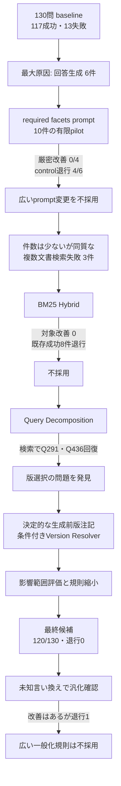

# RAG精度改善の意思決定レポート

## 1. この資料の目的

本資料は、改善手法を並べるだけでなく、次の順序で実験の意図と経過を説明する。

1. 総合回答成功を妨げていた最大原因は何か
2. なぜその原因から着手したか
3. 小規模実験で何が分かり、なぜ次の手へ移ったか
4. 最終的にどの変更が、どの質問の改善へ寄与したか
5. 費用と退行リスクを含め、どこで改善を止めたか

この資料の「精度」は検索だけの指標ではない。**必要な根拠を取得し、根拠に沿った回答を生成し、
回答可能性を正しく分類できた質問の割合**を総合回答成功率とする。

## 2. 評価条件

| 項目 | 条件 |
|---|---|
| 評価セット | gold v1.2、130問 |
| 総合成功条件 | 検索、回答内容、根拠支持、最終分類がすべて成功 |
| 比較原則 | 同じ質問セット、同じgold、同じ指標 |
| 外部障害 | API errorは内容品質と分けて記録 |
| sealed holdout | 今回の改善探索では未使用 |
| retry | 各有限runで0 |

### 改善前の失敗Pareto

| 主原因 | 件数 | 失敗13件に占める割合 | 全130件に占める割合 |
|---|---:|---:|---:|
| 回答生成 | **6** | **46.2%** | 4.6% |
| 回答分類 | 4 | 30.8% | 3.1% |
| 検索 | 3 | 23.1% | 2.3% |
| 成功 | 117 | - | 90.0% |

最大原因は回答生成だった。ただし「件数が最大」であることと「一つの変更でまとめて直せる」ことは
同じではない。以下では、最大原因を最初に試し、その同質性と改善可能性を小規模実験で確認した。

## 3. 意思決定の流れ

## 4. 実験台帳

### 4.1 基準構成を作った先行実験

| 変更 | 観測結果 | 判断 |
|---|---|---|
| 親見出しをEmbedding入力へ追加 | 影響8問の完全回答が3/8から6/8。ただしQ446が退行 | 単独では不採用。検索表現の知見として利用 |
| Top-kを5から8へ変更 | 必須内容一致6/8から8/8、完全回答6/8から7/8。生成費用は約36%増 | 基準構成へ採用 |
| 分類decision rule v2 | 小さいoracleでは有望だったが、130問の取得根拠条件では改善0、退行2 | 不採用。classifier v1を維持 |

これらは現在の117/130というbaselineを作る過程の変更であり、後述する117から120への増分へ
重ねて数えない。

### 4.2 現在の改善キャンペーン

| 優先 | 仮説と手法 | 小規模評価 | 結果 | 判断 |
|---:|---|---|---|---|
| 1 | 最大原因6件に、質問の必須facet確認をGenerator promptへ追加 | 失敗4件＋control 6件 | 厳密改善0/4、意味上改善1/4、control退行4/6、US$0.01053975 | 不採用。回答生成6件は一つのpromptで直せる同質な集合ではない |
| 2 | 複数文書検索失敗3件をBM25 Hybridで回復 | formal 100問 | 対象改善0、Hit@5 80/90→73/90、既存成功8件退行 | 不採用 |
| 3 | 複合質問を決定的に分割して個別検索 | 対象質問＋回帰 | Q291・Q436の検索根拠を回復、Hit@5退行0 | 有望。回答段の旧版選択が次のボトルネックと判明 |
| 4 | 既存classifier promptへ版規則を追加 | 対象7件＋control 10件 | 対象5件改善、control 2件退行 | 一括prompt変更は不採用。版判定だけを分離 |
| 5 | 質問日・制度domain・施行日から生成前版注記を作る | 日付影響範囲 | 内容品質は7/7成功。provider 503は別記録 | 採用候補 |
| 6 | 版競合時だけVersion Resolverを呼ぶ | 版競合対象＋回帰 | 旧評価では分類失敗15→9、6件改善、退行0 | 採用候補 |
| 7 | 分解規則を5系統から実測効果のある2系統へ縮小 | 最終コードの影響10問 | 退行した規則と便益のない規則を除去 | 採用 |
| 8 | 未知の言い換えへ規則を一般化 | 開発用16件、E2E 9件 | E2E 1/9→3/9だが退行1 | 本番不採用。artifactだけ保存 |
| 9 | answerability prompt追加 | E2E 9件 | 3/9→2/9、改善0、退行1 | 不採用。prompt探索を停止 |

## 5. 最終候補の結果

| 指標 | 改善前 | 最終候補 | 差 |
|---|---:|---:|---:|
| **総合回答成功** | **117/130 (90.0%)** | **120/130 (92.3%)** | **+3** |
| 回答生成失敗 | 6 | 6 | 0 |
| 回答分類失敗 | 4 | 3 | -1 |
| 検索失敗 | 3 | 1 | -2 |

- 改善: `Q286`、`Q291`、`Q436`
- 退行: 0
- 残った検索失敗: `Q156`
- 採用判定に使ったcandidate recordの推定費用: **US$0.012088**
- temporal pilot以降の失敗試行を含む全費用: **US$0.0229015 / 40 logical calls**
- production deploy: 未実施

## 6. 各手法は総合回答成功へどれだけ寄与したか

最終3件は、手法ごとの効果を単純加算できない。検索で根拠を揃えても、Generatorが旧版を採用すれば
総合失敗になるためである。そこで、同じ質問を複数の手法へ重複計上せず、質問単位で因果を示す。

| 改善質問 | 必要だった変更 | 総合成功への寄与の読み方 |
|---|---|---|
| `Q436` | Query Decomposition | 単独で確認できた直接寄与 **+1件** |
| `Q286` | 条件付きVersion Resolverを含む版処理 | 最終130問で確認できた直接寄与 **+1件** |
| `Q291` | Query Decomposition＋生成前版注記＋Version Resolver | 3要素の組み合わせによる寄与 **+1件** |

したがって、説明できる最小の結論は次のとおりである。

- Query Decompositionは直接1件を改善し、さらにQ291改善の前提にもなった。
- Version Resolverを含む版処理は直接1件を改善し、Q291にも共同で寄与した。
- 生成前版注記は、検索済みの新旧根拠から旧版を選ぶQ291の失敗を防いだ。
- 3手法の寄与率を個別に足して100%とすることはできない。全130問で各要素を一つずつ外す
  ablationは実施していないため、独立した改善率は主張しない。

この表現なら、「失敗要因ごとに手法を一つずつ当てた」という説明ではなく、**最大原因から順に
安価な反証実験を行い、失敗した案を早く止め、相互依存する検索・生成・分類を一つのquery flowとして
改善した**と説明できる。

## 7. 採用する構成と採用しない構成

### 採用するproduction候補

- contextual headingを使うEmbedding
- Top-8検索
- Gemini 3.1 Flash-Liteによる構造化回答生成
- 既存classifier prompt v1
- 版競合時だけ動くVersion Resolver
- 質問日・制度domain・施行日から作る決定的な生成前版注記
- 実測効果があった2種類だけのQuery Decomposition
  - 出生＋支給開始＋届出期限
  - 転居＋通勤実態消失
- 外部API失敗時と表示契約違反時のfallback

### 採用しない実験案

- BM25 Hybrid
- required facetsを広く追加する生成prompt
- classifier promptの一括変更
- classification decision rule v2
- 5種類へ広げたQuery Decomposition
- 未知言い換えへ広げた一般化trigger
- answerability alignment prompt

不採用案も削除せず、実験結果として残す。面接では「成功した技術」だけでなく、退行を観測して
止めた判断と、130問を毎回再実行せず有限pilotで費用を抑えた過程を説明できる。

## 8. 費用対効果の判断

今回の改善では、件数最大の回答生成6件へ最初に取り組んだ。しかし小pilotで改善0、control退行4を
確認したため、130問の全面実行へ進まず約US$0.01で停止した。次に、3件と少数でも原因が
「複数文書・複数事項の検索」にまとまっていた検索失敗へ移った。

この判断により、広いprompt変更や常時二重LLMを避け、追加処理を該当質問だけへ限定した。
最終的に総合成功を3件改善し、退行0を維持した。最大原因へ固執するより、**同じ一手で安全に
改善できる失敗群を選ぶ方が、限られた時間とAPI費用に対して高い成果を得られた**。

## 9. 現時点の限界

- 回答生成失敗6件は残っており、総合成功の最大の残存要因である。
- `Q156`は必要文書の一部を取得できても、住所変更届の正解節が候補へ入らず検索失敗のままである。
- 最終候補の3要素を全130問で個別に外すablationは未実施であり、手法別の独立寄与率は未確定である。
- ルール一般化は開発用言い換えで退行したため、未知質問に対する汎化を保証しない。
- 92.3%はgold v1.2の130問での値であり、質問分布と評価条件を伴わず一般化しない。

## 10. 次の行動候補

### 推奨: 精度探索を一度止め、採用候補を公開可能な状態へ固める

1. 不採用となった一般化triggerがruntimeへ残らないようbranch差分を整理する。
2. 採用候補だけで非integration test、Ruff、PostgreSQL・Qdrant integration smokeを実行する。
3. READMEの数値と構成図を本資料および機械可読artifactへ合わせる。
4. review可能なPRへまとめる。
5. review後に、sealed holdout評価とproduction deployをそれぞれ承認境界として実行する。

この順序を推奨する理由は、現在の改善候補が同一130問で退行0のgateを通過しており、追加の
精度探索よりも「不採用コードを混ぜず、再現可能な証拠と公開デモを一致させる」方が
ポートフォリオ完成への寄与が大きいためである。

### 追加精度改善を続ける場合

| 候補 | 改善上限・便益 | 費用・リスク | 優先度 |
|---|---|---|---|
| `Q156`専用の取得改善 | 現状では最大+1件 | 個別ルールへの過適合 | 低 |
| facet付きSchema＋code validator | 回答生成6件の一部を改善できる可能性 | Schema、UI、評価契約の変更が大きい | 中長期 |
| 高リスク時だけのverifier | 根拠外断定を抑えられる可能性 | 追加LLM費用、遅延、verifier自身の誤り | 中長期 |
| 全件の二重生成・再採点 | 広い検出能力 | 費用と複雑性が大きく、現在規模では過剰 | 見送り |

## 11. 根拠資料

- [残存失敗と優先順位](CURRENT_FAILURE_PRIORITY_V1_2.md)
- [回答生成required facets実験](GENERATION_FACETS_PROMPT_EXPERIMENT.md)
- [BM25 Hybrid評価](BM25_HYBRID_EVALUATION.md)
- [Query Decomposition評価](QUERY_DECOMPOSITION_EVALUATION.md)
- [生成前版注記評価](TEMPORAL_GENERATION_EVALUATION.md)
- [Version Resolver評価](VERSION_RESOLVER_EVALUATION.md)
- [分類prompt比較](VERSION_CONFLICT_PROMPT_EXPERIMENT.md)
- [分類decision rule評価](CLASSIFICATION_DECISION_RULE_RESULT.md)
- [最終統合評価](INTEGRATED_QUERY_CANDIDATE_EVALUATION.md)
- [未知言い換えtrigger評価](QUERY_TRIGGER_ROBUSTNESS_EVALUATION.md)
- [answerability prompt評価](QUERY_ANSWERABILITY_PROMPT_EXPERIMENT.md)
- [機械可読な最終結果](results/integrated_query_candidate_consolidated_v5/summary.json)
