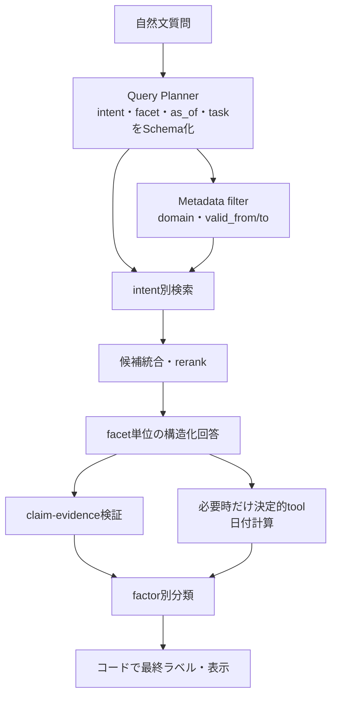

# 精度改善手法の一般化監査

- 作成日: 2026-09-30
- 対象: Query Decomposition、版選択、期限計算、回答分類
- 目的: 現行改善が業務概念を扱う一般的な仕組みか、観測済み表現への個別規則かを区別し、次の最小検証を決める

## 1. 結論

現行の改善には、一般化しやすい仕組みと、表現へ決め打ちした規則が混在している。

| 手法 | 現在の性質 | 判断 |
|---|---|---|
| Contextual heading | 全文書へ同じ変換を適用 | 一般的な検索改善 |
| Top-k拡大 | 全質問へ同じ候補数を適用 | 一般的だがnoiseと費用が増える |
| 構造化回答・根拠ID検証 | 全回答へ同じ契約を適用 | 一般的な安全・監査機構 |
| 日付演算をPythonへ分離 | 構造化済み入力へ同じ演算 | 一般的な責務分離 |
| Query Decompositionの起動 | 特定の2表現を文字列で検出 | ケース固有。一般化候補へ置換すべき |
| 制度domain・版注記の起動 | 固定domainと少数alias | ケース固有。metadataとquery planへ移すべき |
| 日付経路の起動 | 日付正規表現と期限語句の列挙 | ケース固有。intent・slot解析へ移すべき |
| 条件付きVersion Resolver | 版判定という責務は一般的 | 起動をbaseline classifierへ依存する点が弱い |

決定的コードを使うこと自体が例外処理なのではない。表層の文言に反応する`if`を増やすことが問題である。より一般化するには、自然文を一度、業務上の意味を表す構造へ変換し、その構造に対して共通処理を行う。

## 2. 既存調査で確認していた一般手法

2026年9月28日〜29日の`RAG_AND_CLASSIFIER_IMPROVEMENT_RESEARCH.md`と`SEALED_HOLDOUT_REMEDIATION_RESEARCH.md`では、次を調査していた。

- Dense＋sparse Hybrid Search
- LLMによるQuery Decomposition
- reranking
- required facets
- Self-RAG、Corrective RAG
- claim verification
- factor別Classifier、NLI、Jev型decision model
- confidence calibrationとabstention
- semantic parsingと決定的日付計算

したがって一般解の調査を全くしていなかったわけではない。ただし、実装候補を選ぶ段階では、API費用、利用枠、短期完成、既存成功の退行回避を優先し、適用範囲を観測済みケースへ縮小した。

不足していたのは、限定pilotが成功した後に、表層規則を一般化した候補と比較する工程である。

## 3. 原因別の一般的な解決策

### 3.1 複数意図の質問で根拠を取りこぼす

#### 現行方式

`転居`＋`通勤しなく`、または`出生`＋`支給開始時期`＋`届出期限`を含む場合だけ、固定subqueryへ分割する。

この方式は挙動が予測しやすく、費用が小さい。一方、同じ意味の「引っ越して通勤経路がなくなった」や、新しい複合質問には反応しない。

#### 一般的な解決策

質問を構造化された複数の情報要求へ分解するQuery Plannerを使う。

```json
{
  "intents": [
    {
      "domain": "通勤手当",
      "event": "通勤実態消失",
      "requested_facets": ["支給停止"]
    },
    {
      "domain": "住所変更届",
      "event": "転居",
      "requested_facets": ["提出要否", "提出期限"]
    }
  ]
}
```

各intentを検索し、候補を統合した後、rerankerで元質問への有用性を並べ直す。ACL 2025のQuestion Decomposition研究も、LLM分解、subquestion別検索、候補統合、cross-encoder rerankingの構成でMultiHop-RAGとHotpotQAを改善している。[Question Decomposition for RAG](https://aclanthology.org/2025.acl-srw.32/)

2026年の研究では、subqueryを広げることとnoise・計算量を抑えることをexploration/exploitationとして扱っており、すべてのsubqueryへ固定枠を配る方式にも改善余地がある。[Query Decomposition for RAG: Balancing Exploration-Exploitation](https://aclanthology.org/2026.eacl-long.322/)

#### このRAGに適した最小候補

- Gemini structured outputで`intents[]`を抽出する。
- intentが1件なら通常検索、2件以上なら分解検索する。
- intent数、subquery数、最大候補数に上限を置く。
- 元質問を必ず候補統合に残す。
- 分解結果と検索結果をログへ保存する。
- 候補統合後に軽量rerankingを比較する。

LLM分解は語句列挙より一般化しやすいが、分解誤り、追加call、再現性という新しい弱点を持つ。そのため無条件に置換せず、未知言い換えを含む固定development setで比較する。

### 3.2 新旧版を誤って選ぶ

#### 現行方式

質問中の年月、固定制度domain、少数aliasを検出し、取得済みの改正履歴へ版注記を付ける。

#### 一般的な解決策

文書versionへ次のmetadataを付け、検索前または検索中に有効期間でfilterする。

```text
policy_domain
valid_from
valid_to
supersedes_version_id
document_role
target_population
```

質問解析では`as_of`、domain、改正前後比較の有無を抽出する。

```text
通常の時点質問:
valid_from <= as_of < valid_to の版だけを検索

改正前後比較:
filterせず、version chainを取得して差分を比較

日付なし:
現行版を使うか、基準日不足として確認する
```

Qdrantはpayloadのdatetime range filterを提供し、vector検索の候補自体を時間条件で制約できる。[Qdrant filtering](https://qdrant.tech/documentation/search/filtering/)

時点制約をsemantic similarityと別に扱う考え方は、TimeR4の時間制約を明示してretrieve・rerankする構成や、版系列を明示的に扱うVersionRAGと一致する。[TimeR4](https://aclanthology.org/2024.emnlp-main.394/)、[VersionRAG](https://arxiv.org/abs/2510.08109)

2026年9月のTimelyRAGも、規程のように改正前後で文章が強く重なる資料では、semantic similarityだけでなくtemporal distanceを順位へ入れる必要を報告している。ただし新しいpreprintであり、このプロジェクトへの採用根拠ではなく比較候補として扱う。[TimelyRAG](https://arxiv.org/abs/2609.11572)

#### このRAGに適した最小候補

固定domain aliasを増やす前に、取込時の`policy_domain`と`valid_from/to`を必須metadataにする。Query Plannerが抽出した`as_of`とdomainをQdrant filterへ渡す。

Version Resolverは、filterできない経過措置、比較質問、metadata不完全時だけのfallbackへ縮小できる。これにより通常質問の版選択をLLMの注意力へ依存しにくくなる。

### 3.3 具体的な期限日を求める質問

#### 現行方式

日付正規表現、起算日を示す助詞、期限を示す語句の組み合わせで専用経路を起動する。

#### 一般的な解決策

Intent ClassificationとSlot Filling、またはsemantic parsingとして扱う。

```json
{
  "task": "calculate_deadline",
  "anchor": {
    "date": "2027-05-01",
    "event": "住所変更"
  },
  "requested_output": "calendar_date",
  "rule_requirements": ["duration", "counting_rule", "calendar_type"]
}
```

質問表現が「何日まで」「締め切りは」「いつ出せばよい」に変わっても、同じ`task`とslotへ正規化できれば共通処理を使える。Gemini structured outputはJSON Schemaによるdata extractionとstructured classificationを想定している。ただしSchema適合は意味の正しさを保証しないため、値をアプリケーションで検証する必要がある。[Gemini structured output](https://ai.google.dev/gemini-api/docs/structured-output)

計算をLLMではなく実行環境へ委ねる構成は、Program-Aided Language Modelsの「自然言語理解をモデル、計算をprogram runtime」という責務分離と同じ方向である。[PAL](https://arxiv.org/abs/2211.10435)

#### このRAGに適した最小候補

- Query Plannerへ`task`、`anchor_date`、`requested_output`を追加する。
- 日数と数え方は質問から補わず、取得根拠から別Schemaで抽出する。
- `calendar_day`だけをPythonで実行する。
- `business_day`、休日、規則不足は`not_executable`として分類へ返す。
- 現行の語句routeをbaselineとして残し、未知言い換えでplannerと比較する。

日付演算のコード化は維持する。一般化すべき対象は演算ではなく、その起動と入力抽出である。

### 3.4 回答項目の欠落・質問外条件の追加

#### 現行方式の問題

Required facets promptは、質問が要求する項目を広く解釈し、不要な確認事項を増やした。これは質問要求の解析と回答生成を同じprompt内で行い、誤った要求構造をそのまま回答へ反映したことが一因である。

#### 一般的な解決策

Query Plannerが先に`requested_facets`を構造化し、Generatorは各facetへ次のいずれかを対応させる。

```text
answered_by_claim
unanswered_due_to_missing_evidence
not_requested
```

その後、claim単位で取得根拠による支持を検証する。Claim-level verificationは、回答全体を一度に正誤判定するより、unsupported、contradiction、under-evidenceを分けて診断できる。[MedRAGChecker](https://arxiv.org/abs/2601.06519)、[TripleCheck](https://aclanthology.org/2025.hcinlp-1.4/)

#### このRAGに適した最小候補

Required facetsをGeneratorに自由生成させず、Query Plannerの出力として固定する。Generator後に、facetとclaimの対応表をコードで確認する。質問外の`missing_conditions`は`not_requested`として表示判断へ影響させない候補を、独立fixtureで評価する。

### 3.5 回答可能なのに`判断要`へ寄せる

#### 現行方式の問題

一つのClassifierが5 factorを同時に扱い、個別事情、所管判断、版競合の境界が相互干渉する。専用Version Resolverは一つのfactorを分離した改善だが、他factorには同じ問題が残る。

#### 一般的な解決策

最終3ラベルを直接予測せず、次を独立に判定する。

1. 各claimが取得根拠に支持されるか。
2. 質問のrequested facetsが満たされたか。
3. 根拠に書かれていない利用者固有の値が必要か。
4. 文書だけでは決まらない裁量が必要か。
5. 時点filter後も版が競合するか。

コードがfactorから最終ラベルを導出し、model間の不一致や低confidenceではabstainする。LLMのabstentionは独立した評価課題であり、answerable/unanswerableを分けたconfusion matrixとcoverageを測る必要がある。[Do LLMs Know When to NOT Answer?](https://aclanthology.org/2025.coling-main.627/)、[Know Your Limits](https://aclanthology.org/2025.tacl-1.26/)

Self-RAGは検索、生成、critiqueを一体的に学習する一般方式だが、学習済み専用modelを前提とし、Gemini APIへprompt追加だけで導入できるものではない。[Self-RAG](https://proceedings.iclr.cc/paper_files/paper/2024/hash/25f7be9694d7b32d5cc670927b8091e1-Abstract-Conference.html)

#### このRAGに適した最小候補

全面的なagentic loopを導入せず、Query Plannerのfacet、claim-evidence対応、typed missing conditionを共通中間表現にする。版だけでなく、`requires_case_facts`と`requires_policy_judgment`も独立fixtureで測る。confidenceを使う場合はholdout前のdevelopment splitで閾値を固定する。

## 4. 推奨する一般化後の構成



一つのQuery Planを検索、版filter、期限計算、回答facetへ共用する。個別のkeyword routerをそれぞれ増やすより、質問理解の結果を一か所で観察・評価できる。

## 5. 一般化によって増えるコストとリスク

一般化は常に優れているわけではない。

| 変化 | 利点 | 新しいリスク |
|---|---|---|
| LLM Query Planner | 未知言い換え・新しい複合質問へ対応 | 追加call、planner誤り、再現性 |
| Metadata filter | 無効版を検索前に除外 | metadata欠損時に正解を除外 |
| Reranker | 分解後のnoiseを減らす | model・latency・運用負荷が増える |
| Claim verification | 誤りの位置を説明しやすい | call数またはlocal modelが増える |
| Factor分離 | 原因追跡しやすい | pipelineが長くなり部分失敗が増える |

このポートフォリオでは、全面置換より、一般化候補を小さな同一評価で比較する方が費用対効果が高い。

## 6. 次の最小検証案

採用可否は既知失敗と少数controlだけで決めず、mechanism、未知同型事例、代表回帰、安全性・費用、fresh holdoutの順に判定する。詳細は[精度改善策の採用判定プロトコル](INTERVENTION_ADOPTION_PROTOCOL.md)を参照する。

### Phase A: 外部生成を使わない準備

1. `QueryPlan` JSON Schemaを設計する。
2. 現行の2分解、版質問、期限質問、通常質問を同じSchemaで表せることをfixtureで確認する。
3. 既存の個別規則を`QueryPlan`へ変換するbaseline adapterを作る。
4. metadata filterをdry-runし、除外される正解根拠を監査する。

### Phase B: Plannerの小比較

開発に使っていない言い換えを含む30〜40問を先に固定する。

- 複数意図: 10問
- 版・時点: 10問
- 具体期限: 10問
- 誤起動を測る通常control: 10問

現行rule plannerとGemini structured plannerを同じgold Query Planで比較する。

測定項目:

- intent完全一致
- requested facet完全一致
- date・domain slot精度
- 不要な分解・日付経路の誤起動
- planner費用、latency、API error

### Phase C: 検索とEnd-to-End gate

Planner単体のgateを通った候補だけで、同じ質問の検索と回答を比較する。

- 必要根拠Hit@8を悪化させない。
- 現行ruleが失敗する未知言い換えを改善する。
- 通常controlの総合退行0件。
- 版filterで正解根拠を除外しない。
- unsupportedな期限計算を増やさない。
- 追加call、token、latencyを記録する。

この結果を見てから現行keyword routeを置換する。最初から本番経路を全面的に書き換えない。

## 7. ポートフォリオ上の説明

現行の限定規則は、原因仮説を低費用で確認したprototypeとして説明できる。一方、それを最終的な汎化解として主張しない。

次の比較まで行えば、次の流れを説明できる。

1. 具体的失敗へ小さい規則を当て、原因仮説が正しいことを確認した。
2. 規則が表層表現へ依存する弱点を認識した。
3. intent・facet・時点・taskを持つ共通Query Planへ抽象化した。
4. 未知言い換えと通常controlで、一般化と退行を比較した。
5. 効果が費用と複雑性に見合う範囲だけを採用した。

これは例外処理を増やした説明より、prototypeから一般設計へ移行した判断として示しやすい。
