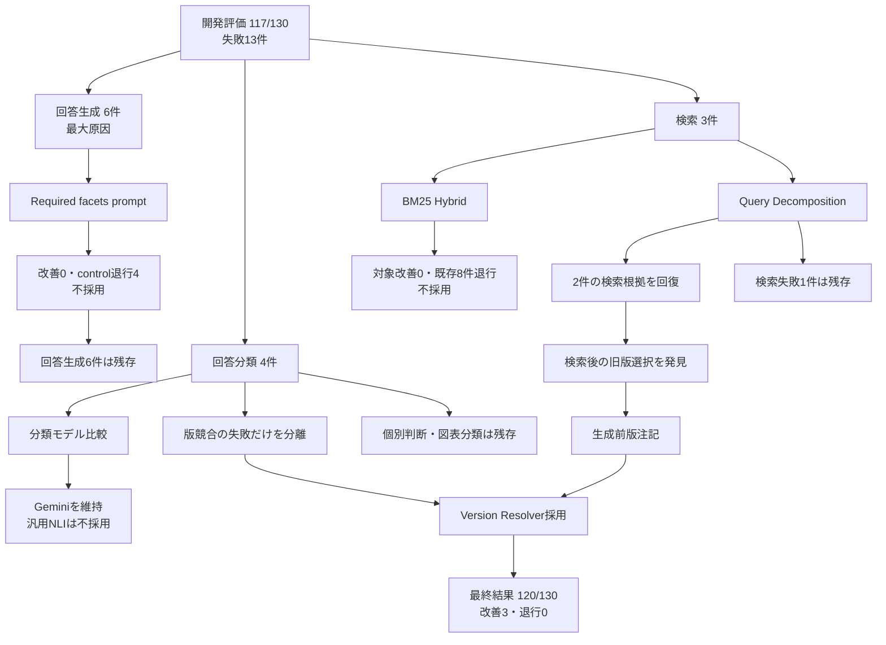

# 精度改善の流れ

## 1. 結論と現在地

このプロジェクトの「精度」は、検索だけではなく、必要な根拠の取得、回答内容、根拠による支持、回答分類、表示のすべてに成功することを指す。

開発用130問では、総合回答成功を117/130（90.0%）から120/130（92.3%）へ改善し、退行は0件だった。その後、開発に使っていないText sealed holdout 100表現では83/100（83.0%）となり、分類の過剰な慎重さと具体期限の計算不足が見つかった。

Holdout後は具体期限だけを対象にした決定的計算を追加し、新規表現4/4で成功した。ただし、**改善後の2回目のText sealed holdoutは未実施**である。したがって、現時点では対象限定の改善と既存回帰の維持までを確認済みとし、未知分布へ一般化したとは主張しない。

各手法が動く原理、処理手順、成立条件、原理的な弱点は[改善手法の技術ガイド](ACCURACY_METHODS_TECHNICAL_GUIDE.md)にまとめている。本資料は改善の経緯と実測結果、技術ガイドは方式そのものの検証に役割を分ける。

## 2. 初期評価では分からなかったこと

最初のPractical質問ではRecall@3とRecall@5が1.00だった。しかし、見出しに近い質問が多く、複数文書、文書不足、言い換え、似た節の選択を十分に測れていなかった。

そこで難問20件を追加したところ、検索対象15件の全根拠見出しHit@3は8/15、Hit@5は10/15だった。主な弱点は、文書自体を見つけられないことより、同じ文書内の必要な節を上位へ出せないことだった。

この初期評価は独立した完成フェーズではない。簡単な評価セットだけで精度を判断できないと分かり、評価条件を作り直した経緯として位置付ける。

詳細: [難問検索評価](../HARD_EVALUATION.md)

## 3. 117/130を作った基準構成

130問の改善キャンペーンを始める前に、検索基盤とモデルを同じ評価条件で比較した。

| 構成 | 観測した問題・比較 | 結果と判断 |
|---|---|---|
| Qdrant | ChromaからDBを変えることで順位が変わらないか | 16問の順位とHit@Kが一致。精度向上ではなく、filter、安定ID、PostgreSQLとの責務分離を理由に採用 |
| `gemini-embedding-001` | Gemini Embedding 2、Ruri v3 310Mと比較 | 全根拠見出しHit@5は最高値と同率、MRRは最良。変更による改善がないため維持 |
| Contextual heading | 正解文書内の似た節を区別できない | 全根拠見出しHit@5を74/88から78/88、section missingを11件から7件へ改善 |
| Top-8 | 複数条件の質問でTop-5の候補枠が不足 | 影響8問の必須内容一致を6/8から8/8へ改善。Generator費用約36%増を許容して採用 |
| Gemini 3.1 Flash-Lite | 回答生成・分類モデルの品質、構造化出力、費用 | 100問を完走。分類モデル比較でも36問中31問正解でBGE-M3の6問を上回ったため維持 |
| Classifier v1 | 広いdecision ruleや汎用NLIへの置換 | 退行または業務分類との不一致があり、基準promptを維持。版競合だけを後段で分離する方針にした |

この構成による開発用130問の基準値が117/130である。

詳細: [Qdrant移行](../QDRANT_MIGRATION_EVALUATION.md)、[Embedding比較](../EMBEDDING_MODEL_EVALUATION.md)、[Contextual heading](../CONTEXTUAL_HEADING_FORMAL_EVALUATION.md)、[Top-k比較](../GEMINI_3_1_TOP_K_ANSWER_EVALUATION.md)、[分類モデル比較](../CLASSIFIER_MODEL_COMPARISON.md)

## 4. 改善前の失敗原因

| 主原因 | 件数 | 失敗13件に占める割合 |
|---|---:|---:|
| 回答生成 | 6 | 46.2% |
| 回答分類 | 4 | 30.8% |
| 検索 | 3 | 23.1% |

回答生成が最大だったが、件数が最大であることと、一つの変更でまとめて直せることは同じではない。そこで、小さいpilotで同質性と退行を確認してから全面評価へ進む方針を取った。

## 5. 改善の意思決定

### 5.1 最大原因へ最初に試した手法

回答生成6件では、質問が求める項目の欠落や質問外の断定が見られた。そこでGeneratorへ必須facetの確認手順を加えた。

対象失敗4件と既存成功control 6件のpilotでは、厳密改善0/4、control退行4/6だった。6件は同じpromptで直せる同質な失敗ではないと判断し、約US$0.01で停止した。

### 5.2 少数でも原因が揃った検索失敗へ移動

検索失敗3件は複数文書・複数事項の根拠不足という共通点があった。追加LLM callを使わないBM25 Hybridを先に試したが、対象改善0件、全根拠Hit@5は80/90から73/90、既存成功8件が退行したため不採用とした。

次に質問を複数の検索意図へ決定的に分けるQuery Decompositionを試し、Q291とQ436の根拠を回復した。効果がなかった規則と退行した規則を削除し、最終的に次の2種類だけを残した。

- 出生、支給開始、届出期限を同時に尋ねる質問
- 転居と通勤実態消失を同時に尋ねる質問

### 5.3 検索改善後に見つかった版選択問題

Q291は新旧根拠を取得できても、Generatorが旧版を選んだため総合成功にならなかった。Classifier prompt全体へ版規則を加える案は対象7件中5件を改善したが、control 10件中2件を退行させた。

そこで次のように責務を限定した。

1. 質問日、制度domain、施行日から、生成前に決定的な版注記を作る。
2. 通常は既存Classifierを使う。
3. `version_conflict=true`の場合だけVersion Resolverを追加で呼ぶ。
4. 低confidence、取得外根拠、表示契約違反では基準結果へ戻す。

全質問を二重LLM化せず、観測した版競合だけに費用と複雑性を限定した。

## 6. 採用構成と実験の対応

### 基準構成

| 採用要素 | 対応する評価 |
|---|---|
| Qdrant | Chromaと同一条件で順位一致を確認したDB移行評価 |
| `gemini-embedding-001` | Gemini Embedding 2、Ruriとの比較 |
| Contextual heading | 節不足11件を7件へ削減した検索評価 |
| Top-8 | 必須内容一致6/8から8/8の回答回帰 |
| Gemini 3.1 Flash-Lite | 回答モデル評価と分類モデル36件比較 |
| Classifier v1 | 広い規則変更と汎用NLIを不採用にした比較 |

### 117/130から120/130への追加

| 採用要素 | 対応する実験 | 総合成功への寄与 |
|---|---|---|
| Query Decomposition | BM25不採用後の複合質問分割 | Q436を単独改善。Q291改善の前提 |
| 生成前版注記 | 検索後に旧版を選ぶ失敗の分離 | Q291で旧版採用を防止 |
| 条件付きVersion Resolver | 広いclassifier prompt変更の退行を回避 | Q286を単独改善。Q291にも共同で寄与 |
| 規則を2種類へ縮小 | 影響範囲回帰 | 便益のない規則と退行規則を除去 |

最終結果は120/130（92.3%）、改善Q286・Q291・Q436、退行0件だった。Q291は3手法の組み合わせで成功したため、各手法の効果を単純加算しない。

詳細: [意思決定レポート](../ACCURACY_IMPROVEMENT_DECISION_REPORT.md)、[統合評価](../INTEGRATED_QUERY_CANDIDATE_EVALUATION.md)

## 7. 初回Text sealed holdout

候補を固定した後、開発に使っていない50シナリオ・100表現で評価した。

| 指標 | 結果 |
|---|---:|
| 総合回答成功 | 83/100 (83.0%) |
| Scenario stability | 39/50 (78.0%) |
| 回答分類 | 86/100 |
| 回答内容 | 94/100 |
| Document retrieval | 100/100 |
| Evidence retrieval | 100/100 |

検索は100/100だった一方、分類失敗14件、内容失敗6件が見つかった。主な傾向は、根拠が揃っている回答でも不要な個別確認を加えて`判断要`へ寄せることと、具体期限を尋ねられても起算規則だけを回答することだった。

詳細: [Text sealed holdout受入評価](../TEXT_HOLDOUT_ACCEPTANCE_RESULTS.md)

## 8. Holdout後の対象限定改善

開封済みholdoutへ直接合わせることを避け、別のdevelopment表現と固定500問で影響範囲を確認した。

| 変更 | 目的 | 確認済みの結果 | 精度上の扱い |
|---|---|---|---|
| 決定的な日付計算 | 具体的な起算日と暦日規則から期限日を算出 | 初回holdoutとは異なる新規4表現で4/4成功 | 対象限定の改善。全体holdout改善とは扱わない |
| 明示的な数え方の必須化 | 根拠にない具体日を生成しない | 数え方が根拠にない場合は計算を拒否 | 安全性の改善 |
| 表示契約fallback | GeneratorとClassifierの意味的不整合を例外にしない | 安全表示と監査ログへ変換 | 実行安定性。総合成功には数えない |

固定500問では新しい日付routeの対象が0件だったため、保存済み120/130は維持値として再利用した。今回の変更による上昇値ではない。

詳細: [Holdout後のrelease gate](../POST_HOLDOUT_TARGETED_RELEASE_GATE.md)

## 9. 未完了: 2回目のText sealed holdout

`text_holdout_v1_predictions_v2`から`v10`は、API障害後に同じv1予測を継続したartifactであり、新しいholdoutではない。

次の受入評価では、初回holdoutと異なる文書family・質問を、同程度の難度と分類構成で事前固定する。予測を固定してからgoldを開封し、次を確認する。

- 総合回答成功率
- 具体期限質問の成功率
- `根拠十分`を`判断要`へ寄せる過剰保留
- 複数文書・版境界の成功率
- Formalとnoisy表現のScenario stability
- 新しい危険な断定の有無

新しい質問集合なので、初回83%との差を完全なpaired比較とは扱わない。対象限定評価は改善機構の確認、2回目のsealed holdoutは未知データへの一般化確認として役割を分ける。

## 10. 現時点で主張できること

- 同じ開発用130問で117件から120件へ改善し、退行0件だった。
- 最大原因へ試した案でも、効果がなければ小pilotで停止した。
- 検索、生成、分類の相互依存を質問単位で追跡した。
- 初回holdoutで83/100となり、開発評価では見えなかった弱点を発見した。
- 日付改善は新規4表現で成功したが、改善後の総合holdout値は未測定である。
