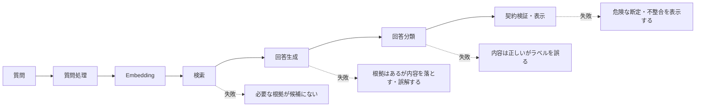
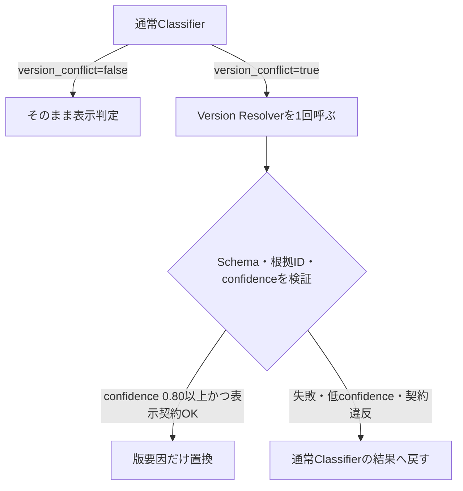

# 精度改善手法の技術ガイド

## 1. この資料の役割

この資料は、精度改善で試した手法について、結果だけでなく次の点を確認できるようにする。

- どの失敗を対象にしたか
- 入力をどのように変換するか
- なぜ改善が期待できるか
- どのような条件では効かないか
- このプロジェクトでどのように実装・検証したか
- 採用後も残るリスクは何か

改善の経緯と数値は[精度改善の流れ](ACCURACY_IMPROVEMENT.md)、個別runの条件とartifactは各実験記録を参照する。この資料では手法の原理と限界に焦点を当てる。

## 2. 改善対象を層に分ける

RAGは一つのモデルではなく、複数の処理を直列につないだシステムである。



総合回答成功には、検索、生成、分類、表示のすべてが成功する必要がある。このため、ある手法がどの層へ作用するかを明確にし、別の層の改善として数えない。

## 3. 採用した検索改善

### 3.1 Contextual heading

#### 対象とした弱点

本文が似ている節を区別できず、正しい文書は取得できても必要な節がTop-kへ入らない問題を対象にした。

たとえば、複数の届出に「提出期限」「変更があった場合」という似た表現がある。段落本文だけをEmbeddingすると、どの制度・見出しに属する段落かという情報が弱くなる。

#### 処理の仕組み

保存済み本文そのものは変更せず、Embeddingを作るときだけ文書名と見出し階層を先頭へ追加する。

```text
変更前:
変更があった日から14日以内に提出してください。

変更後:
文書: 住居手当事務取扱要領
見出し: 住居届 > 提出期限

変更があった日から14日以内に提出してください。
```

実装は`src/embedding_representation.py`の`contextual_heading_document_text()`にある。

#### 効く原理

Embedding vectorへ「住居手当」「住居届」「提出期限」という意味情報が追加される。質問にも同じ制度・手続の語が含まれる場合、内容が似た別制度の段落より近くなりやすい。

#### 原理的な弱点

- 見出し自体が曖昧または誤っていれば、その誤りもvectorへ入る。
- 質問が見出しと異なる言い換えだけで構成される場合、効果が小さい可能性がある。
- 本文より見出し語が強く働き、別の正解節を押し下げる場合がある。
- 取得候補に入った後の回答生成・分類は改善しない。

#### このプロジェクトでの検証

同じQdrant、Embedding、質問88件、Top-5で比較し、全根拠見出しHit@5は74/88から78/88、section missingは11件から7件になった。検索改善が回答へ届くかも別の回答回帰で確認した。

### 3.2 Top-kを5件から8件へ拡大

#### 対象とした弱点

複数文書・複数条件を必要とする質問で、正解候補が6位以下にあり、Generatorへ渡らない問題を対象にした。

#### 処理の仕組み

Vector DBが返す候補数`k`を5から8へ増やす。検索アルゴリズムは変えず、Generatorが読める候補集合を広げる。

#### 効く原理

正解が検索順位6〜8位に存在する場合、候補数を増やすだけで回答に利用できる。再学習や別モデルを必要としないため、小さい変更で試せる。

#### 原理的な弱点

- 候補外の根拠は回復できない。
- 無関係な文書も増え、Generatorが混乱する可能性がある。
- 入力token、費用、応答時間が増える。
- 新旧版が同時に入ると、版選択問題を悪化させることがある。

#### このプロジェクトでの検証

影響8問で必須内容一致が6/8から8/8へ改善した。Generator費用は約36%増えたため、精度だけでなく費用との交換条件を記録して採用した。

### 3.3 Query Decomposition

#### 対象とした弱点

一つの質問に複数の業務上の論点があり、単一vectorでは一方の意味が強くなって、もう一方の根拠が候補外になる問題を対象にした。

例:

```text
転居して通勤しなくなった場合、通勤手当はどうなり、住所変更届はいつまでですか？
```

この質問には「通勤手当の支給停止」と「住所変更届の提出期限」という二つの検索意図がある。

#### 処理の仕組み

現在の実装はLLMによる自由な分解ではなく、観測済みの2種類だけを決定的に分ける。

```text
元質問
  ├─ 転居・通勤実態消失 → 通勤手当の支給停止
  └─ 転居 → 住所変更届の要否・提出期限
```

各subqueryへ`ceil(top_k / subquery数)`件の候補枠を予約する。結果をelement IDで重複排除し、枠が余れば元質問の検索結果で補う。

擬似コード:

```python
subqueries = decompose(question)
quota = ceil(top_k / len(subqueries))

for subquery in subqueries:
    add_unique(search(subquery, quota))

if result_count < top_k:
    add_unique(search(original_question, top_k))
```

実装は`src/query_decomposition.py`にある。

#### 効く原理

一つのvectorで複数の意図を平均化せず、各論点へ検索枠を保証する。関連度の高い一つの話題がTop-kを占有することを防ぎ、根拠の網羅性を上げる。

#### 原理的な弱点

- 分解条件にない新しい質問は、そのまま単一検索になる。
- 誤った分解は無関係な候補へ枠を使う。
- 候補を論点へ配分するため、単一論点のTop-3順位は下がり得る。
- subquery数に応じてEmbedding callまたは入力数が増える。
- 検索した後にGeneratorが正しい根拠を選べる保証はない。

#### このプロジェクトでの検証

Formal 100問の検索対象90問で、Evidence Hit@5は80/90から82/90へ改善し、Hit@5の退行は0件だった。一方、Top-3は75/90から74/90へ低下した。Q291では必要根拠を回復しても旧版を回答したため、検索改善だけでは総合成功にならず、次の版処理が必要になった。

## 4. 採用した版選択改善

### 4.1 生成前の版注記

#### 対象とした弱点

新旧両方の根拠を検索できても、Generatorが日付に合わない旧版を採用する問題を対象にした。

#### 処理の仕組み

質問と取得済み根拠から、LLMを使わず次を計算する。

1. 質問中の基準日を抽出する。
2. 質問が対象とする制度domainを特定する。
3. `effective_date <= 質問日`を満たす改正後・経過措置の要素を探す。
4. 同じdomainの古い記載候補を区別する。
5. Generator promptへ、優先するelement IDと旧記載候補を注記する。

改正前後の比較を求める質問では、片方を捨てず両方を保持する。

実装は`src/temporal_evidence.py`の`analyze_temporal_evidence()`と`temporal_prompt_instruction()`にある。

#### 効く原理

LLMに文書の発効日を毎回ゼロから推論させず、metadataを使った決定的処理で候補関係を先に整理する。Generatorは根拠を削除された状態ではなく、「どれを優先し、どれが古い可能性があるか」を受け取る。

#### 原理的な弱点

- `effective_date`や`document_role`などのmetadataが正しいことを前提にする。
- 現在の制度domainとaliasは限定的で、未知制度や新しい言い換えを自動理解しない。
- 質問に日付がない場合、適用時点を決められない。
- 改正が単純な新旧関係でなく、対象者・経過措置ごとに枝分かれする場合は注記だけでは足りない。
- Generatorが注記に従うこと自体は確率的である。

#### このプロジェクトでの検証

対象7件で正しい内容生成を確認した。Q291ではQuery Decomposition、版注記、Version Resolverの組み合わせで成功したため、版注記だけの単独寄与とは数えていない。

### 4.2 条件付きVersion Resolver

#### 対象とした弱点

通常のClassifierは、回答支持、個別事情、所管判断、版競合など複数要因を同時に判定する。このうち版競合だけを誤るケースへ、Classifier全体を変更せず対処した。

#### 処理の仕組み



Resolverは回答全体を再分類せず、次だけを判定する。

- 質問日
- 根拠の施行日・適用期間
- 明示された優先規則
- 結論に関係する根拠が一つだけか

返された根拠IDが実際の取得集合に含まれること、Schemaが整合すること、confidenceが0.80以上であることをコードで検証する。置換後に表示契約が壊れる場合もbaselineへ戻す。

実装は`src/version_resolution.py`と`src/query_service.py`にある。

#### 効く原理

一つの大きな分類promptへ規則を追加すると、版と無関係な質問まで挙動が変わる。専用Resolverは入力責務を版選択だけに狭め、追加callを`version_conflict=true`の質問だけへ限定する。

#### 原理的な弱点

- 通常Classifierが競合を見逃して`false`にすると、Resolverは起動しない。
- 通常Classifierが過剰に`true`を出すと、追加callと遅延が増える。
- confidenceはモデルの自己申告であり、統計的に校正された確率ではない。
- Resolverも同じproviderを使うため、共通障害や共通の理解誤りを持ち得る。
- 発効期間のmetadataが不足していれば、一意な版を決められない。

#### このプロジェクトでの検証

Classifier prompt全体の版規則変更は対象7件中5件を改善したが、control 10件中2件を退行させた。条件付きResolverへ縮小した構成ではQ286を単独改善し、Q291にも共同で寄与した。

## 5. 採用した回答・表示改善

### 5.1 構造化回答と根拠ID検証

#### 処理の仕組み

Generatorは完成済みの表示文ではなく、claim、claimごとの`evidence_element_ids`、未解決条件、必要に応じて日付計算入力をJSON Schemaで返す。

アプリケーションは次を検証する。

- JSON Schemaに一致するか
- claimが取得外の根拠IDを参照していないか
- 分類結果と未解決条件が表示契約上矛盾しないか
- `文書不足`や`判断要`で表示してよいclaimはどれか

#### 効く原理

自由文だけでは、どの文がどの根拠に基づくかをコードが確認しにくい。主張と根拠IDを分けることで、監査ログ、画面表示、評価を同じ単位で扱える。

#### 原理的な弱点

- Schemaに合うことは、内容が正しいことを保証しない。
- 正しい根拠IDを付けた誤ったclaimは、別の意味評価が必要である。
- 厳しいfallbackは危険な表示を防ぐ一方、答えられる質問も保守側へ倒す可能性がある。

### 5.2 決定的な日付計算

#### 対象とした弱点

具体的な期限日を聞かれても、LLMが「14日以内」の規則だけを返す問題と、根拠にない数え方を補って日付を断定する問題を対象にした。

#### 処理の仕組み

日付経路は、質問に次がある場合だけ起動する。

- `YYYY年M月D日`等の具体日
- 具体日が起算日・基準日だと分かる表現
- 「いつまで」「期限日」等の具体日を求める表現
- 営業日・休日計算を求めていないこと

LLMは次の計算入力だけを構造化する。

- `anchor_date`
- `offset_value`
- `offset_unit=calendar_day`
- `counting_rule=next_day_is_day_1`または`anchor_day_is_day_1`
- 根拠element ID

その後、コードが`datetime`で加算する。

```text
翌日を1日目: anchor_date + offset_value日
当日を1日目: anchor_date + (offset_value - 1)日
```

さらに、選ばれた数え方が取得根拠本文に明記されているかを照合する。明記がなければ計算を破棄し、起算規則を未解決条件へ移す。

実装は`src/temporal_evidence.py`、`src/deadline_calculator.py`、`src/query_service.py`にある。

#### 効く原理

文章から条件を抽出する仕事はLLM、同じ入力から必ず同じ結果を出す暦日演算はコードへ分ける。LLMの算術誤りと、根拠にない起算規則の補完を抑える。

#### 原理的な弱点

- 根拠自体に起算規則がなければ計算できない。
- 営業日、休日、閉庁日、和暦、相対日付は未対応である。
- 質問の経路判定は語句と日付形式を使うため、未知の表現を見逃す可能性がある。
- 日付計算が正しくても、制度上の適用版や対象者条件が誤っていれば総合回答は誤る。

#### このプロジェクトでの検証

初回holdoutとは異なる新規4表現で4/4に成功した。改善後の2回目のText sealed holdoutは未実施なので、全体への一般化は未確認である。

## 6. 試したが採用しなかった手法

### 6.1 Required facets prompt

#### 仮説

回答前に質問が求める項目を列挙し、各項目へ回答または不足条件を対応させれば、回答項目の欠落を減らせると考えた。

#### 弱点と結果

質問の要求を広く解釈すると、本来不要な確認事項まで追加し、回答を過剰に`判断要`へ寄せる。対象4件の厳密改善は0件、control 6件中4件が退行した。

これは「チェック項目を増やせば常に安全」という考えが成立しない例である。質問範囲の判定自体が難しい場合、facetを増やすほど偽の不足条件が増える。

### 6.2 BM25 + RRF Hybrid Search

#### 仮説と仕組み

Dense検索は意味の近さ、BM25は単語の一致を得意とする。日本語をSudachi SplitMode Cで分割し、BM25の順位とdense順位をReciprocal Rank Fusionで統合した。

```text
RRF score(d) = 1 / (60 + dense_rank(d))
             + 1 / (60 + sparse_rank(d))
```

scoreの尺度が違うため、vector scoreとBM25 scoreを直接加算せず順位だけを使った。

#### 原理的な弱点と結果

「届出」「場合」「通勤」のように複数文書へ現れる語もBM25が強く評価する。Sparse順位が質問の複数意図を分離できない場合、RRFは良好だったdense順位まで押し下げる。

対象3件の改善は0件、全根拠Hit@5は80/90から73/90、既存成功8件が退行したため不採用とした。Hybridという方式全般が無効なのではなく、このcorpus、tokenization、fusion条件では利益がなかったという結論である。

### 6.3 Embeddingモデル交換

#### 仮説

日本語benchmarkで強いRuri、multimodal対応のGemini Embedding 2へ変えることで節選択が改善する可能性を検証した。

#### 原理的な注意

Embedding比較はモデル名だけの比較ではない。次元数、query/document prefix、正規化、chunk表現を含むprofile全体が検索結果へ影響する。また、一般benchmarkの順位が、この自治体制度corpusでの順位を保証しない。

主要指標ではGemini 2が2件悪化し、Ruriはbaselineと同数だがMRRが低下したため、`gemini-embedding-001`を維持した。Multimodal対応は画像検索の別の利点であり、今回のテキスト検索精度と混同しない。

### 6.4 分類器のモデル交換

#### 仮説

生成用LLMとは別のローカル分類モデルを使えば、費用、遅延、外部API依存を減らせる可能性がある。

#### 原理的な弱点と結果

この分類は文章の感情分類などではなく、質問、Top-8根拠、生成claimを比較する業務固有のmulti-factor判定である。汎用NLIモデルには入力長、日本語制度語、版関係、独自label定義の不一致がある。

36件でGeminiは31件、BGE-M3は6件正解だった。ローカル実行の利点より品質差が大きく、置換しなかった。Jev型typed decision modelも候補だが、型安全は意味上の正解を保証せず、日本語と長い根拠で同じgold評価が必要である。

## 7. 手法同士の依存関係

各手法の改善件数を単純に足すことはできない。


Q291はこの連鎖全体で成功した。Query Decompositionだけでは旧版を回答し、Version Resolverだけでは必要根拠が検索候補に入らない。したがって、個々の手法を「それぞれ1件改善」と重複計上しない。

## 8. 原理的な弱点を検証するための読み方

各手法は次の順で確認すると、結果の過大解釈を避けられる。

1. **作用点**: 検索、生成、分類、表示のどこを変えるか。
2. **前提**: metadata、見出し、質問表現、provider応答など何を正しいと仮定するか。
3. **到達可能範囲**: 候補外の根拠を作れるか、並べ替えだけか。
4. **副作用**: noise、token、call、遅延、保守規則が増えるか。
5. **fallback**: 失敗や低confidenceのとき、危険側へ進まずbaselineへ戻れるか。
6. **評価範囲**: 対象質問だけか、control、全回帰、sealed holdoutまで測ったか。

## 9. 現在の限界と次の検証

- 開発用130問では117/130から120/130へ改善し、退行0件だった。
- 初回Text sealed holdoutは83/100で、検索より分類と回答内容に弱点が移った。
- 日付計算は新規4表現で確認したが、2回目のsealed holdoutは未実施である。
- Visual holdoutは検索100%でも分類70%であり、図表条件に対する過剰な`判断要`が残る。
- Query Decompositionと版domainは対象を限定しており、未知制度へ自動拡張しない。
- confidence値は校正済み確率ではない。

次の総合判断には、改善コードを固定した上で、開発に使っていない2回目のText sealed holdoutが必要である。そこで期限質問、版境界、複数文書、通常controlを同時に測り、対象改善と別領域の退行を確認する。

また、現行のQuery Decomposition、版domain、日付routeには表層語句へ依存する規則が残る。一般的な解決策との比較と、共通Query Planへ置き換える最小検証案は[精度改善手法の一般化監査](../GENERALIZATION_REVIEW.md)にまとめている。

## 10. 実装・実験資料への案内

| 手法 | 実装 | 詳細な評価 |
|---|---|---|
| Contextual heading | `src/embedding_representation.py` | [Contextual heading評価](../CONTEXTUAL_HEADING_FORMAL_EVALUATION.md) |
| Top-k | `config.py`、`src/query_service.py` | [Top-k回答評価](../GEMINI_3_1_TOP_K_ANSWER_EVALUATION.md) |
| Query Decomposition | `src/query_decomposition.py` | [Query Decomposition評価](../QUERY_DECOMPOSITION_EVALUATION.md) |
| 生成前版注記 | `src/temporal_evidence.py` | [生成前版選択pilot](../TEMPORAL_GENERATION_EVALUATION.md) |
| Version Resolver | `src/version_resolution.py`、`src/query_service.py` | [Version Resolver評価](../VERSION_RESOLVER_EVALUATION.md) |
| 日付計算 | `src/deadline_calculator.py`、`src/temporal_evidence.py` | [Holdout後release gate](../POST_HOLDOUT_TARGETED_RELEASE_GATE.md) |
| BM25 + RRF | `eval/bm25_hybrid_retriever.py` | [BM25 Hybrid評価](../BM25_HYBRID_EVALUATION.md) |
| Embedding比較 | `eval/embedding_profiles.py` | [Embeddingモデル比較](../EMBEDDING_MODEL_EVALUATION.md) |
| 分類モデル比較 | `eval/run_local_nli_classifier_pilot.py` | [分類モデル比較](../CLASSIFIER_MODEL_COMPARISON.md) |
| 全体の採否 | `src/rag_v2.py` | [改善意思決定](../ACCURACY_IMPROVEMENT_DECISION_REPORT.md) |

一般化候補の調査と次の比較設計: [精度改善手法の一般化監査](../GENERALIZATION_REVIEW.md)
